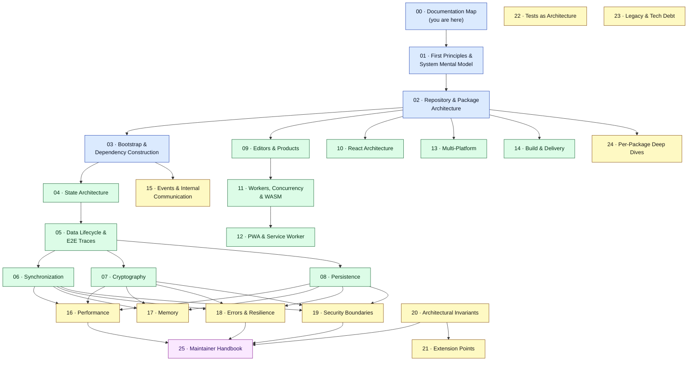
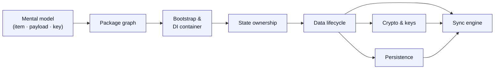
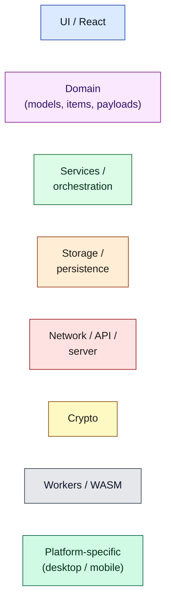

# Document 00 — Documentation Map

> **Standard Notes — Maintainer-Level Architecture Suite**
>
> A model of the system, not a repository walkthrough. Read this document first.

---

## Purpose

This document is the index and navigation layer for the entire architecture suite. It tells you:

- what the suite contains and in which order to read it,
- the conventions, notation, and diagram legend used everywhere,
- the exact repository version every claim is pinned to,
- a glossary that maps Standard Notes vocabulary to underlying computer-science concepts.

If you read nothing else, read this document and [Document 01 — First Principles](./01-first-principles-and-mental-model.md).

---

## Repository version under analysis

Every document in this suite is pinned to a single immutable commit. **No claim mixes code from other branches, tags, or releases.**

| Field | Value |
| ----- | ----- |
| Repository | `convict-git/standardnotes-app` (fork of `standardnotes/app`) |
| Branch | `main` |
| Commit SHA | `e1ebcba3c32c7cb68fdf00bb48bac49a5c10f07d` |
| Commit subject | `chore(release): publish` (by StandardNotes CI, 2026‑08‑25) |
| Workspace layout | Yarn 3 (`yarn@3.2.1`) + Lerna‑Lite, `packages/*` workspaces |
| Toolchain | TypeScript `5.8.3`, Webpack `5`, Babel `7`, Node `22.14.0` (`.nvmrc`); `engines` still declares `>=12.19 <17` |
| Package count | 23 in‑repo workspaces (+ external `@standardnotes/*` npm deps) |

### Source-link convention

Source references look like `packages/services/src/Domain/Sync/SyncService.ts:120-160`. Each is a link to the **commit‑pinned** blob:

```
https://github.com/convict-git/standardnotes-app/blob/e1ebcba3c32c7cb68fdf00bb48bac49a5c10f07d/<path>#L<start>-L<end>
```

Commit‑pinned URLs are used deliberately: line numbers on `main` drift, and **accuracy is the highest priority** of this suite. To view the living version of any file, replace the SHA with `main`.

> **Why a fork?** The analyzed repo is a fork. The upstream is `standardnotes/app`. Package `repository` fields still point at `github.com/standardnotes/app`. The code content is what governs; the fork/upstream distinction only matters for where you click. All links resolve against the fork so they always match the analyzed bytes.

---

## Evidence classification

Every non-trivial claim in this suite is mentally tagged as one of:

| Tag | Meaning | How to trust it |
| --- | ------- | --------------- |
| **Observed** | Directly established by reading source at the pinned commit | Follow the cited `file:line` |
| **Runtime‑verified** | Confirmed by executing code (unit tests, a probe, a build) | Reproduce with the noted command |
| **Inferred** | Strongly implied by surrounding architecture, not directly proven | Treat as a well-supported hypothesis |
| **Unknown** | Insufficient evidence | Flagged as an open question |

Inline, claims that are not plain Observed are marked, e.g. *(Inferred)* or *(Runtime‑verified: `yarn workspace @standardnotes/encryption test`)*. When implementation, tests, types, comments, and docs disagree, the disagreement is shown explicitly and the **executing** behavior is identified as authoritative.

The evidence hierarchy, highest first: **runtime behavior → executable source → tests → types → build config → comments → repo docs → history/PRs.**

---

## The suite at a glance



**How to read this diagram:** arrows are *prerequisite* edges (“read the source before the target”). Blue = foundations everyone needs; green = subsystem deep-dives; yellow = cross-cutting concerns; magenta = the final synthesis. The graph is a DAG: you can always find a valid linear reading order by topological sort, and the “Recommended reading order” below is one such order.

---

## Recommended reading order

The suite is **topologically structured**: abstractions appear only after their prerequisites. A first read straight through 00 → 25 works. If you are here for a specific reason, use these tracks:

| If you want to… | Read, in order |
| --------------- | -------------- |
| Get the whole model fast | 00 → 01 → 02 → 03 → 25 |
| Fix a sync bug | 01 → 04 → 05 → 06 → 18 |
| Touch encryption/keys | 01 → 07 → 08 → 19 → 20 |
| Add an editor | 01 → 09 → 10 → 21 |
| Add a platform | 01 → 03 → 13 → 08 → 21 |
| Chase a performance/frame-drop issue | 01 → 10 → 16 → 17 |
| Understand offline / PWA behavior | 08 → 12 → 06 |
| Onboard as a new maintainer | 00 → 01 → 02 → 03 → 04 → 05 → 25 (then subsystems on demand) |

---

## Prerequisite graph (concept → concept)



**Conclusion it demonstrates:** you cannot reason about sync without first understanding items/payloads (the mental model), how payloads are owned in memory (state), how they become ciphertext (crypto), and where they land locally (persistence). Sync sits at the confluence of all of them — which is why it is the subsystem most prone to cross-package bugs.

---

## Notation & conventions

- **`Payload` vs `Item`** — precise terms are defined in the glossary and used consistently. When either would do, “object” is used.
- **Control flow vs data flow** are described separately. When a document says “A triggers B,” the *mechanism* immediately follows (direct call / Promise / event-bus publish / observer callback / MobX reaction / `postMessage` / network response / IPC channel).
- **Ambiguous verbs** (“manages,” “handles,” “talks to”) are avoided unless the concrete mechanism is stated in the same sentence.
- **Complexity** is given as Big-O only where it is meaningful; `N` is always defined. Where constant factors and I/O dominate, that is said instead.
- **Causal explanations** follow the shape *problem → constraint → abstraction → implementation → runtime consequence → tradeoff*.

### Diagram legend (semantic colors)

The same color vocabulary is used in every diagram. Include this legend mentally when reading any colored graph.



**Edge conventions** used across the suite:

| Edge style | Meaning |
| ---------- | ------- |
| `A --> B` | synchronous, direct call/return |
| `A -.-> B` | asynchronous (Promise / microtask / deferred) |
| `A -. event .-> B` | event or subscription (observer, event bus, MobX reaction) |
| `A ==> B` | data crossing a durable/serialization boundary (persistence, network, worker, IPC) |
| `A -->|"encrypted payload"| B` | annotated edge — the label states *what* moves |

Edges are annotated with the payload wherever it clarifies the mechanism, e.g. `SyncService ==>|"encrypted items[]"| Server`.

---

## Architectural glossary

Standard Notes uses specific vocabulary. This table gives both the repo term and the mental-model term; later documents assume it.

| Repo term | Mental-model term | One-line meaning |
| --------- | ----------------- | ---------------- |
| **Payload** | Immutable record / DTO | Plain data object that is the unit of storage & sync. Has a `content_type`, `uuid`, and either decrypted `content` or an encrypted `content` string. Never mutated in place. |
| **Item** | Live domain object | A class instance wrapping a decrypted payload, adding typed accessors & behavior (e.g. `SNNote`, `SNTag`). |
| **ItemsKey** | Data-encryption key (DEK) | Symmetric key that encrypts item content. Itself an item, synced to the server (encrypted under the root key). |
| **RootKey** | Key-encryption key (KEK) | Derived from the user password; encrypts items keys and account-level secrets. Never leaves the device in plaintext. |
| **KeyParams** | KDF parameters | Salt/nonce + version + identifier used to re-derive the root key from a password. |
| **Operator (00x)** | Crypto protocol version | Versioned encrypt/decrypt implementation (`Operator001`…`Operator004`). `004` is current. |
| **PayloadManager** | In-memory record store | Owns the authoritative in-memory map of all payloads; emits change deltas. |
| **ItemManager** | Live-object index | Projects payloads into `Item` instances, maintains indexes (by type, by reference) and streams. |
| **MutatorService** | Write API | The sanctioned path to change an item (produces a new dirty payload). |
| **DiskStorageService** | Key/value persistence facade | Namespaced local KV store (values + a payload database), optionally encrypted. |
| **DeviceInterface** | Platform storage/keychain port | Abstract per-platform I/O (raw KV, item database, keychain). Web/Desktop/Mobile implement it. |
| **SyncService** | Sync engine | Reconciles dirty local payloads with the server; applies remote deltas. |
| **Application (`SNApplication`)** | Composition root / façade | The god-object that owns the DI container and exposes every service. One per workspace. |
| **ApplicationGroup** | Multi-account/workspace manager | Owns the set of workspaces (“descriptors”) and the active `Application`. |
| **Dependencies** | DI container | Lazy-singleton service registry keyed by `Symbol`. |
| **Challenge** | Auth/unlock prompt abstraction | Uniform request for passcode/biometrics/account password. |
| **Component / Editor** | Sandboxed plugin | A note editor or theme, historically an iframe component; now mostly native + the Super (Lexical) editor. |
| **Vault / KeySystem** | Shared/segregated key domain | A group of items encrypted under a separate key system (private or shared vaults). |
| **Feature / NativeFeature** | Capability descriptor | Static metadata describing an editor/theme/permission (from `@standardnotes/features`). |
| **Deinit** | Teardown | Destroying an `Application` instance (on lock, sign-out, or workspace switch). |
| **004 / SNProtocolVersion** | Encryption scheme id | The string prefix on encrypted content selecting the operator. |

Later documents extend this glossary locally when they introduce narrower terms.

---

## Documents in this suite

| # | Document | What it answers |
| - | -------- | --------------- |
| 00 | Documentation Map *(this)* | Where everything is; conventions; version. |
| 01 | [First Principles & System Mental Model](./01-first-principles-and-mental-model.md) | What Standard Notes *is*; the one model to keep in your head. |
| 02 | [Repository & Package Architecture](./02-repository-and-package-architecture.md) | Static dependency graph, runtime graph, layered view, per-package matrix. |
| 03 | [Bootstrap & Dependency Construction](./03-bootstrap-and-dependency-construction.md) | From browser launch to an editable note; the DI container & launch stages. |
| 04 | [State Architecture](./04-state-architecture.md) | Every category of state, ownership matrix, authority rules. |
| 05 | [Data Lifecycle & End-to-End Traces](./05-data-lifecycle-and-e2e-traces.md) | Representative operations traced through real code. |
| 06 | [Synchronization Architecture](./06-synchronization-architecture.md) | The sync engine, conflicts, offline, concurrency scenarios. |
| 07 | [Cryptographic Architecture](./07-cryptographic-architecture.md) | Key hierarchy, `004`, libsodium/WASM, trust boundaries. |
| 08 | [Persistence Architecture](./08-persistence-architecture.md) | IndexedDB/localStorage, storage encryption, hydration, migrations. |
| 09 | [Editor & Product Architecture](./09-editor-and-product-architecture.md) | Components, the Super editor, adding an editor. |
| 10 | [React Architecture](./10-react-architecture.md) | Providers, MobX bridge, controllers, rerender propagation. |
| 11 | [Workers, Concurrency & WASM](./11-workers-concurrency-and-wasm.md) | Web Workers, Comlink, libsodium WASM crossings. |
| 12 | [PWA & Service Worker](./12-pwa-and-service-worker.md) | What “offline” actually means here. |
| 13 | [Multi-Platform Architecture](./13-multi-platform-architecture.md) | Web vs Desktop (Electron) vs Mobile (RN WebView); capability matrix. |
| 14 | [Build System & Delivery](./14-build-system-and-delivery.md) | Workspaces, webpack, TS source-consumption, chunks. |
| 15 | [Events & Internal Communication](./15-events-and-internal-communication.md) | Event bus, service observers, MobX, IPC, `postMessage`. |
| 16 | [Performance Engineering](./16-performance-engineering.md) | Cost models, probes, measured vs suspected bottlenecks. |
| 17 | [Memory Architecture](./17-memory-architecture.md) | Retained graphs, caches, leak surfaces, cleanup. |
| 18 | [Error Handling & Resilience](./18-error-handling-and-resilience.md) | Failure propagation & recovery paths. |
| 19 | [Security Boundaries](./19-security-boundaries.md) | Secrets, trust boundaries, untrusted inputs. |
| 20 | [Architectural Invariants](./20-architectural-invariants.md) | Rules that must stay true; useful in code review. |
| 21 | [Extension Points](./21-extension-points.md) | Safe ways to add editors, content types, platforms, services. |
| 22 | [Tests as Architecture](./22-tests-as-architecture.md) | What the test suite reveals about intended semantics. |
| 23 | [Legacy Architecture & Technical Debt](./23-legacy-architecture-and-technical-debt.md) | Deprecated layers, migrations-in-progress, dead code. |
| 24 | [Per-Package Deep Dives](./24-per-package-deep-dives.md) | Template-driven deep dives of the important packages. |
| 25 | [Maintainer Handbook](./25-maintainer-handbook.md) | Final synthesis + “Where should I look if…?” |

---

## What you should now understand

- The exact commit, toolchain, and workspace layout every later claim is pinned to.
- The link and evidence conventions, and how to reproduce or challenge any claim.
- The core vocabulary (payload, item, root key, items key, operator, application, device).
- A valid reading order and targeted tracks for common goals.

## Architectural invariants learned

- **Single pinned truth:** all documentation is anchored to one commit; no cross-version mixing.
- **Two-term discipline:** every SN term has a CS mental-model equivalent, used consistently.

## Open questions

- None at the map level. Subsystem documents each carry their own “Open questions.”

## Source index

- `package.json`, `lerna.json`, `.nvmrc` (workspace + toolchain facts)
- `packages/*/package.json` (versions, dependency edges)
- `packages/web/src/index.html`, `packages/web/src/manifest.webmanifest` (bootstrap/PWA facts)

## Next document

Continue to **[Document 01 — First Principles and System Mental Model](./01-first-principles-and-mental-model.md)**.
