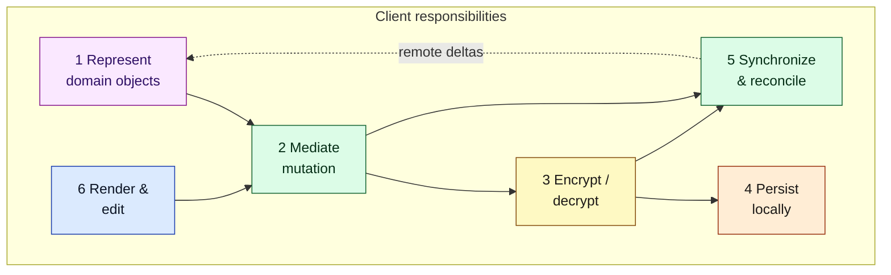
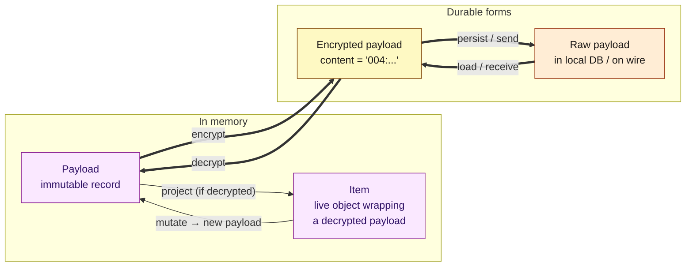
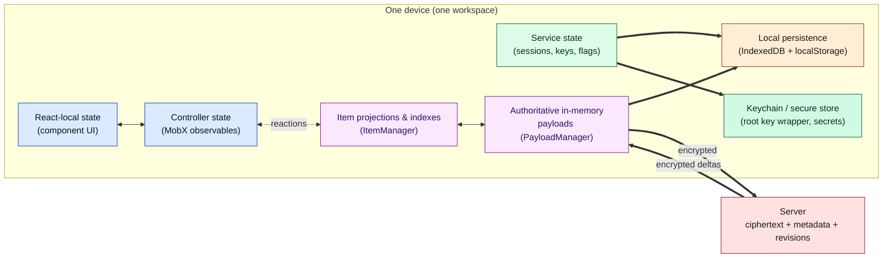
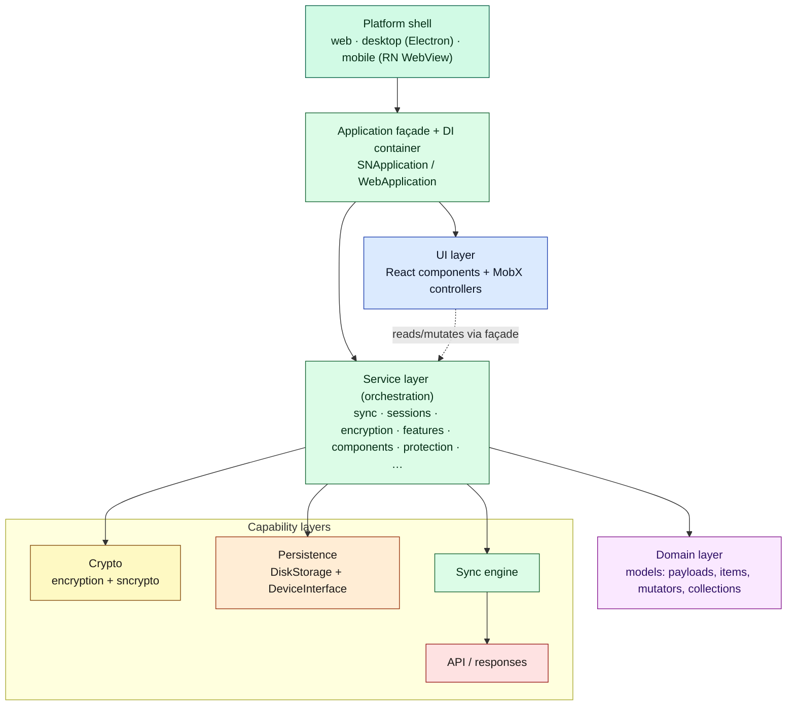
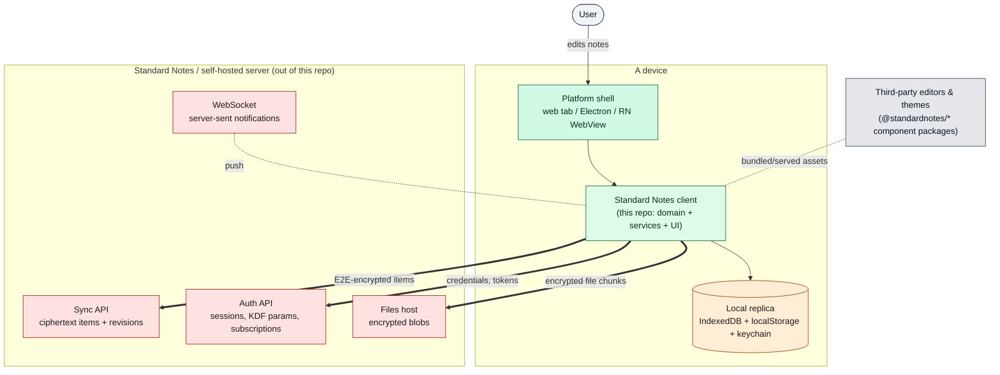

# Document 01 — First Principles and System Mental Model

> **Prerequisite:** [00 — Documentation Map](./00-documentation-map.md) (conventions, glossary, version).
> **Source version:** commit `e1ebcba3c32c7cb68fdf00bb48bac49a5c10f07d`, branch `main`.

## Purpose

Build one durable mental model of Standard Notes that stays useful through every later document. After this you should be able to predict, roughly, where any given behavior lives before you open a file.

## Architectural questions answered

- What *fundamentally* is Standard Notes, as a running system?
- What are its primary architectural responsibilities?
- What state exists, where can it live, and who owns the authoritative copy?
- What transformations happen between a keystroke and durable encrypted bytes?
- What separates shell, domain, persistence, sync, crypto, editors, and UI?
- Which abstractions are *architectural* and which are *implementation conveniences*?

---

## 1. The one-sentence model

> **Standard Notes is an offline-first, end-to-end-encrypted, eventually-consistent replicated object store, wrapped in a pluggable-editor UI, whose server is deliberately a near-dumb store of ciphertext.**

Everything else follows from unpacking that sentence. Each clause is a hard constraint that explains a large part of the architecture:

| Clause | Consequence you will see everywhere |
| ------ | ----------------------------------- |
| **object store** | The unit of everything is a generic *item/payload* with a `content_type`, not a “note table.” Notes, tags, editors, keys, preferences, files-metadata are all items. |
| **replicated** | Every device holds a full local replica; the server holds another. Sync reconciles replicas. |
| **eventually-consistent** | There is no global lock. Concurrent edits are expected and resolved by client-side conflict rules, often by *duplicating* an item. |
| **end-to-end-encrypted** | The client encrypts before persisting/syncing. The server sees only ciphertext + minimal metadata. All correctness-critical logic is client-side. |
| **offline-first** | The local replica is fully usable with no network and no account. The account/sync is an *enhancement*, not a prerequisite. |
| **pluggable-editor UI** | The thing that renders a note is decoupled from the note’s durable representation. Editors are swappable and sandboxed. |
| **near-dumb server** | The server does auth, blob storage, revision history, and a shallow conflict signal — but it does **not** understand note content and cannot decrypt anything. |

Keep this table in your head. When you wonder “where does behavior X live?”, the answer is almost always *client-side*, because the server cannot see plaintext.

---

## 2. What the system must do (primary responsibilities)

The client owns six responsibilities the server cannot help with. These map almost one-to-one onto the package layers you will meet in [Document 02](./02-repository-and-package-architecture.md).



**How to read it:** solid arrows are the write path (edit → mutate → encrypt → persist/sync). The dashed arrow is the read-back path: remote changes re-enter the model and propagate to the UI. Rendering never writes durable state directly — it always goes through mutation. That single rule (Responsibility 2 sits between 6 and everything durable) is the backbone invariant of the whole app.

---

## 3. The core object model: Payload vs Item

This is the single most important distinction in the codebase. Get it wrong and nothing else parses.

- A **Payload** is an *immutable* plain-data record: `{ uuid, content_type, content, ...metadata, dirty?, deleted?, ... }`. It is the unit of persistence and sync. You never mutate a payload; you produce a *new* payload. Payloads come in flavors by encryption state: **Decrypted**, **Encrypted** (its `content` is a ciphertext string), and **Deleted** (tombstone).
- An **Item** is a *live domain object* — a class instance (`SNNote`, `SNTag`, `SNItemsKey`, `FileItem`, …) that wraps a **decrypted** payload and adds typed accessors and behavior. Items are what UI and services work with.



**Architectural conclusion:** *immutability of payloads* is what makes the rest tractable. Because a payload never changes in place, the system can (a) keep the old and new side by side to detect conflicts, (b) treat “dirty” as a property of a specific payload version, and (c) cache aggressively without aliasing bugs. Mutation is modeled as *replacement*, not *edit*. (Observed — see [Document 04](./04-state-architecture.md) and [Document 05](./05-data-lifecycle-and-e2e-traces.md).)

`content_type` (a string like `Note`, `Tag`, `SN|ItemsKey`, `SN|Component`) is the discriminator that decides which `Item` subclass is built and which behaviors apply. It is the app’s open-ended type system: adding a content type is how you add a new *kind* of thing without schema migrations on the server. (Observed.)

---

## 4. State: what exists and where it can live

There are only a handful of *categories* of state, but each can live in several places. The full inventory and ownership matrix is [Document 04](./04-state-architecture.md); here is the mental model.



**Authority rules (the part people get wrong):**

- **In memory, `PayloadManager` is authoritative.** It holds the current version of every payload; `ItemManager` derives items and indexes from it. UI/controllers are *downstream projections* and never a source of truth. (Observed — `PayloadManager`/`ItemManager` wiring, [Document 04](./04-state-architecture.md).)
- **On one device across restarts, the local database is authoritative.** On launch, the app hydrates memory from the local DB *before* contacting the server; the app is usable offline from local state alone. (Observed — `SNApplication.launch()` loads DB payloads then syncs; see [Document 03](./03-bootstrap-and-dependency-construction.md).)
- **Across devices, the server is the convergence point,** but it is *not* an oracle of truth for content — it stores whatever ciphertext each client last pushed, plus per-item timestamps used to detect divergence. Conflicts are resolved on the *client* by comparing timestamps and, when in doubt, **duplicating** the item. (Observed — [Document 06](./06-synchronization-architecture.md).)
- **Secrets (root key material) live in the most protected store available per platform** — an in-memory root key plus, optionally, a passcode-derived wrapping key; on desktop/mobile a native keychain. They are deliberately *not* in the same layer as item data. (Observed — [Document 07](./07-cryptographic-architecture.md), [Document 19](./19-security-boundaries.md).)

---

## 5. The transformation pipeline (user action → durable encrypted state)

This is the write path in one picture. Memorize it; most of [Document 05](./05-data-lifecycle-and-e2e-traces.md) is this pipeline instantiated for specific operations.

```mermaid
sequenceDiagram
    autonumber
    participant U as User / editor (UI)
    participant M as MutatorService
    participant PM as PayloadManager
    participant IM as ItemManager
    participant SY as SyncService
    participant EN as EncryptionService
    participant ST as DiskStorage → DeviceInterface
    participant SV as Server

    U->>M: change note text
    M->>PM: emit new dirty payload (immutable)
    PM->>IM: delta notification
    IM-->>U: updated item streamed to observers
    Note over PM,ST: local durability (offline-safe)
    PM->>SY: item is dirty
    SY->>EN: encrypt dirty payloads
    EN-->>SY: encrypted payloads (004 ciphertext)
    SY==>ST: persist encrypted payloads locally
    SY==>SV: upload encrypted payloads
    SV-->>SY: saved + any conflicts
    SY->>EN: decrypt retrieved/conflicted
    SY->>PM: emit reconciled payloads
    PM->>IM: delta → UI updates
```

**How to read it:** control flow is top-to-bottom; `==>` steps cross a durability/network boundary. The key structural fact: **the UI is updated from the model twice** — first optimistically when the local payload changes (steps 3–4), and again after the server round-trip resolves conflicts (steps 11–12). The user sees their edit instantly; convergence happens behind it. (Observed.)

Two properties fall out of this pipeline:

1. **Encryption is a boundary crossing, not a step in the domain.** Domain code deals in decrypted payloads; ciphertext appears only at the persistence/sync boundary and disappears again on the way in. This is why exactly two packages “know” how to encrypt (`encryption`, with primitives in `sncrypto-*`) while dozens of packages handle items. (Observed — [Document 07](./07-cryptographic-architecture.md), [Document 19](./19-security-boundaries.md).)
2. **Dirty tracking is the join between local edits and sync.** “Dirty” is a flag on a payload meaning “not yet confirmed saved to the server.” Sync’s job is to drive dirty → clean. (Observed — [Document 06](./06-synchronization-architecture.md).)

---

## 6. Separation of concerns (the layers)

The system is layered, and the layers are enforced mostly by *package boundaries* and a *dependency-injection composition root*. Full detail in [Document 02](./02-repository-and-package-architecture.md) and [Document 03](./03-bootstrap-and-dependency-construction.md); the mental model:



The essential separations, and *why* each exists:

- **Shell ↔ everything else** exists so the same domain/service/UI code runs on web, desktop, and mobile. The seam is the `DeviceInterface` port (storage, keychain, platform capabilities) plus environment flags. Adding a platform ≈ implementing that port. (Observed — [Document 13](./13-multi-platform-architecture.md).)
- **UI ↔ domain/services** exists so the durable model is testable and portable without React, and so the UI can be replaced. The seam is the `Application` façade and a set of MobX **controllers** that subscribe to service streams and expose observables. The domain runs *outside* React on purpose. (Observed — [Document 10](./10-react-architecture.md).)
- **Domain ↔ crypto** exists so the vast majority of code never touches keys or ciphertext. The seam is `EncryptionService`, which converts between decrypted and encrypted payloads. (Observed.)
- **Domain ↔ persistence/sync** exists so “where bytes live” and “how replicas converge” are independent of “what a note is.” The seams are `DiskStorageService`/`DeviceInterface` and `SyncService`. (Observed.)

---

## 7. Architectural abstractions vs implementation conveniences

Not every named thing is load-bearing. Distinguishing the two tells a maintainer where they may refactor freely and where they must tread carefully.

| Abstraction | Architectural or convenience? | Why |
| ----------- | ----------------------------- | --- |
| Payload immutability & `content_type` | **Architectural** | Correctness of conflict detection, caching, and the open type system depend on it. |
| `PayloadManager` as sole in-memory authority | **Architectural** | The single-writer-of-truth invariant. |
| `DeviceInterface` port | **Architectural** | The entire multi-platform strategy. |
| `EncryptionService` boundary | **Architectural** | The E2EE trust boundary. |
| Operator versioning (`00x`) | **Architectural** | Enables protocol upgrades without breaking old data. |
| DI container (`Dependencies`) | **Mostly convenience** | It is *how* services are wired, but the graph could be wired differently; the service boundaries are the real architecture. |
| MobX vs another store | **Convenience** | The UI↔service *bridge* is architectural; the choice of MobX is swappable. |
| `SNApplication` god-object | **Convenience with architectural side-effects** | Its breadth is ergonomic; the underlying services are the architecture (see [Document 23](./23-legacy-architecture-and-technical-debt.md)). |
| `snjs` aggregator package | **Convenience** | A re-export barrel; not a runtime component. |

*(Inferred where marked “convenience”: based on how tightly each is coupled to invariants elsewhere; challenged/confirmed in later documents.)*

---

## 8. High-level system context diagram

Zoom all the way out: the app, the humans, and the external systems it touches.



**Boundary conclusion:** the only bytes that leave the device are ciphertext (items, files) and authentication material. The server components live in a *different* repository (`standardnotes/server`); this repo is the **client** plus a thin optional “home server” bridge on desktop. Everything correctness- and privacy-critical is on the left of the `==>` edges. (Observed for the client boundary; server internals are out of scope — Unknown from this repo alone.)

---

## What you should now understand

- The one-sentence model and the seven constraints it encodes.
- Why *payload vs item* is the load-bearing distinction, and why payloads are immutable.
- The categories of state and the three authority rules (memory → `PayloadManager`; device → local DB; cross-device → server-as-convergence, conflicts by duplication).
- The write pipeline (mutate → local durability → encrypt → persist/sync → reconcile → UI), and that the UI updates twice.
- The layer seams and the causal reason each exists.

## Architectural invariants learned

1. **All plaintext-dependent logic is client-side; the server never sees plaintext.**
2. **Payloads are immutable; mutation is replacement.**
3. **`PayloadManager` is the sole in-memory source of truth; UI is a projection.**
4. **Encryption is a boundary crossing between domain and persistence/sync, isolated to the crypto packages.**
5. **The app is usable offline from the local replica before the server is ever contacted.**

## Open questions

- Server-side conflict *signaling* details (what exactly the server compares) are only visible from the client’s handling of responses; the server implementation is out of this repo. Revisited from the client’s perspective in [Document 06](./06-synchronization-architecture.md).

## Source index

- `packages/snjs/lib/Application/Application.ts` — `SNApplication`, launch pipeline, service façade.
- `packages/web/src/javascripts/Application/WebApplication.ts` — web subclass, UI controllers.
- `packages/snjs/lib/Application/Dependencies/Types.ts` — the service inventory.
- `packages/services/src/Domain/Service/AbstractService.ts` — base service (observers + event bus).
- `packages/web/src/index.html`, `packages/web/src/manifest.webmanifest` — bootstrap/offline facts.

## Next document

Continue to **[Document 02 — Repository and Package Architecture](./02-repository-and-package-architecture.md)**, which turns this model into a concrete package graph.
