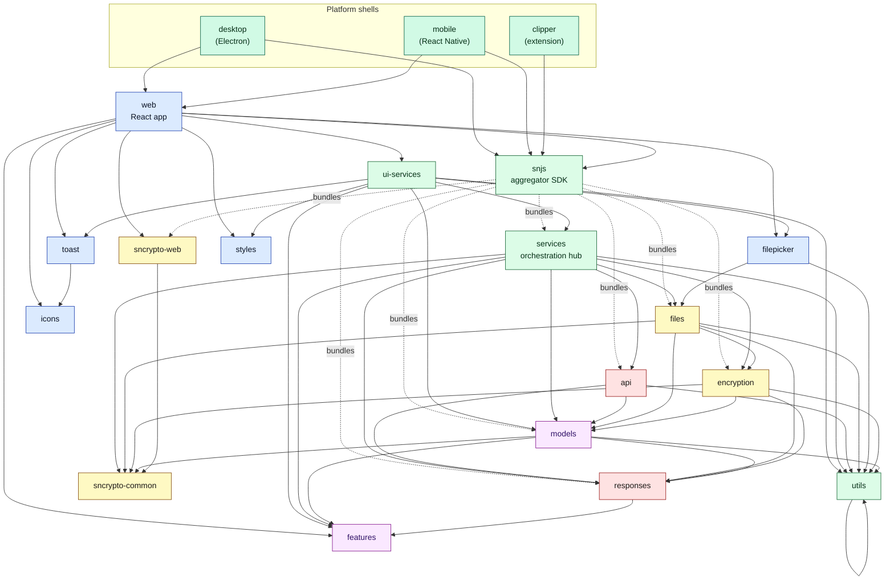
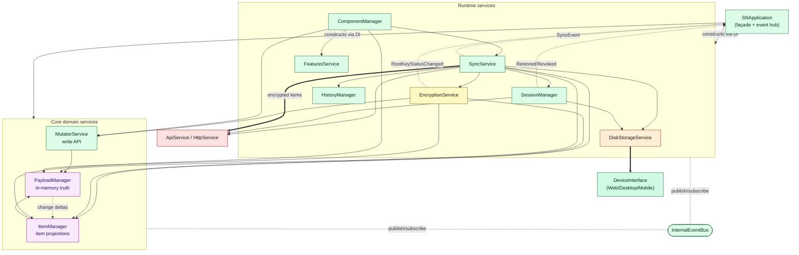
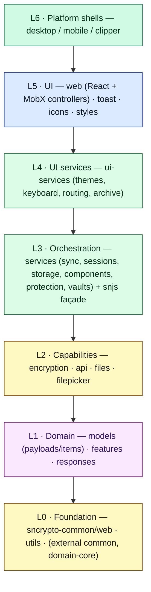

# Document 02 — Repository and Package Architecture

> **Prerequisites:** [00 — Map](./00-documentation-map.md), [01 — Mental Model](./01-first-principles-and-mental-model.md).
> **Source version:** commit `e1ebcba3c32c7cb68fdf00bb48bac49a5c10f07d`, branch `main`.

## Purpose

Turn the mental model into a concrete map of the 23 in-repo packages: what each owns, how they depend on each other at **compile time**, how they interact at **runtime** (a different graph), and how they stack into layers. This document is the reference you will return to whenever you ask “which package should I be in?”

## Architectural questions answered

- What are the packages and what does each fundamentally own?
- What is the **static** dependency graph vs the **runtime** interaction graph?
- Where are the leaves, the orchestration hubs, the façades, the adapters, the platform shells?
- Which packages ship compiled JS and which ship raw TypeScript — and why it matters?
- Where are the dependency cycles and inversions?

---

## 1. Repository topology

```
standardnotes-app/            Yarn 3 workspaces + Lerna-Lite (independent versions)
├── package.json              root scripts: build:web/desktop/mobile/snjs, lint, test
├── lerna.json                { "version": "independent", "npmClient": "yarn" }
├── packages/
│   ├── sncrypto-common/       crypto primitive interfaces (PureCryptoInterface)
│   ├── sncrypto-web/          WebCrypto + libsodium (WASM) implementation
│   ├── utils/                 pure helpers (arrays, dates, sorting, Result)
│   ├── features/              static capability descriptors (editors/themes/perms)
│   ├── responses/             server response DTOs + error types
│   ├── models/                domain: payloads, items, mutators, collections
│   ├── encryption/            operators 001–004, key models, KDF, backups (stateless)
│   ├── api/                   HTTP API clients + servers (endpoints)
│   ├── files/                 encrypted file streaming (chunked xchacha)
│   ├── filepicker/            platform file open/save + stream targets
│   ├── services/              orchestration hub: sync, sessions, encryption svc, …
│   ├── toast/                 toast UI primitive (React)
│   ├── icons/                 SVG icon components
│   ├── styles/                shared CSS/SCSS tokens
│   ├── ui-services/           UI-facing services (themes, keyboard, archive, routes)
│   ├── snjs/                  aggregator SDK: SNApplication + re-export barrel
│   ├── web/                   React app shell + controllers + editors integration
│   ├── desktop/               Electron main/preload wrapping web
│   ├── mobile/                React Native shell hosting web in a WebView
│   ├── clipper/               browser-extension build reusing snjs
│   └── releases/              generated release metadata (desktop/mobile/web)
└── ...
```

**External `@standardnotes/*` dependencies** (not in this repo; published npm packages, mostly from `standardnotes/server`): `common` (enums, protocol version, base types), `domain-core` (`Result`, `Uuid`, value objects), `domain-events`, `settings`, plus the editor/theme component packages (`rich-text`, `bold-editor`, `spreadsheets`, `simple-task-editor`, `markdown-*`, `classic-code-editor`, `authenticator`, `*-theme`) and platform helpers (`electron-clear-data`, `react-native-utils`, `config`). These are consumed as prebuilt artifacts. (Observed — `packages/*/package.json`.)

---

## 2. The `main: src` vs `main: dist` split (read this before the graphs)

A structurally important and easily-missed fact: **the packages fall into two camps by how they are consumed.**

| Camp | `main` field | Packages | Consumed as |
| ---- | ------------ | -------- | ----------- |
| **Prebuilt** | `dist/*.js` | `api`, `features`, `responses`, `models`, `sncrypto-common`, `sncrypto-web`, `utils`, `icons`, `styles`, `snjs` (`dist/snjs.js`), `web` (`dist/app.js`), `releases` | Compiled JS imported directly |
| **Source** | `./src/index.ts` | `encryption`, `files`, `filepicker`, `services`, `ui-services`, `toast` | **Raw TypeScript**, transpiled by the *consumer’s* build |

*(Observed — the `main` fields in each `package.json`.)*

**Why this matters (causal chain):**

- *Problem:* the app must build for three platforms with different bundlers, and iterate quickly in dev.
- *Constraint:* forcing a separate `tsc` build of every leaf package before the app builds is slow and error-prone in a monorepo.
- *Abstraction:* let the **application bundler** (webpack + babel in `web`) compile the “source” packages directly from `.ts`. `web`’s babel config transpiles `node_modules/@standardnotes/{services,ui-services,encryption,…}/src`.
- *Runtime consequence:* editing `packages/services/src/**` is picked up by `web`’s dev server with no intermediate build; but it also means these packages are **not independently tree-shaken or type-checked at publish time the way prebuilt ones are**, and a package like `snjs` (prebuilt) can end up bundling *its own* copy of `services` while `ui-services` pulls `services` from source — a duplication risk discussed in [Document 14](./14-build-system-and-delivery.md).
- *Tradeoff:* fast iteration and simpler wiring, at the cost of larger/duplicated bundles and the `snjs` barrel being a second, pre-bundled copy of the domain.

Hold onto this: it explains several oddities in the build and bundle-size story.

---

## 3. Static (compile-time) dependency graph

This graph is **“package A’s source imports from package B.”** It says nothing about who calls whom at runtime (Section 5). Foundations at the bottom, shells at the top. External `@standardnotes/*` deps (`common`, `domain-core`) are omitted for readability — nearly everything depends on them.



**How to read it & what it demonstrates:**

- The graph is a **DAG at the package level** — there are no package-to-package cycles among in-repo packages. (Observed by inspecting all `dependencies`/`devDependencies`.) Cycles *do* exist *inside* `web` and `snjs` at the module level, which is why both enable webpack’s `circular-dependency-plugin` (see [Document 14](./14-build-system-and-delivery.md); Observed).
- `services` is the **orchestration hub** — the highest in-degree/out-degree non-shell node (depends on 8 in-repo packages, consumed by `snjs` and `ui-services`). If you break `services`, you break everything above it.
- `models` is the **domain core** — everything durable depends on it, and it depends only on truly foundational packages. This is correct dependency direction: domain at the bottom, orchestration above.
- `snjs` is a **façade/barrel** (dashed “bundles” edges): it re-exports and pre-bundles the domain+services so consumers can `import { ... } from '@standardnotes/snjs'`. It is *not* a runtime layer.
- The three shells sit on top and depend on `web` (except `clipper`, which uses `snjs` directly).

### Package classification

| Role | Packages | Evidence |
| ---- | -------- | -------- |
| **Leaf / foundation** (no in-repo deps or only `utils`) | `sncrypto-common`, `icons`, `styles`, `utils` (only external `common`) | package.json |
| **Domain core** | `models`, `features`, `responses` | models is the item/payload home |
| **Capability libs** | `encryption`, `api`, `files`, `filepicker`, `sncrypto-web` | stateless-ish, single-concern |
| **Orchestration hub** | `services` (and `ui-services` for UI) | depends on ~8 packages; owns stateful services |
| **Façade / aggregator** | `snjs` | re-export barrel + prebuilt bundle |
| **UI shell** | `web`, `toast` | React |
| **Platform adapters** | `desktop`, `mobile`, `clipper` | wrap `web` per platform |
| **Generated data** | `releases` | build artifact |
| **Suspiciously broad** | `services` (60+ services), `web` (app + all controllers + editor integration) | see §7 |

---

## 4. Package matrix

The master reference. `Public surface` lists the headline exports; `Runtime role` says when it participates; `State` and `Persistence` say whether it holds/owns durable state. Deep per-field dives (lifecycle, invariants, failure modes, extension points) are in [Document 24](./24-per-package-deep-dives.md).

| Package | Responsibility (owns) | Public surface (headline) | Depends on (in-repo) | Consumed by | Runtime role | Holds state? | Persists? | Side effects |
| ------- | --------------------- | ------------------------- | -------------------- | ----------- | ------------ | ------------ | --------- | ------------ |
| **sncrypto-common** | Crypto primitive **contract** | `PureCryptoInterface`, algorithm enums | — | encryption, files, models, services, sncrypto-web | Types only | No | No | None |
| **sncrypto-web** | Web crypto **implementation** | `SNWebCrypto` (WebCrypto + libsodium WASM) | sncrypto-common | web (injected as `crypto`) | Executes all primitive crypto | No | No | WASM init, `crypto.subtle` |
| **utils** | Pure helpers | `Uuid`, sorting, `Result` re-exports, `sleep`, array ops | — | ~everyone | Pure functions | No | No | None |
| **features** | Static capability **descriptors** | `FeatureIdentifier`, `NativeFeature`, `GetFeatures()` | — | models, responses, services, ui-services, web | Lookup tables | Static consts | No | None |
| **responses** | Server response **DTOs** | `HttpResponse`, `*Response`, `ClientDisplayableError`, `ConflictType` | features | api, models, encryption, files, services | Types + error objects | No | No | None |
| **models** | **Domain**: payloads, items, mutators, collections, deltas | `DecryptedPayload`, `SNNote`, `SNTag`, `ItemInterface`, `ImmutablePayloadCollection`, `ContentType` | features, responses, sncrypto-common, utils | encryption, api, files, services, everything | The object model everywhere | Value objects (immutable) | No | None |
| **encryption** | **Stateless crypto**: operators 001–004, `RootKey`/`ItemsKey` models, KDF params, backups | `SNRootKey`, `RootKeyParams`, `Operator004`, `EncryptionOperators` | models, responses, sncrypto-common, utils | services, files | Encrypt/decrypt/derive on demand | No (operators are stateless) | No | Calls crypto primitives |
| **api** | HTTP **endpoints** | `HttpService`, `SessionApiService`, `*Server` | models, responses, utils | services, snjs | Executes network calls | Auth token in memory | No | **Network** |
| **files** | **Encrypted file** streaming | `FileService`, encrypt/decrypt streams, `BackupService` iface | encryption, models, responses, sncrypto-common, utils | services, filepicker | Chunked file crypto + up/download | Transient stream state | Via device | Network, streams |
| **filepicker** | Platform file **I/O** | `FilePicker`, stream targets | files, utils | ui-services, web | Open/save dialogs, stream to disk | No | Writes files | Filesystem/`showSaveFilePicker` |
| **services** | **Orchestration**: sync, sessions, encryption svc, storage, items/payloads, components, protection, features, vaults, history, … | `SyncService`, `EncryptionService`, `ItemManager`, `PayloadManager`, `DiskStorageService`, `SessionManager`, `AbstractService`, `InternalEventBus` | api, encryption, files, models, responses, features, sncrypto-common, utils | snjs, ui-services | The running brain of the app | **Yes — most app state** | Yes (via device) | Network, storage, timers |
| **toast** | Toast **UI** | `addToast`, `ToastType`, `<ToastContainer>` | icons | ui-services, web | React notifications | Small in-memory store | No | DOM |
| **icons** | SVG **icons** | icon React components | — | toast, web | Presentational | No | No | None |
| **styles** | Design **tokens/CSS** | SCSS/CSS, Tailwind tokens | — | ui-services, web | Styling | No | No | None |
| **ui-services** | **UI-facing services** | `ThemeManager`, `KeyboardService`, `ArchiveManager`, `RouteService`, `WebApplicationInterface`, `AutolockService` | services, filepicker, models, features, styles, toast, utils | web | Bridge domain ↔ UI concerns | Yes (theme, autolock) | Via storage | DOM, timers, files |
| **snjs** | **Aggregator SDK** + `SNApplication` + migrations + application group | `SNApplication`, `SNApplicationGroup`, re-exports of models/services/encryption/… | (bundles) services, encryption, files, models, api, responses, sncrypto-web | web, desktop, mobile, clipper | Composition root + barrel | Owns the DI container | Delegates | Delegates |
| **web** | **React app**: components, MobX controllers, editor integration, `WebApplication`, `WebDevice` | `WebApplication`, `ApplicationGroupView`, controllers, `WebDevice` (IndexedDB) | snjs, ui-services, sncrypto-web, styles, toast, icons, filepicker, features | desktop, mobile, clipper | The UI + web device impl | Yes (controllers) | IndexedDB/localStorage | DOM, network, workers, storage |
| **desktop** | **Electron** main+preload | main process, IPC bridge, `DesktopDevice`, auto-update, components server | snjs, utils, web, `electron-clear-data` | releases | Native shell | Window/menu state | Files, keychain | FS, keychain, IPC, network |
| **mobile** | **React Native** shell | RN app hosting web in WebView, native `MobileDevice` bridge | snjs, web, `react-native-utils` | releases | Native shell | Bridge state | Native storage/keychain | Native modules |
| **clipper** | **Browser extension** | extension entry reusing snjs | snjs | — | Web-clipper shell | Minimal | Extension storage | Extension APIs |
| **releases** | **Release metadata** | `releases.json` | (dev) desktop, mobile, web | update checks | Static data | No | No | None |

---

## 5. Runtime interaction graph (different from §3!)

Static imports do **not** equal runtime calls. At runtime, services are constructed lazily by the DI container and communicate through a mix of **direct method calls**, a shared **`InternalEventBus`**, and **per-service observer lists**. This graph shows the *actual* hot runtime edges among the core services, derived from the DI factory wiring in `packages/snjs/lib/Application/Dependencies/Dependencies.ts` and each service’s constructor.



**How to read it & what it demonstrates:**

- **Two communication planes.** Solid arrows are direct constructor-injected calls (e.g. `SyncService` calls `EncryptionService.encryptSplit(...)`). Dashed `-. event .-` arrows are decoupled notifications: services extend `AbstractService`, whose `notifyEvent` both invokes registered observer callbacks *and* publishes to the shared `InternalEventBus` (`packages/services/src/Domain/Service/AbstractService.ts:30-53`, Observed). The `SNApplication` wires the important service→app observer edges in `registerServiceObservers()` (`packages/snjs/lib/Application/Application.ts:236-364`, Observed).
- **`PayloadManager` is the runtime sink of truth.** All roads (mutation, sync apply, encryption results) push new payloads into `PayloadManager`, which then emits deltas that `ItemManager` turns into item-change notifications (the mechanism the UI observes). (Observed; detailed in [Document 04](./04-state-architecture.md).)
- **`DeviceInterface` is the only edge to durable local storage** — every persistence path funnels through `DiskStorageService → DeviceInterface`, which is the per-platform seam. (Observed.)
- Compare with §3: e.g. `models` is imported by almost everyone (static) but at runtime it is *passive data* — it does not “call” anything. Conversely `InternalEventBus` barely appears in the static graph (a single class) yet is a central runtime hub. **Static centrality ≠ runtime centrality.**

Full event taxonomy and ordering guarantees are in [Document 15](./15-events-and-internal-communication.md).

---

## 6. Layered architecture diagram

A third view: neither imports nor runtime calls, but **conceptual layers** and the direction of allowed dependency.



**Rule the layering encodes:** dependencies point **down only**. A lower layer must never import an upper layer. The one apparent exception — the UI needing services — is resolved by **dependency inversion**: `ui-services` defines `WebApplicationInterface` (a port) that the `web` layer implements, rather than `services` importing `web`. (Observed — `WebApplicationInterface` in `ui-services`, implemented by `WebApplication`.) This is the main dependency-inversion seam in the codebase.

---

## 7. Notable structural findings

- **Dependency cycles:** none at package granularity; several at *module* granularity inside `web` and `snjs` (webpack `circular-dependency-plugin` is configured to warn, not fail — [Document 14](./14-build-system-and-delivery.md)). *(Observed that the plugin is enabled; the specific cycles are enumerated in Doc 14 — Inferred to be intra-package.)*
- **Dependency inversion:** `ui-services` → `WebApplicationInterface` implemented by `web`; `services` → `DeviceInterface` implemented by each shell; `files` → `BackupServiceInterface` implemented by `desktop`. Ports live low, implementations live high.
- **Façade packages:** `snjs` (barrel + composition root). It also *pre-bundles* the domain, creating the duplication caveat from §2.
- **Adapter packages:** `desktop`, `mobile`, `clipper`, `sncrypto-web` (adapts browser crypto to `PureCryptoInterface`), `filepicker` (adapts platform file APIs).
- **Orchestration layer:** `services` (+ `ui-services` for UI concerns).
- **Leaf packages:** `sncrypto-common`, `icons`, `styles`, `utils`, `releases`.
- **Platform-specific packages:** `desktop`, `mobile`, `clipper`, and the platform `DeviceInterface` implementations inside `web`.
- **Suspiciously broad responsibilities (watch these):**
  - **`services`** hosts 60+ services and ~100 use-cases (Observed — `TYPES` in `packages/snjs/lib/Application/Dependencies/Types.ts`). It is really a dozen subsystems in one package. Splitting it is a recurring temptation; the DI container is what keeps it navigable.
  - **`web`** contains the app shell *and* every MobX controller *and* editor integration *and* the web `DeviceInterface` (`Application/Database.ts`). It mixes “platform device” with “UI,” which is why some device concerns leak into `web` rather than a dedicated package.
  - **`snjs`** is simultaneously a barrel, a bundle, the `SNApplication` composition root, the migrations home, and the e2e test server — a lot of unrelated responsibilities under one name (see [Document 23](./23-legacy-architecture-and-technical-debt.md)).

---

## What you should now understand

- The 23 packages, their responsibilities, and how to classify each (leaf, domain, capability, orchestration, façade, adapter, shell).
- The three distinct graphs — **static imports**, **runtime interactions**, **conceptual layers** — and why they differ.
- The `src` vs `dist` consumption split and its build/bundle consequences.
- Where the orchestration hub (`services`) and domain core (`models`) sit, and where the platform seams are.

## Architectural invariants learned

- **Dependencies point down the layer stack; UI↔service coupling is inverted via ports (`WebApplicationInterface`, `DeviceInterface`).**
- **No package-level cycles; `models` never depends on `services` (domain stays below orchestration).**
- **All local persistence funnels through `DiskStorageService → DeviceInterface`.**

## Open questions

- Exact intra-package module cycles flagged by `circular-dependency-plugin` — enumerated/verified in [Document 14](./14-build-system-and-delivery.md).
- Degree of `services` duplication between `snjs/dist` and source-consumed `ui-services` — quantified in Doc 14 (Inferred here).

## Source index

- All `packages/*/package.json` (dependency edges, `main` fields, versions).
- `packages/snjs/lib/Application/Dependencies/Dependencies.ts` (runtime wiring).
- `packages/snjs/lib/Application/Dependencies/Types.ts` (service inventory).
- `packages/services/src/Domain/Service/AbstractService.ts` (event mechanism).

## Next document

Continue to **[Document 03 — Bootstrap and Dependency Construction](./03-bootstrap-and-dependency-construction.md)**: how these packages come alive in the right order.
