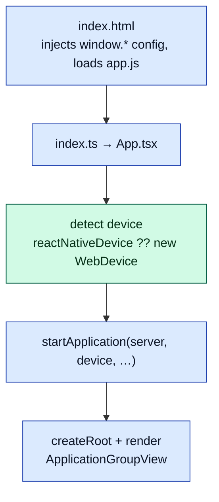
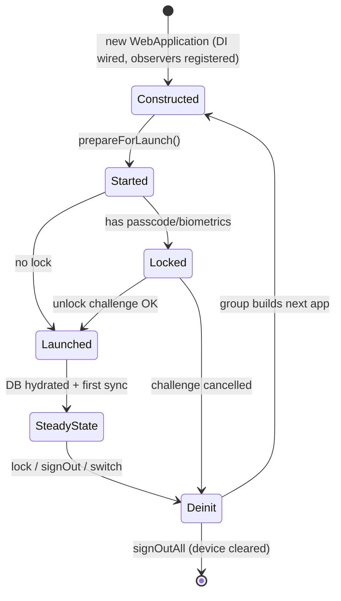

# Document 03 — Bootstrap and Dependency Construction

> **Prerequisites:** [01 — Mental Model](./01-first-principles-and-mental-model.md), [02 — Packages](./02-repository-and-package-architecture.md).
> **Source version:** commit `e1ebcba3c32c7cb68fdf00bb48bac49a5c10f07d`, branch `main`.

## Purpose

Trace exactly how the application comes alive: from the browser loading `app.js` to a launched, editable workspace. This is the spine every other subsystem hangs off. If you understand this document, you can place any service in time (“when is it constructed? when initialized? when is it safe to call?”).

## Architectural questions answered

- What are the entry points, and how is the platform/device detected?
- How are the two dependency-injection containers built, and what is the singleton behavior?
- What is a “workspace,” and how does `ApplicationGroup` pick one?
- What is the exact ordered launch sequence, and which steps are awaited vs deferred?
- What are the boot **failure** paths and the **restart/teardown** paths?

---

## 1. Entry points and the `window` bootstrap

The web bundle’s entry is trivial; almost everything is deferred to `App.tsx`.

```
packages/web/src/javascripts/index.ts  →  import './App'
```

`index.ts` only imports global CSS and `./App` (`packages/web/src/javascripts/index.ts:1-6`, Observed). The real bootstrap lives in `App.tsx`:

- **Configuration by global injection.** `index.html` inlines a `<script>` that sets `window.defaultSyncServer`, `window.websocketUrl`, `window.defaultFilesHost`, etc., *before* `app.js` loads (`packages/web/src/index.html:34-46`, Observed). This is the app’s primary configuration channel — not env vars at runtime, but server-rendered globals. Desktop and mobile overwrite these globals before loading the bundle (see [Document 13](./13-multi-platform-architecture.md)).
- **Platform/device detection.** On a plain web platform, `App.tsx` waits a tick, then constructs the device:

```ts
// packages/web/src/javascripts/App.tsx:115-131 (cropped)
if (IsWebPlatform) {
  setTimeout(() => {
    const device = window.reactNativeDevice || new WebDevice(WebAppVersion) // mobile injects its device
    if (window.isClipper) device.environment = Environment.Clipper
    window.platform = getPlatform(device)
    startApplication(window.defaultSyncServer, device, window.enabledUnfinishedFeatures, window.websocketUrl)
  }, 0)
} else {
  window.startApplication = startApplication // desktop calls it explicitly after injecting its device
}
```

The `setTimeout(…, 0)` exists so a React Native WebView host has one macrotask to inject `window.reactNativeDevice` before the app reads it (`ReactNativeWebViewInitializationTimeout = 0`, Observed; the *reason* is Inferred from the mobile injection path). If no native device was injected, a `WebDevice` (browser IndexedDB/localStorage implementation) is used.

- **React root creation.** `startApplication` builds the DOM root imperatively (no static `<div id="app">`; the root `<div>` is created and appended to `<body>`), then renders `<ApplicationGroupView>` (`packages/web/src/javascripts/App.tsx:51-101`, Observed). It also special-cases the `u2f` route to render a standalone iframe component.



---

## 2. Workspaces: the ApplicationGroup

`ApplicationGroupView` (a **React class component**) is the boundary between React and the domain. In its constructor it creates a `WebApplicationGroup`, exposes it as `window.mainApplicationGroup`, subscribes to its events, and calls `group.initialize()` (`packages/web/src/javascripts/Components/ApplicationGroupView/ApplicationGroupView.tsx:41-84`, Observed).

An **`ApplicationGroup`** owns the set of *workspaces* (called **descriptors**) and constructs the active `Application`:

- Descriptors are persisted as a `DescriptorRecord` in raw storage under `RawStorageKey.DescriptorRecord`. On first run, a single primary descriptor with identifier `'standardnotes'` is created — deliberately reusing the historical database name (`packages/snjs/lib/ApplicationGroup/ApplicationGroup.ts:90-108`, Observed).
- `initialize()` loads the descriptor record, finds the primary descriptor, and calls `buildApplication(primary)`, which invokes the `applicationCreator` callback to `new WebApplication(...)` (`ApplicationGroup.ts:51-88` + `WebApplicationGroup.ts:38-48`, Observed).
- When the primary application is built, the group fires `PrimaryApplicationSet`; `ApplicationGroupView` stores it in React state and renders `ApplicationView` **keyed by `application.ephemeralIdentifier`** (`ApplicationGroupView.tsx:61-72, 126-140`, Observed). That key is the crux of the restart model: a new `ephemeralIdentifier` forces React to unmount/remount the entire app subtree.

**Why a group at all?** Standard Notes supports multiple accounts/workspaces on one device. The group is the multiplexer: exactly one `primaryApplication` is live; switching or signing out deinits it and builds another. (Observed — `unloadCurrentAndActivateDescriptor`, `ApplicationGroup.ts:242-250`.)

---

## 3. Two dependency-injection containers

There are **two** DI containers, at two layers:

| Container | Class | Scope | Keys | Where |
| --------- | ----- | ----- | ---- | ----- |
| Domain container | `Dependencies` | one per `SNApplication` | `Symbol.for(...)` in `TYPES` | `packages/snjs/lib/Application/Dependencies/Dependencies.ts` |
| UI container | `WebDependencies extends DependencyContainer` | one per `WebApplication` | `Web_TYPES` | `packages/web/src/javascripts/Application/Dependencies/WebDependencies.ts` |

Both share the same **lazy-singleton** mechanism. The domain container:

```ts
// packages/snjs/lib/Application/Dependencies/Dependencies.ts:186-238 (cropped)
export class Dependencies {
  private factory = new Map<symbol, () => unknown>()      // maker fns
  private dependencies = new Map<symbol, unknown>()        // resolved singletons
  constructor(private options: FullyResolvedApplicationOptions) {
    this.dependencies.set(TYPES.DeviceInterface, options.deviceInterface) // seed 3 externals
    this.dependencies.set(TYPES.AlertService, options.alertService)
    this.dependencies.set(TYPES.Crypto, options.crypto)
    this.registerServiceMakers(); this.registerUseCaseMakers()            // register ~160 factories
  }
  public get<T>(sym: symbol): T {
    const dep = this.dependencies.get(sym); if (dep) return dep as T       // cached?
    const maker = this.factory.get(sym); if (!maker) throw new Error(...)  // registered?
    const instance = maker(); if (!instance) return undefined as T         // optional deps allowed
    this.dependencies.set(sym, instance); return instance as T            // memoize
  }
}
```

**Mechanism and its consequences (causal):**

- *Lazy construction.* A service is not built until first `get()`. This means **construction order is determined by access order**, not by registration order. The launch sequence (Section 4) and `registerServiceObservers()` implicitly define the real init order by which services they touch first. (Observed.)
- *Singletons.* Each symbol resolves once and is cached, so `application.sync` always returns the same `SyncService`. Constructor-injected dependencies are resolved eagerly *within* a maker (e.g. the `SyncService` maker calls `this.get(TYPES.ItemManager)` etc.), so getting one service transitively builds its whole dependency subtree. (Observed — maker bodies, `Dependencies.ts:1365-1386` for `SyncService`.)
- *Seeded externals.* `DeviceInterface`, `AlertService`, and `Crypto` are injected from the constructor `options`, i.e. they are the **platform-provided** pieces. Everything else is built from them. (Observed.)
- *Optional dependencies.* A maker may return `undefined` (e.g. desktop-only `FilesBackupService`, `HomeServerService`); `get()` tolerates it. This is how the same container serves web/desktop/mobile with different capability sets. (Observed — `Dependencies.get():229-233`.)

The UI container `WebDependencies` is the same pattern with `bind(symbol, factory)`/`get(symbol)` (from `@standardnotes/utils`’s `DependencyContainer`), and its makers construct **MobX controllers** wired to the domain via the `application` façade (e.g. `ItemGroupController(application.items, application.mutator, application.sync, …)`, `WebDependencies.ts:112-124`, Observed). See [Document 10](./10-react-architecture.md).

### Service-observer wiring at construction time

The `SNApplication` constructor does three things after building the container: set logger level, `registerServiceObservers()`, and `RegisterApplicationServicesEvents(...)` (`Application.ts:226-233`, Observed). `registerServiceObservers()` is where cross-service reactions are established by touching services (thus constructing them) and subscribing:

- `EncryptionService` `RootKeyStatusChanged` → app emits `KeyStatusChanged`.
- `SessionManager` `Restored` → trigger a sync, and create a new default items key if needed.
- `SessionManager` `Revoked` → sign out.
- `SyncService` events → forward to app events *and* call `encryption.onSyncEvent`.
- `UserService` `SignedOut` → `prepareForDeinit()` then `deinit()`.
- Plus `ProtectionService`, `PreferencesService`, `FeaturesService` bridges.

(`Application.ts:236-364`, Observed.) **Architectural note:** merely *constructing* the application wires a web of observers before launch — so services must tolerate being observed before they are initialized.

---

## 4. The launch sequence

`ApplicationView` (functional component) drives launch in a `useEffect`: `prepareForLaunch({ receiveChallenge })` then `.launch()` (`ApplicationView.tsx:55-74`, Observed). These are two distinct phases.

### Phase A — `prepareForLaunch()` (bring services to a ready-but-locked state)

```ts
// packages/snjs/lib/Application/Application.ts:374-404 (cropped)
await this.options.crypto.initialize()                       // libsodium WASM ready
this.setLaunchCallback(callback)
const databaseResult = await this.device.openDatabase(this.identifier) // IndexedDB open
this.createdNewDatabase = databaseResult?.isNewDatabase ?? false
await this.migrations.initialize()
await this.notifyEvent(ApplicationEvent.MigrationsLoaded)
await this.handleStage(ApplicationStage.PreparingForLaunch_0)
await this.storage.initializeFromDisk()                       // hydrate KV storage
await this.notifyEvent(ApplicationEvent.StorageReady)
await this.encryption.initialize()                            // load key params, items keys
await this.handleStage(ApplicationStage.ReadyForLaunch_05)
this.started = true
await this.notifyEvent(ApplicationEvent.Started)
```

### Phase B — `launch()` (unlock, then go online)

```ts
// packages/snjs/lib/Application/Application.ts:417-485 (cropped)
const launchChallenge = this.getLaunchChallenge()             // passcode/biometrics?
if (launchChallenge) { const r = await this.challenges.promptForChallengeResponse(launchChallenge); await this.handleLaunchChallengeResponse(r) }
if (this.storage.isStorageWrapped()) { await this.storage.decryptStorage() } // unwrap KV with passcode key
await this.handleStage(ApplicationStage.StorageDecrypted_09)
this.http.setHost(this.legacyApi.loadHost()); this.sockets.loadWebSocketUrl(); this.settings.initializeFromDisk()
this.launched = true
await this.notifyEvent(ApplicationEvent.Launched)
await this.handleStage(ApplicationStage.Launched_10)
await this.handleStage(ApplicationStage.LoadingDatabase_11)
if (this.createdNewDatabase) { await this.sync.onNewDatabaseCreated() }
const loadPromise = this.sync.loadDatabasePayloads().then(async () => {   // NOT awaited by default
  await this.handleStage(ApplicationStage.LoadedDatabase_12)
  this.sync.beginAutoSyncTimer()
  await this.sync.sync({ mode: SyncMode.DownloadFirst, source: SyncSource.External, sourceDescription: 'Application Launch' })
})
if (awaitDatabaseLoad) { await loadPromise }
```

**The single most important scheduling decision:** `loadDatabasePayloads()` is deliberately **not awaited** (default `awaitDatabaseLoad = false`). The app becomes “launched” and interactive *before* the local item database finishes hydrating memory; database loading and the first (download-first) sync happen in the background (`Application.ts:460-484`, Observed). This is what makes cold start feel fast on large accounts — at the cost of a window where the item list is still filling in. See [Document 16](./16-performance-engineering.md).

### The stage ladder

Stages are published on the internal event bus with `InternalEventPublishStrategy.SEQUENCE` (awaited, ordered) via `handleStage()` (`Application.ts:510-518`, Observed). The numeric suffixes encode order; services subscribe to the stages they care about (e.g. a service that must act only after storage is decrypted listens for `StorageDecrypted_09`).

| Stage | Constant | Meaning | Awaited? |
| ----- | -------- | ------- | -------- |
| 0 | `PreparingForLaunch_0` | DB open + migrations loaded | yes |
| 0.5 | `ReadyForLaunch_05` | storage + encryption initialized (still locked) | yes |
| — | `Started` event | services ready; UI may show unlock | yes |
| 9 | `StorageDecrypted_09` | passcode/biometric unlock done, KV decrypted | yes |
| 10 | `Launched_10` | host/sockets/settings loaded | yes |
| 11 | `LoadingDatabase_11` | about to hydrate items | yes |
| 12 | `LoadedDatabase_12` | items hydrated into memory | **background** |
| 13 | `FullSyncCompleted_13` | first full sync completed | on sync completion |

### End-to-end boot sequence

```mermaid
sequenceDiagram
    autonumber
    participant B as Browser
    participant AG as ApplicationGroupView (React)
    participant GRP as WebApplicationGroup
    participant APP as WebApplication / SNApplication
    participant DI as Dependencies (DI)
    participant DEV as DeviceInterface
    participant AV as ApplicationView (React)
    participant SVC as Services (crypto/storage/sync)

    B->>AG: render (App.tsx)
    AG->>GRP: new + initialize()
    GRP->>DEV: getJsonParsedRawStorageValue(DescriptorRecord)
    GRP->>APP: applicationCreator(primaryDescriptor)
    APP->>DI: new Dependencies(options) — register ~160 makers
    APP->>APP: registerServiceObservers() (touches enc/session/sync/…)
    GRP-->>AG: PrimaryApplicationSet
    AG->>AV: render(application) keyed by ephemeralIdentifier
    AV->>APP: prepareForLaunch({receiveChallenge})
    APP->>SVC: crypto.initialize (WASM), openDatabase, migrations, storage.initFromDisk, encryption.init
    APP-->>AV: Started event → setNeedsUnlock(hasPasscode)
    AV->>APP: launch()
    alt has passcode/biometrics
      APP->>AV: receiveChallenge → ChallengeModal
      AV-->>APP: submit values → unwrap root key, decrypt storage
    end
    APP-->>AV: Launched event → setLaunched(true)
    APP->>SVC: loadDatabasePayloads() [background] → beginAutoSyncTimer → sync(DownloadFirst)
    SVC-->>AV: item deltas populate UI; FullSyncCompleted_13
```

**How to read it:** steps above the `Launched` event are blocking prerequisites; steps after it (DB hydration + first sync) run in the background while the UI is already interactive. React gates the *visible* app on `!needsUnlock && launched` (`ApplicationView.tsx:187-189`, Observed), so the user sees either the unlock modal or the populated app.

---

## 5. Eager vs lazy initialization

Although the DI container is lazy, some services must exist *before* anyone asks for them (they set up listeners). `WebApplication.createBackgroundServices()` eagerly constructs them by touching their getters (`void this.themeManager`, etc.):

```ts
// packages/web/src/javascripts/Application/WebApplication.ts:155-194 (cropped)
void this.mobileWebReceiver; void this.autolockService; void this.persistence
if (this.environment !== Environment.Clipper) void this.themeManager
void this.momentsService; void this.routeService
const appEventObserver = this.deps.get(Web_TYPES.ApplicationEventObserver)
this.disposers.push(this.addEventObserver(appEventObserver.handle.bind(appEventObserver)))
```

So: **domain services** are lazy (built on demand during launch), while a handful of **UI background services** (theme, autolock, routing, persistence, mobile receiver, the master `ApplicationEventObserver`) are eagerly constructed in the `WebApplication` constructor because their whole job is to react to events. (Observed.)

---

## 6. Failure paths during boot

| Failure | Where detected | Behavior | Reference |
| ------- | -------------- | -------- | --------- |
| **Device already destroyed** (secure memory wiped) | `ApplicationGroupView` constructor | Renders a “Secure memory has destroyed this application… restart/close tab” dialog; no group built | `ApplicationGroupView.tsx:48-54, 103-111` (Observed) |
| **Local DB open/read error** | `prepareForLaunch` (`device.openDatabase` catch) → `LocalDatabaseReadError` event | App still continues (treated as no DB); `ApplicationView` shows “Unable to load local database” alert | `Application.ts:383-387`; `ApplicationView.tsx:127-137` (Observed) |
| **Local DB write error** | Storage/sync write path → `LocalDatabaseWriteError` event | “Unable to write to local database” alert | `ApplicationView.tsx:138-147` (Observed) |
| **No primary descriptor** (missing migrations) | `ApplicationGroup.initialize` | Logs error, promotes descriptor[0] to primary, persists | `ApplicationGroup.ts:65-74` (Observed) |
| **Launch challenge cancelled** | `launch()` | Throws `Launch challenge was cancelled.`; app stays locked | `Application.ts:426-429` (Observed) |
| **Storage decrypt failure** | `launch()` (`decryptStorage` catch) | Alerts `StorageDecryptError…`; continues with wrapped storage | `Application.ts:433-439` (Observed) |
| **Crypto/WASM init failure** | `prepareForLaunch` (`crypto.initialize`) | Rejects the launch promise (caught by `ApplicationView`’s `.catch(console.error)`) | `Application.ts:379`; `ApplicationView.tsx:72` (Observed) |
| **Sync `SyncTooManyRequests`** | during first sync | Toast “Too many requests”; app remains usable offline | `ApplicationView.tsx:148-153` (Observed) |

**Conclusion:** boot is defensively *degradation-first* — a broken local DB or a failed first sync does **not** prevent the app from opening; it surfaces an alert and continues with whatever state it has. The only hard stops are a destroyed secure device and a cancelled unlock. (Observed.)

---

## 7. Restart, reload, and teardown paths

There is no single “shutdown.” Instead, an `Application` instance is **deinit**ed and (usually) a fresh one is built. Distinguishing the triggers matters:

| Trigger | Entry | `DeinitSource` | Data effect | Next state |
| ------- | ----- | -------------- | ----------- | ---------- |
| **Lock** | `application.lock()` | `Lock` | none (keys dropped from memory) | group rebuilds app; launch challenge required | 
| **Sign out (this workspace)** | `user.signOut()` → `SignedOut` account event | `SignOut` | descriptor removed; this workspace’s local data cleared | group builds another (or none) |
| **Sign out all** | `group.signOutAllWorkspaces()` | `SignOutAll` | all descriptors + all device data cleared | fresh empty state |
| **Switch workspace** | `group.unloadCurrentAndActivateDescriptor` | `SwitchWorkspace` | none | new app for chosen descriptor |
| **App-level restart** | `App.tsx` `onDestroy` | — | unmounts React root, removes DOM node, re-renders | fresh `ApplicationGroupView` |

The teardown mechanics (Observed):

- `SNApplication.lock()` calls `prepareForDeinit(500ms)` — awaiting each service’s `blockDeinit()` (which resolves outstanding *critical* promises like key persistence) up to 500 ms — then `deinit(Lock)` (`Application.ts:867-878`, `AbstractService.executeCriticalFunction`/`blockDeinit` at `AbstractService.ts:88-92, 60-65`).
- `SNApplication.deinit()` uninstalls all service observers, calls `crypto.deinit()`, nulls `options`, and `dependencies.deinit()` — which iterates every constructed dependency and calls `deinit()` on the deinitable ones (`Application.ts:738-763`; `Dependencies.deinit():201-212`).
- `WebApplication.deinit()` additionally removes itself from the device, disposes UI observers, and deinits `WebDependencies` (`WebApplication.ts:196-220`).
- The `ApplicationGroup.onApplicationDeinit` callback then either clears device data (sign-out) and/or triggers `device.performSoftReset()`/`performHardReset()`, and fires `DeviceWillRestart` so `ApplicationGroupView` shows a “Locking/Switching workspace…” dialog (`ApplicationGroup.ts:127-170`, Observed).



**Lock vs shutdown, precisely:** locking and signing out both `deinit()` the instance and drop keys from memory; the difference is **data**. Lock preserves the (wrapped) local database and descriptors; sign-out removes the workspace’s data and descriptor. There is no OS-level “process exit” concept on web — closing the tab simply discards the JS heap, and the wrapped local DB survives for next time. (Observed.)

---

## What you should now understand

- The full path from `index.html` → `App.tsx` → `ApplicationGroup` → `Application` → `ApplicationView` → launched app.
- The two lazy-singleton DI containers and why construction order equals access order.
- The workspace/descriptor model and why the app remounts on `ephemeralIdentifier` change.
- The two-phase (`prepareForLaunch` then `launch`) staged sequence and that DB hydration + first sync are deliberately deferred.
- The degradation-first failure paths and the lock/sign-out/switch/restart teardown taxonomy.

## Architectural invariants learned

1. **Platform-provided pieces (`DeviceInterface`, `AlertService`, `Crypto`) are injected; everything else is built from them by the DI container.**
2. **A service’s construction is triggered by first access; therefore the launch sequence and observer wiring define the real init order.**
3. **`prepareForLaunch` must complete (crypto+storage+encryption ready) before `launch`; `launch` must not require the item DB to be fully hydrated.**
4. **Boot degrades rather than aborts on storage/sync errors; only a destroyed device or cancelled unlock hard-stops.**
5. **Every teardown goes through `deinit()`, which must release keys and stop observers/timers; a new instance is built for continued use.**

## Open questions

- The precise contents of `migrations.initialize()` and per-version migrations are covered in [Document 08](./08-persistence-architecture.md) (Observed there).
- Desktop/mobile device injection specifics are in [Document 13](./13-multi-platform-architecture.md).

## Source index

- `packages/web/src/javascripts/App.tsx` — window bootstrap, device detection, React root.
- `packages/web/src/javascripts/Components/ApplicationGroupView/ApplicationGroupView.tsx` — React↔group boundary, remount key.
- `packages/web/src/javascripts/Application/WebApplicationGroup.ts` + `packages/snjs/lib/ApplicationGroup/ApplicationGroup.ts` — workspace model.
- `packages/web/src/javascripts/Components/ApplicationView/ApplicationView.tsx` — launch driver + React gating.
- `packages/snjs/lib/Application/Application.ts` — `prepareForLaunch`, `launch`, stages, deinit.
- `packages/snjs/lib/Application/Dependencies/Dependencies.ts` — DI container mechanism + wiring.
- `packages/web/src/javascripts/Application/WebApplication.ts` — eager background services, web deinit.

## Next document

Continue to **[Document 04 — State Architecture](./04-state-architecture.md)**: now that services exist, where does state live and who owns it?
