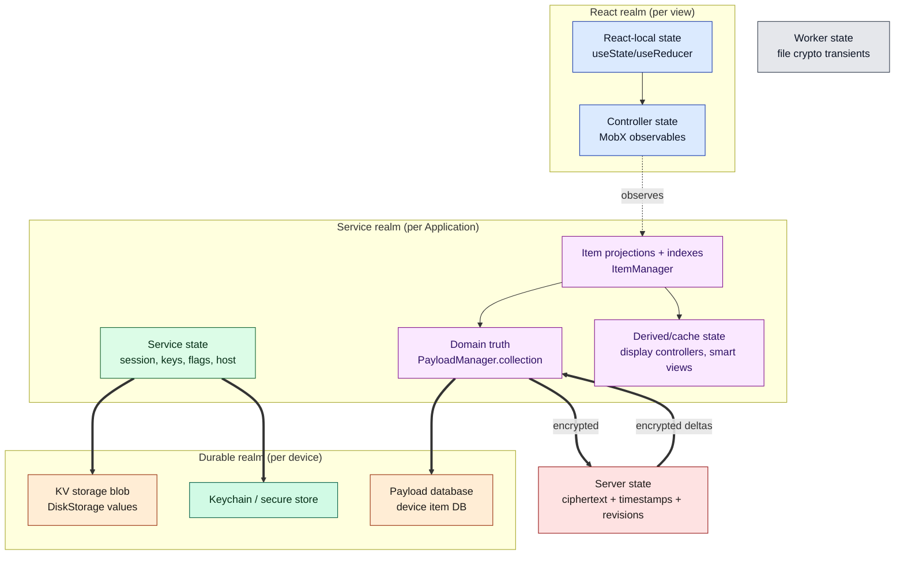
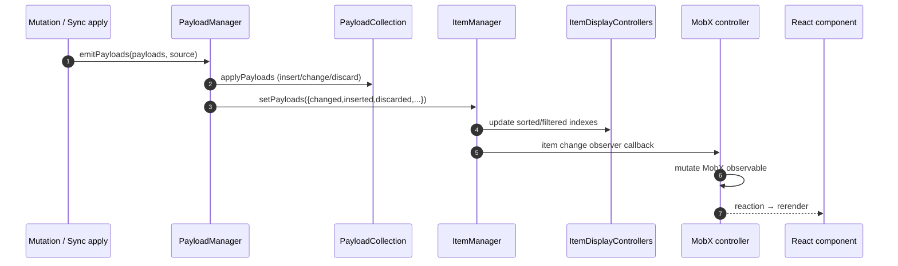
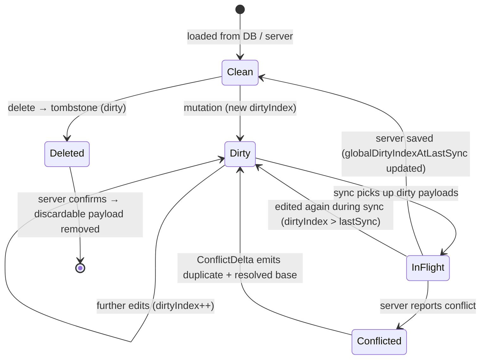
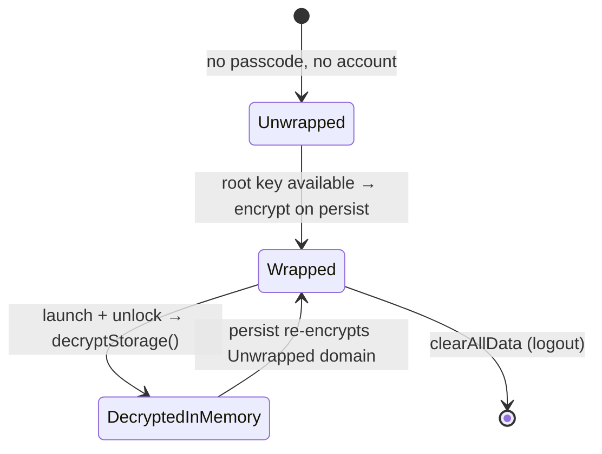

# Document 04 — State Architecture

> **Prerequisites:** [01 — Mental Model](./01-first-principles-and-mental-model.md), [03 — Bootstrap](./03-bootstrap-and-dependency-construction.md).
> **Source version:** commit `e1ebcba3c32c7cb68fdf00bb48bac49a5c10f07d`, branch `main`.

## Purpose

Inventory every category of state, name its single owner, and state the authority rules that decide which copy wins after reload or after another device changes it. This is the document you consult when a value looks stale or a change didn’t “stick.”

## Architectural questions answered

- What categories of state exist, and where does each live?
- Who **creates**, **owns**, **mutates**, and **observes** each?
- What is authoritative in memory, on device, and across devices?
- What survives reload? What happens when another client changes the same thing?

---

## 1. The state taxonomy

Standard Notes has more *places* state can live than *categories* of state. The categories:



**Reading:** the arrow *directions* encode authority. Everything upstream (React, controllers) is a **projection**; `PayloadManager` is the confluence where the write path (from mutation) and the read-back path (from sync) meet. The durable realm is a *serialization* of the service realm, and the server is a *replica* of `PayloadManager`’s encrypted form.

---

## 2. Domain truth: `PayloadManager` → `ItemManager` → observers

This is the core, so it gets first-class treatment. (All Observed — see source refs.)

### `PayloadManager`: the single in-memory source of truth

`PayloadManager` holds `collection: PayloadCollection<FullyFormedPayloadInterface>` — the latest version of every payload the app knows about (`packages/snjs/lib/Services/Payloads/PayloadManager.ts:40-51`). Its own doc comment states it plainly: it keeps “state regarding what items exist in the global application state … deals only with in-memory state, and does not deal directly with storage” (`PayloadManager.ts:30-39`).

All writes enter through **`emitDeltaEmit` / `emitPayloads`**, which push onto a **serialized queue**:

```ts
// packages/snjs/lib/Services/Payloads/PayloadManager.ts:104-116, 151-173 (cropped)
this.emitQueue.push(element)
if (this.emitQueue.length === 1) void this.popQueue()   // only the head processes
// popQueue: applyPayloads → notifyChangeObservers → resolve → recurse if queue non-empty
```

**Why the queue matters (invariant):** every mutation of the master collection is applied **strictly one delta at a time**, in FIFO order, with observers notified synchronously *within* that step before the next delta begins. This is what prevents interleaving between, say, a local edit and an incoming remote batch. Any code path that bypasses `emit*` and mutates the collection directly would break global consistency. (Observed — this is the key domain-state invariant.)

`applyPayloads` classifies each incoming payload against the current collection: **inserted** (no base), **changed** (had a base), **discarded** (deleted + discardable), and **unerrored** (base was encrypted, now decrypted) (`PayloadManager.ts:175-221`). Observers registered via `addObserver(types, callback, priority)` are notified with those buckets, **filtered by content type** and **ordered by ascending priority** (`PayloadManager.ts:230-286`).

### `ItemManager`: projection + indexes

`ItemManager` subscribes to *all* payload changes in its constructor and converts them to live items:

```ts
// packages/snjs/lib/Services/Items/ItemManager.ts:44-52 (cropped)
this.unsubChangeObserver = this.payloadManager.addObserver(ContentType.TYPES.Any, this.setPayloads.bind(this))
```

It maintains an `ItemCollection` plus a set of **`ItemDisplayController`s** — pre-sorted, pre-filtered views per content type (Notes+Files, Tags, ItemsKeys, Components, Themes, SmartViews, Files) — and an `ItemCounter` (`ItemManager.ts:64-108`). These are the **derived/cache state** that back UI lists: the UI never sorts the whole item set itself; it reads a display controller’s maintained ordering.

**The full read-propagation chain (control + data flow):**



Control flow is a chain of **direct callbacks** (observer lists), not the event bus, until it reaches MobX, where it becomes a **reaction**. This is why domain changes reach the UI without any React re-render of the whole tree — only observers of the specific changed observables rerender. (Observed; detailed in [Document 10](./10-react-architecture.md).)

---

## 3. Persistent local state: the KV blob and the payload DB

`DiskStorageService` owns **two distinct durable stores** with different shapes (`packages/snjs/lib/Services/Storage/DiskStorageService.ts:49-58`, Observed):

### (a) Key/value storage — one encrypted blob

An in-memory `values` object with three domains, serialized to disk as a **single** raw value under `namespacedKey(identifier, StorageObject)`:

| Domain | Constant | Encrypted at rest? | Holds |
| ------ | -------- | ------------------ | ----- |
| **Unwrapped** | `ValueModesKeys.Unwrapped` | Yes (encrypted into Wrapped on persist) | The working KV set: preferences pointers, host, session-adjacent flags |
| **Wrapped** | `ValueModesKeys.Wrapped` | It *is* the ciphertext blob | Encrypted form of Unwrapped, written to disk |
| **Nonwrapped** | `ValueModesKeys.Nonwrapped` | **Never** | Values that must be read *before* unlock (e.g. which encryption source exists, KDF params pointers) |

`setValue(key, val, mode)` writes into the Unwrapped (Default) or Nonwrapped domain and triggers `persistValuesToDisk()` (`DiskStorageService.ts:284-304`). On persist, if a root key is available, the whole Unwrapped domain is encrypted under the root key into `Wrapped`; otherwise it is stored as a decrypted context payload (`generatePersistableValues`, `DiskStorageService.ts:254-282`). On launch, `decryptStorage()` unwraps it with the root key (`DiskStorageService.ts:193-207`).

Two behaviors worth burning in:

- **Persistence is gated on launch stage.** `storagePersistable` flips true only at `ApplicationStage.Launched_10`; earlier writes set `needsPersist` and are deferred (`DiskStorageService.ts:91-100, 210-214`). *This prevents persisting a half-built storage object during boot.* (Invariant.)
- **KV persist is not debounced.** The source literally says `@todo This function should be debounced` (`DiskStorageService.ts:209`). Every `setValue` re-serializes and re-encrypts the **entire** Unwrapped domain and writes the whole blob. Concurrent writes are serialized via `currentPersistPromise`, but bursts of `setValue` cause repeated full-blob encryption — a real hotspot flagged in [Document 16](./16-performance-engineering.md).

### (b) Payload database — per-item entries

Item payloads are written individually via `device.saveDatabaseEntries` / read via `getAllDatabaseEntries`, namespaced by identifier (`DiskStorageService.ts:387-451`). `savePayloads` splits payloads by encryption type (root-key / key-system-root-key / items-key), encrypts each via the encryption provider, and writes **encrypted / decrypted / deleted** context payloads. Deletions remove entries (`deletePayloads`, `DiskStorageService.ts:453-468`).

All DB writes are wrapped in `executeCriticalFunction`, so they **block deinit** until complete (`DiskStorageService.ts:446-451`, base at `AbstractService.ts:88-92`). *This is the durability guarantee across lock/sign-out.* (Invariant.)

The physical backend (IndexedDB vs localStorage vs native) is the `DeviceInterface`’s concern — [Document 08](./08-persistence-architecture.md).

---

## 4. State ownership matrix

The reference table. “Authority” answers *whose copy wins*. (All Observed unless noted.)

| State domain | Creator | Owner | Mutators | Observers | Cached in | Persisted in | Invalidated by | Authoritative copy |
| ------------ | ------- | ----- | -------- | --------- | --------- | ------------ | -------------- | ------------------ |
| **Payloads** (all items) | `PayloadManager` | `PayloadManager.collection` | `emitPayloads` only (from Mutator, Sync, Encryption) | `ItemManager`, sync, encryption | in-memory collection | payload DB (encrypted) | new emit for same uuid; sync apply | **PayloadManager in memory; payload DB on reload** |
| **Items** (live objects) | `ItemManager` | `ItemManager.collection` | derived from payloads | controllers, services | ItemCollection + display controllers | — (re-derived) | payload change | PayloadManager (items are projections) |
| **Display lists** (sorted/filtered) | `ItemDisplayController` | ItemManager | display options changes | UI lists | in ItemManager | — | item change or option change | derived (never authoritative) |
| **Root key / items keys (in use)** | EncryptionService/RootKeyManager | RootKeyManager (in-memory root key) | login, unlock, key rotation | storage, sync, files | in-memory | keychain (wrapper) + items keys as items | logout, password change | RootKeyManager memory; keychain wrapper on device |
| **Session / tokens** | SessionManager | SessionManager | login, refresh, revoke | api, sync | in-memory | KV storage (session mapper) | expiry, revoke | server (session validity); local mirror |
| **KV values / prefs pointers / host** | DiskStorageService | `values` object | `setValue` | services reading getValue | in-memory `values` | KV blob (encrypted) | setValue/removeValue | KV blob on device |
| **User preferences** (`SN|UserPreferences`) | PreferencesService | a singleton item | `setValue` → item mutation | UI, per-tag prefs | as an item | payload DB + synced | remote pref item change | synced item (server converges) |
| **Controller/UI state** | each controller | the controller | controller methods | React via `observer()` | MobX observables | usually not (some via PersistenceService) | app events, item changes | ephemeral (rebuilt per Application) |
| **React-local state** | component | component | setState | that component | React fiber | no | unmount | ephemeral |
| **Feature/role entitlements** | FeaturesService | FeaturesService | roles response, subscription | UI gating | in-memory + item | KV/items | server roles change | server (roles) |
| **Server item state** | server | server | client uploads | clients via sync | — | server DB | any client push | server is the convergence point |
| **Worker state** (file crypto) | FileService | worker instance | encrypt/decrypt calls | caller via promise | worker heap (transient) | no | operation completion | ephemeral |

### Where UI controller state persists

Most controller state is ephemeral (rebuilt each `Application`). The exceptions go through `PersistenceService` (`packages/web/src/javascripts/Controllers/Abstract/PersistenceService.ts`), which serializes selected UI state (e.g. selected note, pane layout) — controlled by application options `allowNoteSelectionStatePersistence` (disabled on mobile) (`WebApplication.ts:130-131`, Observed). So “which note was open” can survive reload on web/desktop but not mobile. (Observed.)

---

## 5. Authority resolution under scenarios

The three authority rules from [Document 01](./01-first-principles-and-mental-model.md), made concrete:

| Scenario | Who wins | Mechanism |
| -------- | -------- | --------- |
| Two in-memory writers race for one item | last `emitPayloads` to reach the head of the serialized queue | FIFO emit queue (`PayloadManager.popQueue`) |
| Reload the app | payload DB → hydrates PayloadManager | `sync.loadDatabasePayloads()` reads `getAllRawPayloads`, decrypts, emits |
| Another device edited the same note | client-side conflict rules; often **both survive** (a duplicate is created) | `updated_at_timestamp` comparison + `ConflictDelta` (see [Document 06](./06-synchronization-architecture.md)) |
| A value is set but never synced (offline) | local KV/DB is authoritative until sync | `dirty` flag persists across reloads |
| Root key changed (password change) | new key re-encrypts items keys; storage re-wrapped | EncryptionService key rotation |

**The subtlety maintainers miss:** the server is authoritative for *convergence timing* (its `updated_at_timestamp` gates whether your push is accepted), but it is **not** authoritative for *content resolution* — when content diverges, the client does not let the server pick a winner; it keeps both by duplicating, so no edit is silently lost. (Observed — conflict handling, [Document 06](./06-synchronization-architecture.md).)

---

## 6. State-machine diagrams for stateful subsystems

### Payload dirty lifecycle



**Conclusion:** “dirty” is not a boolean toggled by a save; it is a **monotonic `dirtyIndex`** compared against `globalDirtyIndexAtLastSync`. An edit that lands *during* an in-flight sync bumps `dirtyIndex` past the snapshot, so the item stays dirty and re-syncs — this is how the system avoids losing edits made mid-sync. (Observed — `getIncrementedDirtyIndex`, `PayloadManager.ts:20, 311-327`; the comparison logic is in the sync layer, [Document 06](./06-synchronization-architecture.md).)

### Storage wrapping state (KV blob)



### Application-level state (from Document 03, for reference)

The `Application` lifecycle state machine (Constructed → Started → Launched → SteadyState → Deinit) is in [Document 03 §7](./03-bootstrap-and-dependency-construction.md). Item/service state only becomes trustworthy at **SteadyState** (post `LoadedDatabase_12`).

---

## What you should now understand

- The categories of state and that everything above `PayloadManager` is a projection.
- The serialized emit queue and why it is the domain-state consistency invariant.
- The two durable stores in `DiskStorageService` (encrypted KV blob + payload DB), value modes, and the launch-stage persistence gate.
- The ownership matrix and the three authority rules made concrete.
- That “dirty” is a monotonic index, not a boolean, and why that prevents lost mid-sync edits.

## Architectural invariants learned

1. **`PayloadManager.collection` is the sole in-memory source of truth; all mutations enter via `emit*` and are applied one delta at a time (FIFO).**
2. **`ItemManager` and all display controllers are pure projections of `PayloadManager`; they never hold independent truth.**
3. **Nonwrapped KV values are the only local state readable before unlock; everything else in the KV blob is encrypted at rest when a key exists.**
4. **Local persistence writes are “critical functions” and block deinit until complete.**
5. **KV persistence starts only at `Launched_10`.**

## Open questions

- The exact set of keys stored in Nonwrapped vs Unwrapped domains — enumerated in [Document 08](./08-persistence-architecture.md) and [Document 19](./19-security-boundaries.md).
- Precise `dirtyIndex` comparison in the sync collector — resolved in [Document 06](./06-synchronization-architecture.md) once the sync explorer’s findings are integrated.

## Source index

- `packages/snjs/lib/Services/Payloads/PayloadManager.ts` — in-memory truth, emit queue, observers.
- `packages/snjs/lib/Services/Items/ItemManager.ts` — item projection, display controllers.
- `packages/snjs/lib/Services/Storage/DiskStorageService.ts` — KV blob + payload DB.
- `packages/web/src/javascripts/Controllers/Abstract/PersistenceService.ts` — persisted UI state.

## Next document

Continue to **[Document 05 — Data Lifecycle and End-to-End Traces](./05-data-lifecycle-and-e2e-traces.md)**, which walks concrete operations through this state machinery.
