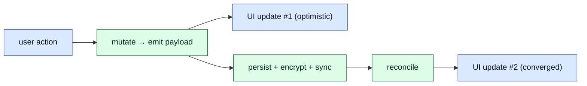
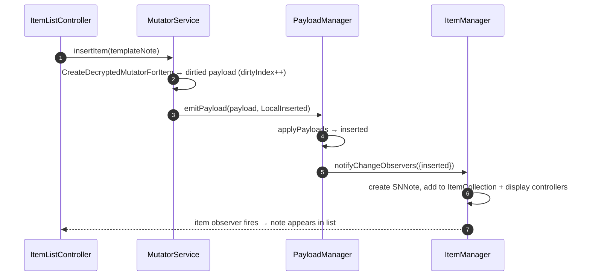
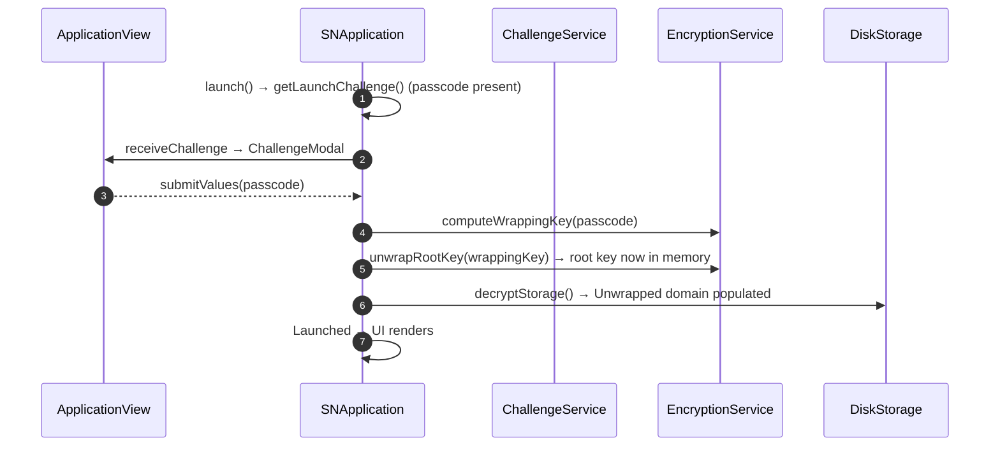

# Document 05 — Data Lifecycle and End-to-End Traces

> **Prerequisites:** [03 — Bootstrap](./03-bootstrap-and-dependency-construction.md), [04 — State](./04-state-architecture.md), [07 — Cryptography](./07-cryptographic-architecture.md).
> **Source version:** commit `e1ebcba3c32c7cb68fdf00bb48bac49a5c10f07d`, branch `main`.

## Purpose

Trace representative operations through the *real* code, separating **control flow** (what causes execution) from **data flow** (what information moves). These traces are the connective tissue between the subsystem documents: each one references sync ([06](./06-synchronization-architecture.md)), crypto ([07](./07-cryptographic-architecture.md)), and persistence ([08](./08-persistence-architecture.md)) where they go deep.

## Architectural questions answered

- What exactly happens from launch until the first editable note?
- What happens on every keystroke, and how does autosave work?
- How does a remote change reach an open editor?
- What survives offline, and what happens on reconnect?

## The two update points (recurring pattern)

Almost every write follows the same shape: an **optimistic** in-memory update reaches the UI immediately, and a later **reconciled** update arrives after durability/sync. Keep this in mind for every trace.



---

## Trace 1 — Cold application launch (data plane)

Control flow is in [Document 03 §4](./03-bootstrap-and-dependency-construction.md); here is the **data** that moves.

```mermaid
sequenceDiagram
    autonumber
    participant DEV as DeviceInterface (IndexedDB)
    participant SY as SyncService
    participant EN as EncryptionService
    participant PM as PayloadManager
    participant IM as ItemManager
    participant UI as Controllers/React

    Note over SY,DEV: launch() calls sync.loadDatabasePayloads() (NOT awaited)
    SY->>DEV: getDatabaseLoadChunks(batchSize, contentTypePriority, uuidPriority)
    DEV-->>SY: chunk descriptors (items keys first)
    SY->>PM: emit items keys, key-system keys (priority)
    Note over EN: items keys now decryptable → available to decrypt everything else
    loop each remaining chunk
      SY->>DEV: getDatabaseEntries(chunk)
      SY->>EN: decrypt encrypted payloads in batch
      SY->>PM: emit decrypted payloads (batch)
      PM->>IM: deltas → items → display controllers
      IM-->>UI: item lists fill progressively
      SY->>SY: sleep(sleepBetweenBatches) to let UI paint
    end
    SY->>SY: beginAutoSyncTimer(); sync(DownloadFirst)
```

**Data-flow facts (Observed):**

- Keys are loaded and emitted **before** content, in priority order (`SyncService.loadDatabasePayloads`, `SyncService.ts:293-320`). *You cannot decrypt items without their items key in memory* — this ordering is an invariant.
- Content is decrypted and emitted in **batches** with a `sleep(sleepBetweenBatches)` between them; the source comment notes total decrypt time is batch-size-independent, but batching exists so “the interface has a chance to update” (`SyncService.ts:321-362`). This is why a large account’s note list fills progressively.
- The item list is usable *before* the first server sync — the `DownloadFirst` sync runs after local hydration (`SyncService.ts:363-364`, and `Application.ts:462-475`).

**Complexity:** O(N) payload creations + O(E) decryptions where N = total local payloads, E = encrypted subset. Decryption dominates CPU (libsodium); emit/paint dominates perceived latency. See [Document 16](./16-performance-engineering.md).

---

## Trace 2 — Create a note

**Control flow:** UI action → `items.createTemplateItem` → `mutator.insertItem` → `PayloadManager.emitPayload`.

```ts
// e.g. WebApplication.handleReceivedTextEvent, WebApplication.ts:404-411 (cropped)
const note = this.items.createTemplateItem(ContentType.TYPES.Note, { title, text, references: [] })
const insertedNote = await this.mutator.insertItem(note)   // → emitItemFromPayload(LocalInserted)
this.itemListController.selectItem(insertedNote.uuid, true)
```



**Data flow:** a brand-new immutable `DecryptedPayload` with `dirty: true` and a fresh `dirtyIndex` enters `PayloadManager` (`MutatorService.insertItem`, `MutatorService.ts:361-375`). No encryption, disk, or network yet — creation is a **pure in-memory** operation. Durability/upload happen only when a sync runs (Trace 5). (Observed.)

---

## Trace 3 — Edit a note + autosave (the hot path)

This is what happens on typing. The editor calls `NoteViewController.saveAndAwaitLocalPropagation`, which delegates to `NoteSyncController` (`packages/web/src/javascripts/Controllers/NoteSyncController.ts`, Observed).

```mermaid
sequenceDiagram
    autonumber
    participant ED as Editor (Plain/Super)
    participant NC as NoteSyncController
    participant M as MutatorService
    participant PM as PayloadManager
    participant SY as SyncService
    ED->>NC: saveAndAwaitLocalPropagation({text, title})
    NC->>NC: clear prior syncTimeout; set savingLocallyPromise
    NC->>NC: debounce (700ms desktop/mobile; 100ms if offline/bypass)
    NC->>NC: setTimeout(debounce) →
    NC->>M: changeItem(note, mut => {title,text,preview_plain(160ch)})
    M->>PM: emit dirtied payload → UI updates
    NC->>SY: sync({mode: LocalOnly if large, else full})
    NC-->>ED: onLocalPropagationComplete → status "All changes saved"
```

**Debounce & large-note logic (Observed — `NoteSyncController.ts:143-201`):**

| Condition | Local save debounce | Server upload |
| --------- | ------------------- | ------------- |
| Normal note, signed in | 700 ms (`Desktop`/`NativeMobileWeb`) | included in the same `sync()` |
| Normal note, signed out | 100 ms (`ImmediateChange`) | n/a (offline) |
| **Large note (> 1.5 MB text)** | 700 ms, but `sync({mode: LocalOnly})` — **persist locally, do not upload** | separate timer every **60 s** (`LargeNote`) |

So for a >1.5 MB note (`LargeNoteThreshold = 1.5 * BYTES_IN_ONE_MEGABYTE`, `Constants.ts:70`), each edit is saved to the local DB within 700 ms but only *uploaded* to the server every 60 seconds, with a UI status “Note is too large. It will be synced less often.” **Why:** re-encrypting and uploading a multi-MB payload on every keystroke would saturate CPU and network; local durability is cheap, server convergence can be lazy. (Observed — a deliberate perf tradeoff; see [Document 16](./16-performance-engineering.md).)

**Preview generation:** `preview_plain` is truncated to 160 chars during the same mutation (`NoteSyncController.ts:229-235`), so list previews are precomputed, not derived at render.

**Deinit safety:** if a save is in flight, `NoteViewController` waits on `savingLocallyPromise` before deallocating the editor (`NoteViewController.ts:85-92`) — a note is never destroyed mid-save. (Observed; durability invariant.)

---

## Trace 4 — Open a note (editor resolution)

**Control flow:** selecting a note constructs/reuses an `ItemGroupController` → `NoteViewController` and resolves which editor renders it. Data-wise, the note’s decrypted payload already lives in `PayloadManager`; opening it is a **read**, not a load. The editor component is chosen by the note’s `editorIdentifier`/component association via `ComponentManager` (plain editor by default, Super/Lexical, or a third-party component). The full editor-resolution and hydration path is [Document 09](./09-editor-and-product-architecture.md). Key data-plane fact: **no decryption happens on open** — items are decrypted at load/sync time and held decrypted in memory. (Observed — items in `PayloadManager` are already decrypted; opening reads them.)

---

## Trace 5 — Save propagates to the server (sync push)

High level here; the algorithm is [Document 06](./06-synchronization-architecture.md).

```mermaid
sequenceDiagram
    autonumber
    participant SY as SyncService
    participant PM as PayloadManager
    participant EN as EncryptionService
    participant ST as DiskStorage
    participant API as ApiService
    participant SV as Server
    SY->>PM: collect dirty payloads (dirtyIndex > lastSync)
    SY->>ST: persist dirty payloads locally (encrypted) [offline-safe]
    SY->>EN: encrypt dirty payloads (004)
    SY==>API: upload encrypted items
    API==>SV: POST /items/sync
    SV-->>SY: saved_items + conflicts + cursor_token
    SY->>EN: decrypt retrieved/conflicted
    SY->>PM: emit reconciled payloads (clear dirty / create conflict duplicates)
    PM-->>SY: UI updates (#2)
```

**Data-flow facts:** dirty payloads are **persisted locally before/independently of upload**, so a note is durable even if the network fails (the status becomes “Changes saved offline”). Encryption happens at the boundary (Trace refs [07](./07-cryptographic-architecture.md)); only ciphertext leaves. The server returns any `conflicts`, which the client resolves — often by duplicating (see [06](./06-synchronization-architecture.md)). (Observed structurally; exact fields verified in Doc 06.)

---

## Trace 6 — A remote change reaches an open editor

The read-back path: another device changed a note; how does *this* device’s open editor update?

```mermaid
sequenceDiagram
    autonumber
    participant WS as WebSocketsService
    participant SY as SyncService
    participant SV as Server
    participant EN as EncryptionService
    participant PM as PayloadManager
    participant IM as ItemManager
    participant NC as NoteViewController
    participant ED as Editor
    WS-->>SY: ItemsChangedOnServer (bus)
    SY==>SV: sync (download)
    SV-->>SY: retrieved encrypted items
    SY->>EN: decrypt
    SY->>PM: emit (source: RemoteRetrieved)
    PM->>IM: deltas → updated SNNote
    IM-->>NC: item change observer (same uuid)
    NC->>NC: reconcile: if not locally dirty, adopt remote text
    NC-->>ED: controller pushes new content → editor rerenders
```

**Control flow:** the trigger is a server push (`WebSocketsServiceEvent.ItemsChangedOnServer`) delivered over the event bus to `SyncService` (`DependencyEvents.ts:43`, Observed), which syncs. The updated payload flows through the same `PayloadManager → ItemManager` chain as a local edit; the difference is `source = RemoteRetrieved`. The editor controller decides whether to adopt the remote content (if the local copy isn’t dirty) or treat it as a conflict. (Observed for the propagation chain; the editor’s adopt-vs-conflict policy is in [Document 09](./09-editor-and-product-architecture.md).)

**If the WebSocket is closed**, the same reconciliation happens on the next poll: `autoSync` runs on its interval when the socket is down (`SyncService.autoSync`, `SyncService.ts:371-388`, Observed).

---

## Trace 7 — Offline edit, then reconnect

```mermaid
stateDiagram-v2
    [*] --> Editing: user edits offline
    Editing --> DirtyLocal: mutate → emit (dirty payload)
    DirtyLocal --> PersistedLocal: NoteSyncController local save (100ms debounce when signed out)
    PersistedLocal --> DirtyLocal: further edits
    PersistedLocal --> Reconnect: network returns
    Reconnect --> Uploading: sync() collects still-dirty payloads
    Uploading --> Converged: server saves; dirty cleared
    Uploading --> Conflicted: server has newer version → duplicate
    Converged --> [*]
```



**Data-flow facts (Observed):**

- Offline, `NoteSyncController` uses the `ImmediateChange` (100 ms) debounce because `sessions.isSignedOut()` (`NoteSyncController.ts:150-156`) — edits are saved to the local DB quickly.
- Dirtiness (`dirtyIndex`) persists across reloads because it is a payload field written to the DB. On reconnect, the next `sync()` collects everything still dirty and uploads it.
- Reconnect after a **prolonged** offline period can surface conflicts if other devices edited the same items; the concurrency algorithm and the exact “A edits offline, B edits online” walkthrough are in [Document 06 §7](./06-synchronization-architecture.md).

---

## Trace 8 — Delete and restore

- **Delete** produces a **tombstone**: a `DeletedPayload` (`deleted: true`, `content: undefined`, `dirty: true`) emitted to `PayloadManager` (`PayloadManager.deleteErroredPayloads` shows the shape, `PayloadManager.ts:311-327`). It is synced so the server knows to delete; once the server confirms, the payload becomes **discardable** and `applyPayloads` removes it from the collection (`PayloadManager.ts:202-205`, Observed). Until then the tombstone is retained so the deletion propagates.
- **“Trash” vs delete:** moving to Trash is *not* deletion — it sets `trashed: true` on the note (still a normal item), so it can be restored by clearing the flag. Permanent delete is the tombstone path above. (Observed — `SystemViewId.TrashedNotes` filter, `ItemManager.ts:156-160`.)
- **Restore** (from trash) is an ordinary mutation clearing `trashed`; from a revision, `HistoryManager` re-applies an older payload as a new dirty version. (Observed structurally; revisions in [Document 06](./06-synchronization-architecture.md).)

---

## Trace 9 — Unlock (passcode)



**Data flow (Observed — `Application.ts:499-508, 433-439`):** the passcode never unlocks data directly; it computes a **wrapping key** that unwraps the stored root key, which then decrypts the KV storage blob. If `decryptStorage` fails, the app alerts and continues wrapped ([Document 03 §6](./03-bootstrap-and-dependency-construction.md)). Crypto detail: [Document 07 §7](./07-cryptographic-architecture.md).

---

## Trace 10 — Logout

```mermaid
sequenceDiagram
    autonumber
    participant UI as Account menu
    participant U as UserService
    participant APP as SNApplication
    participant GRP as ApplicationGroup
    participant DEV as DeviceInterface
    UI->>U: signOut()
    U-->>APP: AccountEvent.SignedOut
    APP->>APP: notifyEvent(SignedOut); prepareForDeinit (await critical writes)
    APP->>APP: deinit(SignOut) — drop keys, stop observers, dependencies.deinit()
    APP->>GRP: onApplicationDeinit(SignOut)
    GRP->>DEV: remove descriptor + clear this workspace's data
    GRP->>GRP: build next app (or empty) → DeviceWillRestart
```

**Data flow (Observed — `Application.ts:311-329, 738-763`; `ApplicationGroup.ts:127-170`):** logout is a `deinit` plus **data removal** for that workspace (descriptor removed, `clearAllData`). Contrast with **lock**, which deinits but keeps the (wrapped) local data. This is the precise “logout ≠ shutdown” distinction from [Document 03 §7](./03-bootstrap-and-dependency-construction.md). `prepareForDeinit` awaits in-flight critical writes (key/payload persistence) so nothing is lost mid-logout.

---

## Traces elaborated in other documents

To avoid speculation, these operations are traced where their subsystem is proven:

| Operation | Where |
| --------- | ----- |
| Login / registration (KDF, session, server password) | [06 §3](./06-synchronization-architecture.md) + [07 §4](./07-cryptographic-architecture.md) |
| Full sync algorithm, pagination, retries | [06 §4–6](./06-synchronization-architecture.md) |
| Conflict resolution (“A offline, B online”) | [06 §7](./06-synchronization-architecture.md) |
| Editor open/hydrate/component bridge | [09](./09-editor-and-product-architecture.md) |
| File upload/download (streaming crypto, worker) | [11](./11-workers-concurrency-and-wasm.md) |

---

## What you should now understand

- The two-update-point pattern and that creation/edits are optimistic in-memory writes, durable/uploaded later.
- The exact autosave debounce logic and the large-note (>1.5 MB) local-save-often / upload-every-60s strategy.
- That keys load before content on boot, and content emits in UI-friendly batches.
- How a remote change reaches an open editor (server push → sync → PayloadManager → item observer → controller → editor).
- That offline dirtiness persists across reloads and reconciles on reconnect.
- The precise data difference between lock and logout.

## Architectural invariants learned

1. **Creation and mutation are pure in-memory emits; durability and upload are separate, sync-driven steps.**
2. **Local persistence precedes/does not depend on successful upload — edits survive network failure (“saved offline”).**
3. **Items are decrypted once (load/sync) and held decrypted; opening a note performs no decryption.**
4. **A note is never deallocated while a save is in flight.**
5. **Very large notes trade server-convergence latency for keystroke performance (LocalOnly + 60s upload).**

## Open questions

- Exact conflict-duplication predicate and revision semantics — resolved in [Document 06](./06-synchronization-architecture.md) with the sync explorer’s findings.

## Source index

- `packages/snjs/lib/Services/Mutator/MutatorService.ts` — insert/change → emit.
- `packages/web/src/javascripts/Controllers/NoteSyncController.ts` — autosave/debounce/large-note.
- `packages/web/src/javascripts/Components/NoteView/Controller/EditorSaveTimeoutDebounce.ts` — debounce constants.
- `packages/snjs/lib/Services/Sync/SyncService.ts` — DB load, autosync.
- `packages/snjs/lib/Services/Payloads/PayloadManager.ts` — emit/apply/observe; tombstones.

## Next document

Continue to **[Document 06 — Synchronization Architecture](./06-synchronization-architecture.md)**.
