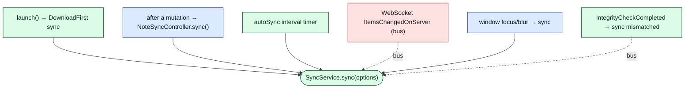
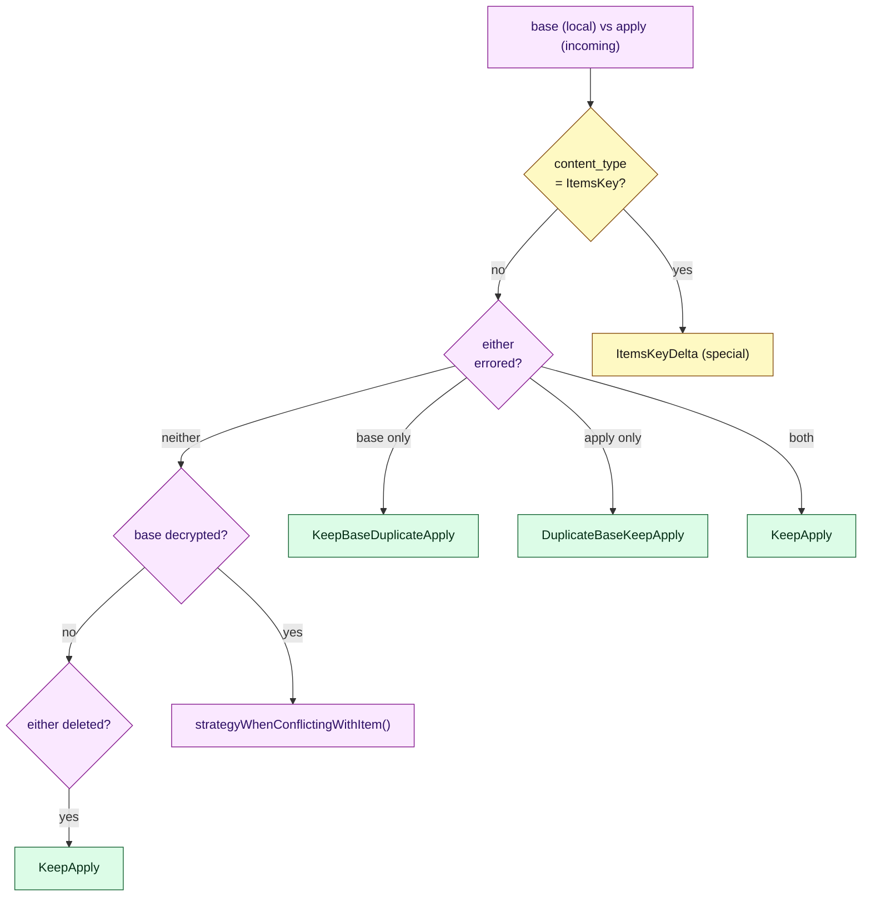

# Document 06 — Synchronization Architecture

> **Prerequisites:** [04 — State](./04-state-architecture.md), [05 — Data Lifecycle](./05-data-lifecycle-and-e2e-traces.md), [07 — Cryptography](./07-cryptographic-architecture.md), [15 — Events](./15-events-and-internal-communication.md).
> **Source version:** commit `e1ebcba3c32c7cb68fdf00bb48bac49a5c10f07d`, branch `main`.

## Purpose

Sync is where offline-first, end-to-end encryption, and multi-device concurrency collide. It is the subsystem most prone to cross-package bugs. This document explains the full engine: what triggers it, how dirtiness is tracked, how the request/response cycle paginates, and — most importantly — exactly how conflicts are resolved so that **no edit is ever silently lost**.

## Architectural questions answered

- What triggers a sync, and how are concurrent syncs controlled?
- How is “dirty” tracked, and how does the system avoid losing edits made mid-sync?
- What is the request/response protocol (tokens, pagination, batch size)?
- How are conflicts detected and resolved? What is the exact algorithm?
- What happens across two devices editing the same note?

---

## 1. The reconciliation problem (why client-side)

The server is a near-dumb ciphertext store ([Document 01](./01-first-principles-and-mental-model.md)). It cannot merge note content because it cannot read it. Therefore **all reconciliation is client-side**, driven by two pieces of server metadata the client *can* see: each item’s `updated_at_timestamp` and per-request sync cursors. The server’s only “opinion” is a shallow signal: *“your push is stale, here’s the current version”* (a conflict) or *“accepted”* (saved). The client turns that into a concrete new local state. (Observed — response handling below.)

---

## 2. Sync triggers (control flow)



| Trigger | Mechanism | Reference |
| ------- | --------- | --------- |
| App launch | `sync({mode: DownloadFirst})` after DB hydration | `Application.ts:462-475` |
| After editing | `NoteSyncController` calls `sync()` post-mutation | `NoteSyncController.ts:241` |
| Auto timer | `setInterval(autoSync, DEFAULT_AUTO_SYNC_INTERVAL)` | `SyncService.ts:368-369` |
| Server push | `WebSocketsServiceEvent.ItemsChangedOnServer` → bus → SyncService | `DependencyEvents.ts:43` |
| Window focus/blur | `WebAppEvent.WindowDidFocus/Blur` → `sync()` | `ApplicationView.tsx:173-180` |
| Integrity mismatch | `IntegrityEvent.IntegrityCheckCompleted` → bus → SyncService | `DependencyEvents.ts:42` |

**Push-preferred, poll-fallback.** `autoSync` only issues a network sync on the timer when the WebSocket is **closed**; when the socket is open it waits for a server `ItemsChangedOnServer` push and syncs on that (`SyncService.autoSync`, `SyncService.ts:371-388`, Observed). This minimizes redundant polling while the socket is healthy.

---

## 3. Dirty tracking (the join between edits and sync)

Dirtiness is not a boolean; it is a **monotonic counter** plus timestamps (Observed):

| Field | Meaning |
| ----- | ------- |
| `dirty` | this payload has unsynced changes |
| `dirtyIndex` | monotonically increasing counter, bumped on each mutation (`getIncrementedDirtyIndex`) |
| `globalDirtyIndexAtLastSync` | the `dirtyIndex` snapshot captured when the last sync began |
| `lastSyncBegan` / `lastSyncEnd` | when the item was sent / confirmed |

An item “needs sync” if it is dirty and its `dirtyIndex` exceeds the last synced snapshot. The subtlety that prevents lost edits:

```ts
// packages/snjs/lib/Services/Sync/SyncService.ts:608-639 (cropped)
const items = this.itemsNeedingSync()
const beginDate = new Date()
const frozenDirtyIndex = getCurrentDirtyIndex()  // freeze NOW
// ... persist locally, then upload ...
// setLastSyncBeganForItems(items, beginDate, frozenDirtyIndex)
```

**The freeze is the trick.** The sync captures `frozenDirtyIndex` at the instant it collects dirty items. If the user edits an item *while the upload is in flight*, that edit bumps the item’s `dirtyIndex` past `frozenDirtyIndex`, so when the server confirms the *old* version as saved, the item is still considered dirty and re-syncs. **No mid-sync edit is lost.** (Observed — `SyncService.ts:609-614`; confirmation via `setLastSyncBeganForItems`, `SyncService.ts:717+`.)

---

## 4. Concurrency control: single-flight with coalescing

Multiple triggers can call `sync()` simultaneously. The engine guarantees **one sync in flight** and coalesces the rest:

```ts
// packages/snjs/lib/Services/Sync/SyncService.ts:650-688 (cropped)
const canExecuteSync = !this.syncLock
const syncLimitReached = this.syncFrequencyGuard.isSyncCallsThresholdReachedThisMinute()
const shouldExecuteSync = canExecuteSync && databaseLoaded && !syncInProgress && !syncLimitReached
// else defer with a queue strategy:
//  ResolveOnNext  → caller resolves when the *next* sync completes (coalesce)
//  ForceSpawnNew  → schedule a fresh sync after the current one finishes
```

| Guard | Purpose | Reference |
| ----- | ------- | --------- |
| `syncLock` | a call has begun preparing (pre-network) | `SyncService.ts:652-659` |
| `opStatus.syncInProgress` | a request is in flight | `SyncService.ts:651` |
| `databaseLoaded` | never sync before local hydration | `SyncService.ts:653` |
| `SyncFrequencyGuard` | rate limit (`DEFAULT_SYNC_CALLS_THRESHOLD_PER_MINUTE = 200`) | `Dependencies.ts:190`; `SyncFrequencyGuard.ts` |
| `SyncBackoffService` | back off syncing repeatedly-failing items | injected `Dependencies.ts:1383` |

**Queue strategies (Observed — `SyncService.ts:676-688`):** the default `ResolveOnNext` collapses a burst of `sync()` calls into a single follow-up sync — every caller’s promise resolves when that one completes. `ForceSpawnNew` guarantees a *fresh* pass (used when the caller needs its specific changes flushed). This is how the app can call `sync()` liberally after every mutation without flooding the server.

---

## 5. The sync algorithm (data flow)

```mermaid
sequenceDiagram
    autonumber
    participant SS as SyncService
    participant PM as PayloadManager
    participant ST as DiskStorage
    participant OP as AccountSyncOperation
    participant API as ApiService
    participant SV as Server
    participant RR as ResponseResolver
    SS->>PM: itemsNeedingSync() → dirty payloads
    SS->>SS: freeze beginDate + frozenDirtyIndex
    SS->>ST: persist dirty payloads locally (offline-safe)
    SS->>OP: new AccountSyncOperation(pushPayloads, receiver, {syncToken, paginationToken})
    loop until done (no pending uploads AND no paginationToken)
      OP->>OP: popPayloads(150)
      OP==>API: sync(payloads, syncToken, paginationToken, downLimit=150)
      API==>SV: POST /items/sync
      SV-->>OP: {retrieved, saved, conflicts, sync_token, cursor_token}
      OP->>SS: SyncSignal.Response
      SS->>RR: resolve(response, baseCollection, savedOrSaving, historyMap)
      RR-->>SS: DeltaEmit[] (retrieved/saved/data-conflict/uuid-conflict/rejected)
      SS->>PM: emit deltas → collection updates → UI
    end
    SS->>SS: mark saved items clean; re-sync if still dirty
```

### 5a. Request/response protocol

The round-trips are driven by `AccountSyncOperation.run()` (`packages/snjs/lib/Services/Sync/Account/Operation.ts:49-79`, Observed):

- **Batch size:** `SyncUpDownLimit = 150` — at most 150 items uploaded and 150 downloaded per request (`Operation.ts:7`).
- **`syncToken`** (`sync_token`): the client’s cursor of “last state seen.” Sent up, updated from each response. The server returns everything changed since it.
- **`paginationToken`** (`cursor_token`): when the server has more than one page of changes to return, it sends a pagination token; the operation loops to fetch the next page.
- **Termination:** `done = pendingPayloads.length === 0 && !paginationToken` (`Operation.ts:81-83`). The loop continues until all uploads are sent *and* the server has no more pages.

So a single logical `sync()` can be **many** HTTP round-trips — one per 150-item page in either direction. Progress is emitted via `SyncSignal.StatusChanged`.

### 5b. Response resolution is purely functional

`ServerSyncResponseResolver` takes the response + current base collection and returns *recommended* deltas **without mutating global state** (`packages/snjs/lib/Services/Sync/Account/ResponseResolver.ts:22-46`, Observed). Only after computing all deltas does `SyncService` emit them to `PayloadManager`. It produces five delta kinds:

| Delta | Server data | Effect |
| ----- | ----------- | ------ |
| `DeltaRemoteRetrieved` | items changed on server since `syncToken` | adopt/merge into local (may itself conflict) |
| `DeltaRemoteSaved` | items the server confirmed we saved | clear `dirty` on those payloads |
| `DeltaRemoteDataConflicts` | `ConflictType.ConflictingData` | resolve via `ConflictDelta` (duplicate) |
| `DeltaRemoteUuidConflicts` | `ConflictType.UuidConflict` | re-uuid our unsaved item and re-upload |
| `DeltaRemoteRejected` | content/permission/vault errors | keep as errored / drop per error type |

(Observed — `ResponseResolver.ts:38-100`.) **Why purely functional:** computing the entire new state before touching `PayloadManager` means the serialized emit ([Document 04 §2](./04-state-architecture.md)) applies a consistent batch, and the resolver is independently testable.

---

## 6. Conflict resolution — the exact algorithm

This is the correctness heart of the system. When the server rejects a push as `ConflictingData` (its `updated_at_timestamp` is newer than the client expected), or when a retrieved item collides with a locally-dirty one, `ConflictDelta` decides what happens (`packages/models/src/Domain/Runtime/Deltas/Conflict.ts`, Observed).

### 6a. Strategy selection



The decrypted-vs-decrypted case delegates to `GenericItem.strategyWhenConflictingWithItem` (`GenericItem.ts:137-204`, Observed), whose logic is:

1. `isSingleton` → **KeepBase** (singletons like `UserPreferences` never duplicate).
2. this deleted → **KeepApply**; incoming deleted → **KeepApply** (unless from import → KeepBase).
3. content identical → **KeepApply** (no real conflict).
4. content differs *excluding references*:
   - if a `previousRevision` equals the incoming content, the rejected change is legitimate → **KeepBase**;
   - else, **the 20-second rule**: if the incoming payload is a file import **or** the user modified this item within the last **20 000 ms** → **KeepBaseDuplicateApply** (keep mine, duplicate theirs); otherwise → **DuplicateBaseKeepApply** (duplicate mine, keep theirs).
5. only references differ → **KeepBaseMergeRefs** (union the reference arrays).

**The 20-second “actively editing” rule is the key UX safeguard:** if you just touched a note, *your* version stays under the original UUID and the incoming version becomes a visible conflict copy — so your cursor/content isn’t yanked out from under you. (Observed — `GenericItem.ts:183-199`.)

### 6b. What each strategy emits

| Strategy | Result payloads | Net effect |
| -------- | --------------- | ---------- |
| `KeepBase` | base, re-marked dirty, adopting server timestamp | keep mine, re-upload |
| `KeepApply` | incoming, `dirty:false` | accept server’s |
| `KeepBaseDuplicateApply` | base (dirty) **+ duplicate of incoming** (`conflict_of`) | keep mine, theirs becomes a conflict copy |
| `DuplicateBaseKeepApply` | **duplicate of base** (`conflict_of`) + incoming (`dirty:false`) | theirs wins the UUID, mine becomes a conflict copy |
| `KeepBaseMergeRefs` | base with merged `references`, dirty | union links |

(Observed — `Conflict.ts:116-224`.) **The invariant:** in every “both changed” case, *both* pieces of content survive — one under the original UUID, the other as a `conflict_of` duplicate. Duplication (not last-write-wins) is the system’s answer to concurrency. (Observed.)

### 6c. Duplicate prevention & idempotency

- Before duplicating, `ConflictDelta` checks whether a conflict with identical content already exists (`baseCollection.conflictsOf(uuid)` + `PayloadContentsEqual`) and returns **KeepBase** if so — preventing duplicate-of-duplicate spam across multi-page syncs (`Conflict.ts:54-70`, Observed).
- **UUID conflicts** (`DeltaRemoteUuidConflicts`) handle the case where an item’s UUID already exists server-side (e.g. re-import): the client assigns a new UUID and re-uploads, so no data is dropped. (Observed — `ResponseResolver.ts:79-82`.)

---

## 7. Multi-device concurrency walkthrough

**Scenario:** Note *X* exists on the server (timestamp `T0`). Device A goes offline and edits X (→ `A1`). Device B, online, edits X (→ `B1`, timestamp `T1`). Device A reconnects.

```mermaid
sequenceDiagram
    autonumber
    participant A as Device A (offline→online)
    participant SV as Server
    participant B as Device B (online)
    B->>SV: push X=B1 (expects T0) → accepted, now T1
    Note over A: A edited X=A1 offline, still expects T0
    A->>SV: reconnect → push X=A1 (expects T0)
    SV-->>A: ConflictingData: server has X=B1 @ T1
    A->>A: ConflictDelta(base=A1, apply=B1)
    Note over A: A recently edited X (within 20s?) → KeepBaseDuplicateApply<br/>else DuplicateBaseKeepApply
    A->>A: emit: X keeps one version; other becomes conflict_of duplicate (dirty)
    A->>SV: next sync uploads the duplicate + the re-marked original
    SV-->>B: retrieved: the new duplicate + updated X
    B->>B: both versions now present on B too
```

**Resulting state (Observed logic):** both `A1` and `B1` survive on *all* devices — one as X, the other as a conflict copy referencing X via `conflict_of`. The user resolves the duplicate manually. Which one keeps the original UUID depends on the 20-second rule at the moment A reconnects. **No content is lost on either device.** (Observed — §6 algorithm.)

---

## 8. Offline, DownloadFirst, and integrity

- **Offline:** with no network, `sync()` still persists dirty payloads locally (the persist step precedes upload — `SyncService.prepareForSync`, `SyncService.ts:630-633`). Dirtiness is a DB-persisted field, so edits survive reload and upload on reconnect. Offline mode with no account uses the `Offline` sync path (`packages/snjs/lib/Services/Sync/Offline/`, Observed dir).
- **DownloadFirst:** launch syncs with `SyncMode.DownloadFirst` so the client pulls the server’s items keys and items *before* pushing local ones — critical when a fresh device must obtain items keys to decrypt anything (`Application.ts:471-475`; the persist-error is suppressed during download-first because keys may still be arriving — `SyncService.ts:631-633`, Observed).
- **Integrity / out-of-sync recovery:** `SyncService` periodically emits `SyncEvent.SyncRequestsIntegrityCheck`; `IntegrityService` computes a hash of local state and compares with the server, emitting `IntegrityEvent.IntegrityCheckCompleted` with any mismatched items back to `SyncService`, which re-syncs them (`DependencyEvents.ts:21,42`, Observed). This detects and self-heals silent divergence (e.g. a dropped update). Exact hashing is in `packages/services/src/Domain/Integrity` (Inferred: content-hash comparison; the wiring is Observed).

---

## 9. Retries and backoff

- **Rate limiting:** `SyncFrequencyGuard` caps sync calls per minute (200), returning `SyncTooManyRequests` upward (surfaced as a toast — `ApplicationView.tsx:148-153`). (Observed.)
- **Per-item backoff:** `SyncBackoffService` (injected into `SyncService`, `Dependencies.ts:1383`) is designed to defer repeatedly-failing items so one poison item doesn’t block the whole batch. (Observed wiring; the backoff curve is in `packages/services` — Inferred exponential.)
- **Download-first retry:** `downloadFirstSync(waitTimeOnFailureMs)` retries up to a max on failure with a wait (`SyncService.ts:565-583`, Observed).

---

## 10. State-transition diagram (sync operation)

```mermaid
stateDiagram-v2
    [*] --> Idle
    Idle --> Preparing: sync() and !locked and dbLoaded
    Idle --> Deferred: locked / inProgress / rateLimited
    Deferred --> Preparing: current sync completes (ResolveOnNext)
    Preparing --> Uploading: persist local + build operation
    Uploading --> Paginating: response has cursor_token OR pending uploads
    Paginating --> Uploading: run() again
    Uploading --> Resolving: response received
    Resolving --> Uploading: more pages
    Resolving --> Done: no pending + no cursor_token
    Done --> Idle: mark saved clean; re-sync if still dirty
    Done --> Preparing: items dirtied during sync (frozenDirtyIndex)
```

---

## 11. Complexity

| Path | Cost | `N` = |
| ---- | ---- | ----- |
| Collect dirty | O(N) scan | items in collection |
| Encrypt upload batch | O(D) AEAD ops | dirty items |
| Round-trips | ⌈U/150⌉ up + ⌈R/150⌉ down | U uploads, R retrieved |
| Conflict resolution | O(C) with O(refs) merges | C conflicts |
| Apply deltas | O(Δ) serialized emit | changed payloads |

Network round-trips (latency-bound), not CPU, dominate large-account initial sync. See [Document 16](./16-performance-engineering.md).

---

## What you should now understand

- Every sync trigger, and that autosync is push-preferred / poll-fallback.
- The monotonic `dirtyIndex` model and the `frozenDirtyIndex` freeze that prevents lost mid-sync edits.
- Single-flight-with-coalescing concurrency control and the two queue strategies.
- The paginated multi-roundtrip protocol (`syncToken`, `paginationToken`, 150-item batches).
- The full conflict decision tree, the 20-second rule, and resolution-by-duplication (`conflict_of`).
- How two devices editing one note end with *both* versions preserved everywhere.

## Architectural invariants learned

1. **Reconciliation is entirely client-side; the server only signals saved/conflict/retrieved.**
2. **Dirty payloads are persisted locally before any upload; edits survive network failure.**
3. **Concurrent `sync()` calls collapse to one in-flight operation (single-flight + coalescing).**
4. **Edits made during an in-flight sync are re-synced (frozenDirtyIndex), never lost.**
5. **“Both changed” conflicts are resolved by duplication (`conflict_of`), never last-write-wins — no content is dropped.**
6. **The response resolver is pure: it computes deltas, then emits them as one serialized batch.**

## Open questions

- Exact `SyncBackoffService` backoff curve and `IntegrityService` hash algorithm — wiring is Observed; internal formulas are Inferred and should be confirmed in `packages/services` (flagged in Verification Notes of [Document 25](./25-maintainer-handbook.md)).

## Source index

- `packages/snjs/lib/Services/Sync/SyncService.ts` — triggers, locking, dirty freeze, DB load, autosync.
- `packages/snjs/lib/Services/Sync/Account/Operation.ts` — round-trip loop, tokens, 150 batch.
- `packages/snjs/lib/Services/Sync/Account/ResponseResolver.ts` — 5 delta kinds.
- `packages/models/src/Domain/Runtime/Deltas/Conflict.ts` — conflict strategies + emission.
- `packages/models/src/Domain/Abstract/Item/Implementations/GenericItem.ts` — `strategyWhenConflictingWithItem`, 20s rule.

## Next document

Continue to **[Document 08 — Persistence Architecture](./08-persistence-architecture.md)**.
