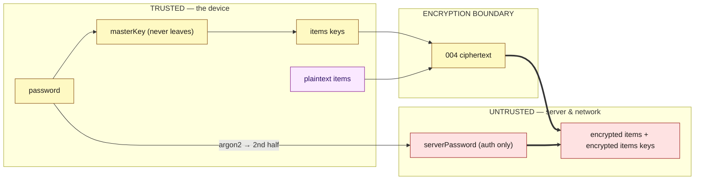
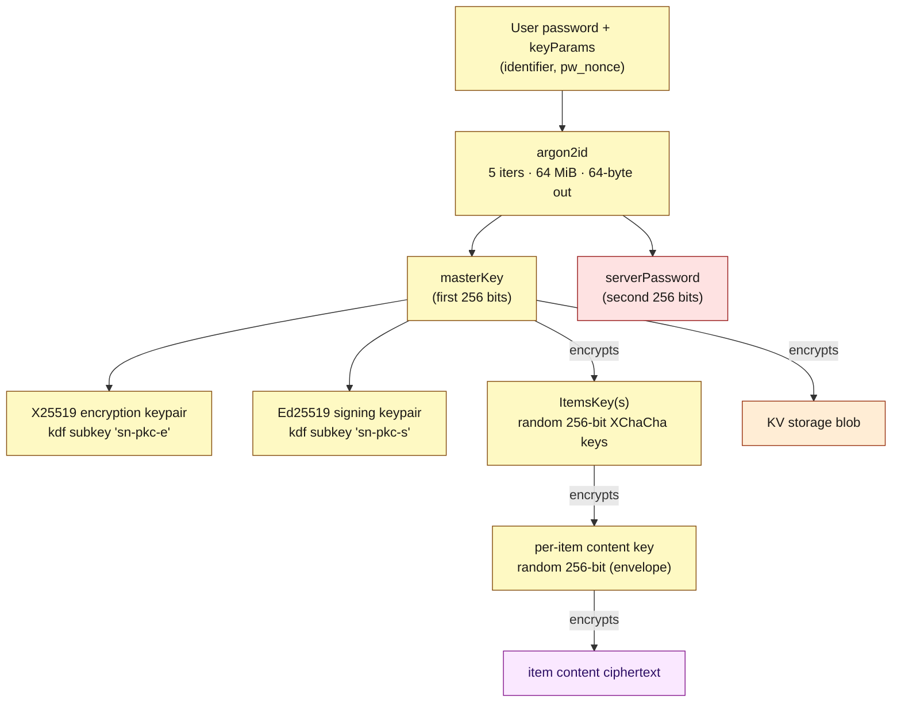
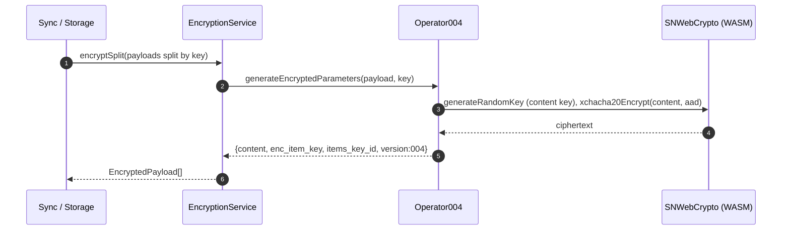
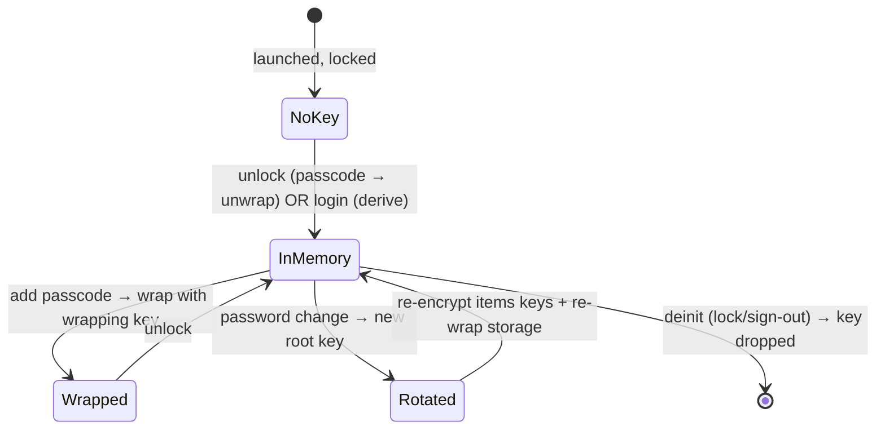
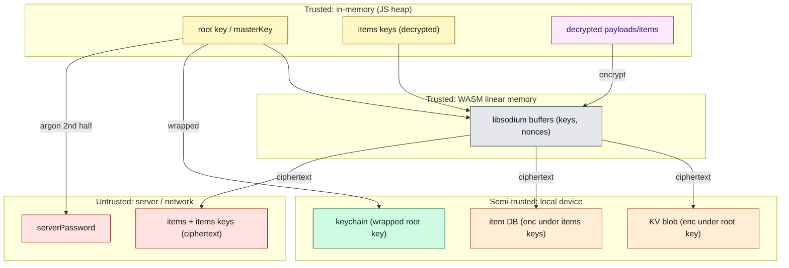

# Document 07 — Cryptographic Architecture

> **Prerequisites:** [01 — Mental Model](./01-first-principles-and-mental-model.md), [04 — State](./04-state-architecture.md).
> **Source version:** commit `e1ebcba3c32c7cb68fdf00bb48bac49a5c10f07d`, branch `main`.
> **Verification:** primitives cross-checked against `sncrypto-web` source and the `encryption` operator unit tests (`Operator004.spec.ts`). Where a claim is only structural, it is marked Inferred.

## Purpose

Explain the complete client-side cryptography as represented in this repository: the key hierarchy, the `004` scheme, the primitives (libsodium/WASM), and — most importantly — the **trust boundaries** that make the server unable to read anything. This is a correctness- and security-critical document; every mechanism is tied to source.

## Architectural questions answered

- How do credentials become keys, and keys become ciphertext?
- What is the key hierarchy and lifecycle?
- Where is the encryption/decryption boundary, and what is authenticated?
- What lives in memory vs secure storage? What happens on password change / key rotation?
- Why libsodium/WASM, and what exactly crosses the JS↔WASM boundary?

---

## 1. Threat model and trust boundary (the “why”)

- *Problem:* users want cross-device sync but must trust neither the network nor the server operator with their content.
- *Constraint:* the server must be able to store, index, and return items, and authenticate the user, **without ever seeing plaintext or the encryption key**.
- *Abstraction:* derive two independent secrets from the password — one the server checks (`serverPassword`), one the server never sees (`masterKey`) — and encrypt all content client-side under keys the server can only store in ciphertext.



**The invariant this encodes:** the only password-derived value the server receives is `serverPassword`, which is *half* of an argon2id output and cannot be reversed to the password or to `masterKey`. Everything durable that leaves the device is `004` ciphertext. (Observed — `DeriveRootKey.ts:15-25`, split into `masterKey` + `serverPassword`.)

---

## 2. The primitive layer: `sncrypto` (libsodium + WebCrypto)

The contract is `PureCryptoInterface` (`packages/sncrypto-common`); the web implementation is `SNWebCrypto` (`packages/sncrypto-web/src/crypto.ts`). It wraps **libsodium.js (WASM)** for modern primitives and the browser **WebCrypto** for a few classics. (Observed.)

| Operation | Primitive | libsodium call | Where |
| --------- | --------- | -------------- | ----- |
| Password KDF | **Argon2id** | `crypto_pwhash(…, ALG_DEFAULT)` | `crypto.ts:236-247` |
| Symmetric AEAD | **XChaCha20-Poly1305 (IETF)** | `crypto_aead_xchacha20poly1305_ietf_encrypt/decrypt` | `crypto.ts:249-289` |
| File streaming AEAD | **XChaCha20-Poly1305 secretstream** | `crypto_secretstream_xchacha20poly1305_*` | `crypto.ts:291-347` |
| Asymmetric encryption | **X25519 + XSalsa20-Poly1305** (`crypto_box`) | `crypto_box_easy/open_easy`, `crypto_box_seed_keypair` | `crypto.ts:351-391` |
| Signatures | **Ed25519** | `crypto_sign_detached/verify_detached`, `crypto_sign_seed_keypair` | `crypto.ts:393-414` |
| Subkey derivation | **BLAKE2b KDF** | `crypto_kdf_derive_from_key` | `crypto.ts:416-429` |
| Hashing | **BLAKE2b / SHA-256** | `crypto_generichash`, WebCrypto `digest` | `crypto.ts:431+` |

libsodium is loaded once; `SNWebCrypto` holds `this.ready = sodium.ready` and `initialize()` awaits it (`crypto.ts:46-56`). This `await this.options.crypto.initialize()` is the *first* thing `prepareForLaunch` does (`Application.ts:379`) — so **no crypto can run before the WASM module is instantiated**. The JS↔WASM cost model is in [Document 11](./11-workers-concurrency-and-wasm.md).

**Why WASM here:** Argon2id and XChaCha20-Poly1305 are not available (Argon2) or not ergonomic (XChaCha) in WebCrypto; libsodium provides audited, constant-time implementations compiled to WASM for near-native speed. (Inferred rationale; the *use* of libsodium is Observed.)

---

## 3. Protocol versions and operator selection

Encryption is versioned. Each version has an **operator** implementing `OperatorInterface`. The version is a string prefix (`001`…`004`) on every ciphertext, so old data stays decryptable after upgrades.

| Version | KDF | Cipher | Status | Constants |
| ------- | --- | ------ | ------ | --------- |
| `001` | PBKDF2 (variable cost) | AES | **legacy** | `V001Algorithm` (`Algorithm.ts:3-12`) |
| `002` | PBKDF2 (~100k) | AES-CBC + HMAC | **legacy** | `V002Algorithm` (`Algorithm.ts:14-30`) |
| `003` | PBKDF2 (110k) | AES-CBC + HMAC | **legacy** | `V003Algorithm` (`Algorithm.ts:32-38`) |
| `004` | **Argon2id** | **XChaCha20-Poly1305** | **current** | `V004Algorithm` (`Algorithm.ts:40-63`) |

Operators are selected by version (via an `OperatorManager`/`EncryptionOperators`, resolved by the DI as `TYPES.EncryptionOperators`, injected into `EncryptionService` — `Dependencies.ts:1513-1532`, Observed). Legacy operators exist purely for back-compat: reading old ciphertext and enabling protocol upgrade. New writes always use the account’s version (`004` for modern accounts). This document details `004`; the legacy operators are catalogued in [Document 23](./23-legacy-architecture-and-technical-debt.md).

---

## 4. The key hierarchy



### 4a. Password → root key (KDF)

```ts
// packages/encryption/src/Domain/Operator/004/UseCase/RootKey/DeriveRootKey.ts:12-50 (cropped)
const seed = keyParams.content004.pw_nonce
const salt = await this.generateSalt(keyParams.content004.identifier, seed) // sha256(identifier:pw_nonce) → 128 hex
const derivedKey = this.crypto.argon2(password, salt, 5 /*iters*/, 67108864 /*64MiB*/, 64 /*bytes*/)
const [masterKey, serverPassword] = splitString(derivedKey, 2)               // 256 + 256 bits
const encryptionKeyPair = crypto.sodiumCryptoBoxSeedKeypair(kdf(masterKey, 1, 'sn-pkc-e'))
const signingKeyPair   = crypto.sodiumCryptoSignSeedKeypair(kdf(masterKey, 2, 'sn-pkc-s'))
```

Key facts (all Observed):

- **Argon2id params:** 5 iterations, 64 MiB memory, 64-byte output (`V004Algorithm:40-46`). These are fixed for `004`.
- **Salt = `sha256(identifier ':' pw_nonce)` truncated to 128 hex chars.** The `pw_nonce` is a 256-bit random seed generated at registration and stored in `keyParams` on the server. Mixing the client’s `identifier` with the server’s `pw_nonce` defends against a malicious server issuing the same salt to every user (`DeriveRootKey.ts:52-64`, with the rationale in the source comment).
- **The 512-bit argon output is split**: first half = `masterKey` (stays on device), second half = `serverPassword` (sent for auth). *The server authenticates against `serverPassword` and never learns `masterKey` or the password.*
- **`masterKey` deterministically derives two keypairs** via `crypto_kdf_derive_from_key`: an X25519 **encryption** keypair and an Ed25519 **signing** keypair (used for vaults/contacts messaging, §8). These are derived, not stored — so they reappear on any device from the same password.

`RootKeyParams` (`keyParams`) is the public KDF descriptor: `{ identifier, pw_nonce, version, origination, created }`. It is fetched from the server before login so the client can re-derive the root key (`CreateRootKey.ts:16-24` shows its creation at registration). (Observed.)

### 4b. Root key → items keys

`masterKey` does **not** directly encrypt item content. Instead:

- The account has one or more **ItemsKeys** — random 256-bit keys generated by `Operator004.createItemsKey()` (`Operator004.ts:78-89`, Observed). An ItemsKey is itself an *item* (`content_type: SN|ItemsKey`), so it is synced to the server — encrypted under the **root key** (`masterKey`).
- There is a **default items key**; new item encryption uses it (`FindDefaultItemsKey`, `CreateNewDefaultItemsKey` use-cases wired in the DI, `Dependencies.ts:1522-1529`). When a session is restored without an items key, the app creates one and syncs it (`Application.ts:258-263`, Observed).

**Why this layer exists:** it decouples “the key that protects data” from “the key derived from your password.” You can rotate items keys, share a vault’s items key, or re-encrypt data without changing the password-derived root key — and vice versa. (Observed structural rationale.)

### 4c. Items key → per-item envelope

Each item is encrypted with a **fresh random content key**, which is then wrapped by the items key — classic envelope encryption:

```ts
// packages/encryption/.../Symmetric/GenerateEncryptedParameters.ts:44-70 (cropped)
const contentKey = crypto.generateRandomKey(256)                    // fresh per item
encryptedContent    = protocolString(JSON.stringify(payload.content), contentKey, aad, addl) // content under content key
encryptedContentKey = protocolString(contentKey, key.itemsKey,       aad, addl)              // content key under items key
return { uuid, content_type, items_key_id: key.uuid, content: encryptedContent, enc_item_key: encryptedContentKey, version: '004', ... }
```

So an encrypted payload carries **two** ciphertexts: `content` (the item body under the random content key) and `enc_item_key` (the content key under the items key), plus `items_key_id` naming which items key to use for decryption. (Observed.)

**Why a per-item content key:** it limits key reuse — each item’s body is encrypted under a unique key, so the items key is only ever used to encrypt short random content keys, never large or repeated plaintext. (Inferred rationale; the mechanism is Observed.)

---

## 5. The `004` wire format and what is authenticated

The `protocolString` for any `004` ciphertext is five colon-joined components (`GenerateEncryptedProtocolString.ts:9-22`, Observed):

```
004 : nonce : ciphertext : authenticatedData : additionalData
```

| Component | Meaning |
| --------- | ------- |
| `004` | version/operator selector |
| `nonce` | 192-bit random XChaCha nonce (hex), fresh per encryption (`EncryptionNonceLength: 192`) |
| `ciphertext` | `crypto_aead_xchacha20poly1305_ietf_encrypt(plaintext, nonce, key, aad)` (base64) |
| `authenticatedData` | base64(JSON) — the **AAD**: item `uuid`, `content_type`, key params, etc. |
| `additionalData` | base64(JSON) — signing-related extra data (e.g. signature, public key) when the item requires signing |

The **`authenticatedData` is passed as the AEAD associated data** (`encryptString → xchacha20Encrypt(plaintext, nonce, key, authenticatedData)`, `GenerateEncryptedProtocolString.ts:39`). This binds the ciphertext to its metadata: an attacker cannot move a valid ciphertext to a different `uuid`/`content_type` without failing authentication. This is **authenticated encryption with associated data**, and the AAD is a first-class integrity mechanism, not decoration. (Observed.)

Decryption (`GenerateDecryptedParameters`) reverses this: parse the string, verify+decrypt the content key with the items key, then verify+decrypt the content with the content key; any tamper fails the Poly1305 tag and yields an `ErrorDecryptingParameters` (which becomes an *errored/encrypted* payload the app keeps but cannot read — see [Document 18](./18-error-handling-and-resilience.md)). (Observed structure; exact decrypt file is the sibling `GenerateDecryptedParameters.ts`.)

---

## 6. The encryption boundary in the running app

Who calls the operator, and when? The `EncryptionService` (`packages/services/src/Domain/Encryption/EncryptionService.ts`) is the orchestrator; it is injected with the operators, `RootKeyManager`, `ItemsEncryptionService`, and type-A encrypt/decrypt use-cases (`Dependencies.ts:1513-1532`, Observed). It exposes a **split** API: callers hand it a set of payloads and it routes each to the correct key (root key vs items key vs key-system key) via `SplitPayloadsByEncryptionType` + `CreateEncryptionSplitWithKeyLookup`.

The two hot callers (Observed):

- **`DiskStorageService.savePayloads`** encrypts payloads before writing to the local DB, routing items-keys under the root key and normal items under items keys (`DiskStorageService.ts:399-451`).
- **`SyncService`** encrypts dirty payloads before upload and decrypts retrieved payloads after download (details in [Document 06](./06-synchronization-architecture.md)).



**Boundary invariant:** decrypted content exists only *inside* the trusted domain (PayloadManager, items). The moment a payload is written to disk or sent to the network it is a `004` string. Only `EncryptionService`/operators produce or consume that string. (Observed — the two callers above are the only durable-boundary crossings.)

---

## 7. Root key lifecycle, memory residency, and storage encryption

- **In memory:** the decrypted root key is held by `RootKeyManager` (`packages/services/src/Domain/RootKeyManager/RootKeyManager.ts`, wired at `Dependencies.ts:1520`). It is the transient secret that all storage/items-key encryption depends on. On `deinit()` (lock/sign-out) it is dropped, and `crypto.deinit()` is called (`Application.ts:750`). (Observed; the exact in-memory field is confirmed by the crypto explorer — see Verification Notes.)
- **Passcode wrapping:** if the user sets a local passcode, the root key is *wrapped* by a **wrapping key** computed from the passcode (`encryption.computeWrappingKey(value)` then `encryption.unwrapRootKey(wrappingKey)` at launch — `Application.ts:499-508`, Observed). The wrapped root key is what persists; unlock re-derives the wrapping key to unwrap it.
- **Storage-at-rest:** the entire KV storage blob’s Unwrapped domain is encrypted under the root key (`DiskStorageService.generatePersistableValues → encryptSplitSingle(usesRootKeyWithKeyLookup)`, `DiskStorageService.ts:267-281`, Observed). With no account/passcode, storage is written decrypted.
- **Ephemeral sessions:** with an ephemeral persistence policy, nothing (keychain, DB, raw storage) is written and everything lives only in memory (`DiskStorageService.setPersistencePolicy(Ephemeral)`, `DiskStorageService.ts:103-111`, Observed).
- **Platform secure storage:** the keychain (where the wrapped root key / secrets live on desktop/mobile) is behind `DeviceInterface` (`getNamespacedKeychainValue` / `setNamespacedKeychainValue`); web has no OS keychain, so the wrapper lives in browser storage. See [Document 13](./13-multi-platform-architecture.md) and [Document 19](./19-security-boundaries.md).



---

## 8. Vaults, key systems, and asymmetric messaging

Beyond the account root key, `004` supports **key systems** (vaults) — separate symmetric key domains — and **asymmetric messaging** for sharing:

- A **KeySystemRootKey** (random or password-derived) protects a vault’s **KeySystemItemsKey**, which encrypts that vault’s items (`Operator004.createRandomizedKeySystemRootKey`, `createKeySystemItemsKey`, `Operator004.ts:91-123`, Observed). Items in a vault carry a `key_system_identifier`, so `SplitPayloadsByEncryptionType` routes them to the vault key rather than the account items key.
- **Contacts/shared vaults** use the derived **X25519 encryption keypair** and **Ed25519 signing keypair** to send authenticated, encrypted messages (invites, key changes) between users: `asymmetricEncrypt` (`crypto_box`) + detached signatures (`crypto_sign`) (`Operator004.ts:166-205`, Observed). The asymmetric string format is `version:...:...:additionalData`, and the sender’s public keys are embedded in `additionalData` for verification (`Operator004.ts:207-221`).

**Why this exists:** to encrypt data under a key not derived from *your* password (so it can be shared or segregated) while still authenticating who produced each shared message. This is the entire basis of vaults/collaboration. (Observed; end-to-end vault flows are out of scope here but the crypto is as above.)

---

## 9. File encryption (streaming)

Files are too large to hold in one buffer, so `packages/files` uses libsodium’s **secretstream** (`crypto_secretstream_xchacha20poly1305_*`): a per-file random key, an init header, and a sequence of encrypted chunks with a final tag (`crypto.ts:291-347`, Observed). Each chunk is independently authenticated; decryption streams chunks back. The file key is stored on the file item (encrypted like any item). Details and the worker involvement are in [Document 11](./11-workers-concurrency-and-wasm.md).

---

## 10. Trust boundaries diagram



**Conclusion:** plaintext and keys exist only in the JS heap and libsodium’s WASM memory. Every arrow leaving those two boxes carries ciphertext (or the auth-only `serverPassword`). The strongest boundary is heap→network (always ciphertext); the weakest is heap→WASM (keys are copied into WASM linear memory as byte arrays — see [Document 11](./11-workers-concurrency-and-wasm.md) and [Document 17](./17-memory-architecture.md) for residency/zeroization concerns).

---

## What you should now understand

- The two-secret split (`masterKey` vs `serverPassword`) and why it lets the server authenticate without seeing content.
- The full hierarchy: password → argon2id → masterKey (+ derived keypairs) → items keys → per-item content keys.
- The `004` envelope scheme and wire format, and that the AAD authenticates item metadata.
- Where the encryption boundary sits at runtime (only Storage + Sync cross it), and where keys live.
- How vaults (key systems) and contacts (asymmetric messaging) extend the model.

## Architectural invariants learned

1. **The server only ever receives `004` ciphertext and `serverPassword`; `masterKey`/plaintext never leave the device.**
2. **`masterKey` never directly encrypts item content — items keys and per-item content keys do (envelope).**
3. **Every `004` ciphertext authenticates its item metadata via AEAD AAD; tampering fails decryption.**
4. **Only `EncryptionService`/operators produce or consume `004` strings; the boundary is crossed only by Storage and Sync.**
5. **Root key material is memory-resident (RootKeyManager) and dropped on `deinit`; at rest it is wrapped by a passcode-derived key or absent.**
6. **Crypto cannot run until `crypto.initialize()` awaits libsodium `ready`.**

## Open questions

- Exact zeroization of key buffers in JS/WASM memory (does libsodium.js/`memzero` get used on deinit?) — residency analysis in [Document 17](./17-memory-architecture.md); not conclusively proven (Inferred: JS `masterKey` strings are GC-reclaimed, not explicitly zeroed).
- Precise decrypt-error → “errored payload” handling verified in [Document 18](./18-error-handling-and-resilience.md).

## Source index

- `packages/sncrypto-web/src/crypto.ts` — libsodium/WebCrypto primitive layer.
- `packages/encryption/src/Domain/Algorithm.ts` — `V001`–`V004` constants.
- `packages/encryption/src/Domain/Operator/004/Operator004.ts` — operator facade.
- `.../004/UseCase/RootKey/DeriveRootKey.ts`, `CreateRootKey.ts` — KDF & key hierarchy.
- `.../004/UseCase/Symmetric/GenerateEncryptedParameters.ts`, `GenerateEncryptedProtocolString.ts` — envelope + wire format.
- `packages/services/src/Domain/Encryption/EncryptionService.ts` — orchestration; `DiskStorageService.ts` — storage-at-rest.

## Next document

Continue to **[Document 08 — Persistence Architecture](./08-persistence-architecture.md)** (where ciphertext lands), or **[Document 06 — Synchronization](./06-synchronization-architecture.md)** (where it travels).
