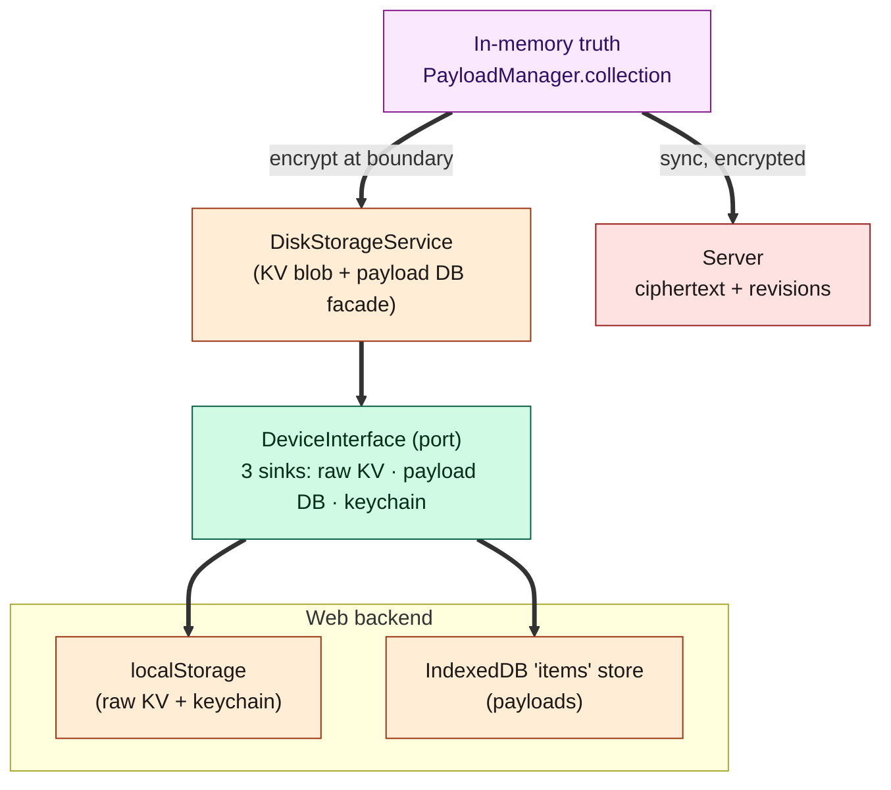
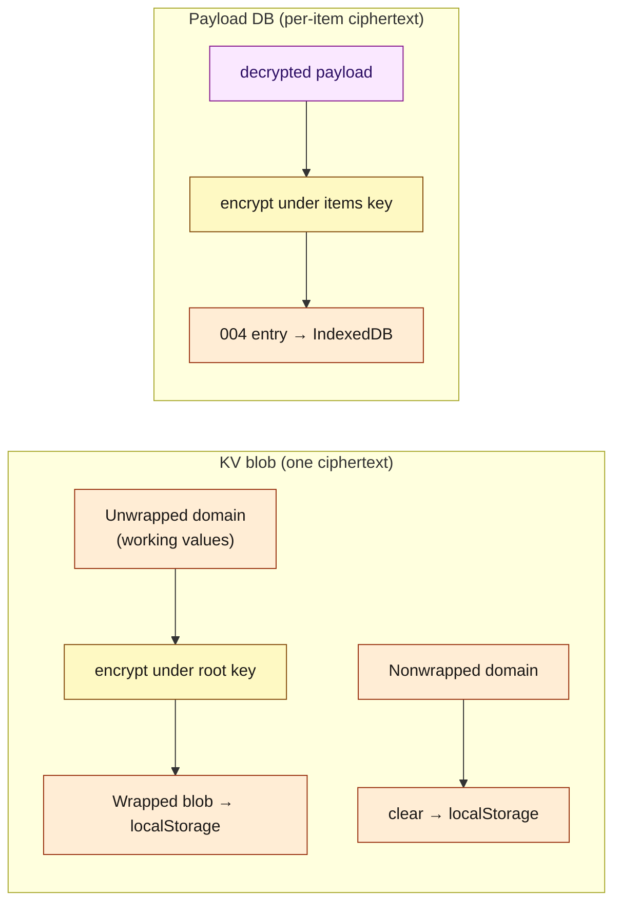
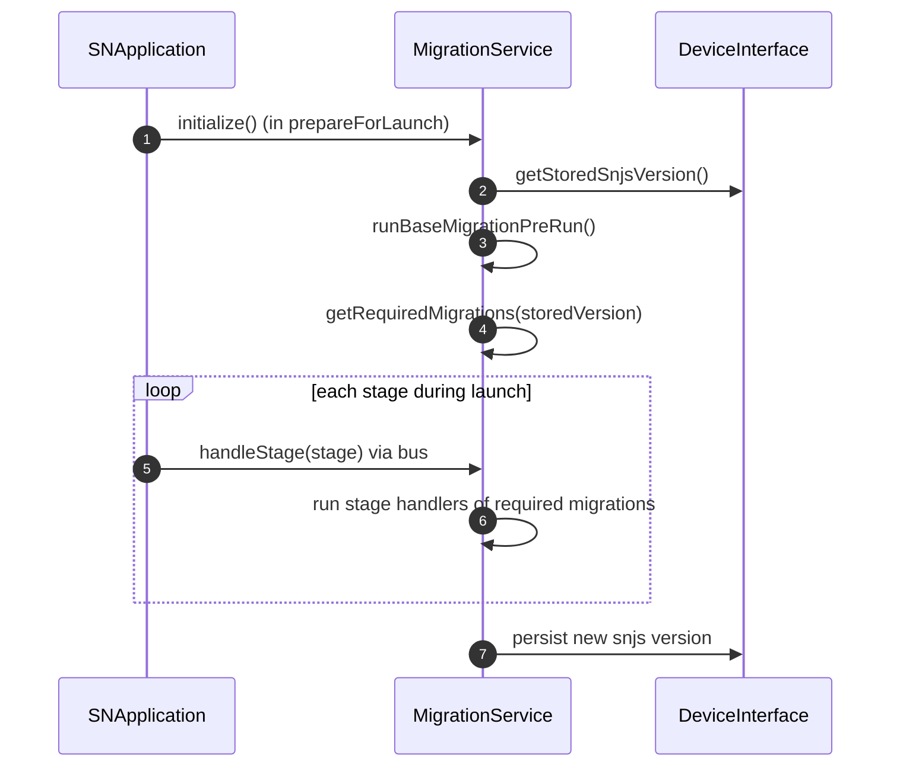
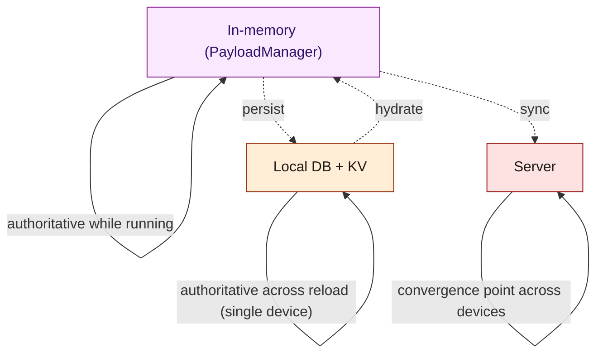

# Document 08 — Persistence Architecture

> **Prerequisites:** [04 — State](./04-state-architecture.md), [07 — Cryptography](./07-cryptographic-architecture.md).
> **Source version:** commit `e1ebcba3c32c7cb68fdf00bb48bac49a5c10f07d`, branch `main`.

## Purpose

Explain every local persistence technology, its schema, how data is namespaced and encrypted at rest, how the app hydrates on boot, and which layer is authoritative under which circumstances. This is the document for “where do the bytes actually live, and can I trust them?”

## Architectural questions answered

- What local persistence backends exist, and what is each used for?
- What is the storage schema, and how is data namespaced per workspace?
- How is data encrypted at rest, and what is *not*?
- How does hydration work on boot, and how are migrations applied?
- Which layer is authoritative, and how are corruption/quota handled?

---

## 1. The layered persistence model



Two abstractions sit between memory and the metal:

1. **`DiskStorageService`** — the logical facade ([Document 04 §3](./04-state-architecture.md)): a key/value blob and a payload database, both encrypted before they descend.
2. **`DeviceInterface`** — the physical port with **three sinks**: raw KV storage, the payload database, and the keychain. Each platform implements it. (Observed.)

---

## 2. The three device sinks (the `DeviceInterface` contract)

Every platform must provide three storage sinks with distinct semantics (Observed — `WebOrDesktopDevice`, `WebDevice`):

| Sink | API (abridged) | Purpose | Web backend |
| ---- | -------------- | ------- | ----------- |
| **Raw KV** | `getRawStorageValue`, `setRawStorageValue`, `removeRawStorageValue` | small values: the KV storage blob, descriptor record, snjs version, session mapper | `localStorage` (`WebOrDesktopDevice.ts:80-99`) |
| **Payload DB** | `getAllDatabaseEntries`, `getDatabaseEntries`, `getDatabaseLoadChunks`, `saveDatabaseEntries`, `removeDatabaseEntry` | the bulk of item payloads | IndexedDB (`Database`, `WebOrDesktopDevice.ts:31,123,188`) |
| **Keychain** | `getNamespacedKeychainValue`, `setNamespacedKeychainValue`, `clearNamespacedKeychainValue` | the wrapped root key / account secrets | **`localStorage`** on web (`WebDevice.ts:12-26`) |

**Security note (web):** the “keychain” on web is a *plain `localStorage` key* (`KEYCHAIN_STORAGE_KEY`) — there is no OS secure enclave in a browser. On desktop/mobile the keychain sink is backed by the OS keystore. This platform difference is central to the threat model in [Document 19](./19-security-boundaries.md). (Observed — `WebDevice.ts:11-26`.)

---

## 3. Namespacing: one workspace = one namespace

All persistence is **namespaced by the workspace identifier** (`application.identifier`, e.g. `'standardnotes'` for the default workspace):

- Raw KV keys use `namespacedKey(identifier, RawStorageKey.X)` (e.g. the storage blob at `namespacedKey(identifier, StorageObject)`, `DiskStorageService.ts:344-346`, Observed).
- The IndexedDB database name **is** the identifier: `new Database(application.identifier, alerts)` (`WebOrDesktopDevice.ts:31`, Observed).
- Keychain values are namespaced by identifier.

**Consequence:** multiple workspaces (multi-account, [Document 03 §2](./03-bootstrap-and-dependency-construction.md)) are fully isolated on disk — a separate IndexedDB database and separate `localStorage` key prefixes per workspace. Signing out one workspace clears only its namespace. (Observed — `DiskStorageService.setPersistencePolicy`/`clearAllData` operate per-identifier, `DiskStorageService.ts:103-111, 476-484`.)

---

## 4. The payload database (IndexedDB on web)

The web payload DB is a single IndexedDB object store (`packages/web/src/javascripts/Application/Database.ts`, Observed):

```ts
// Database.ts:109-125 (cropped) — schema
const objectStore = db.createObjectStore('items', { keyPath: 'uuid' })
objectStore.createIndex('uuid', 'uuid', { unique: true })
// version 1; onNewDatabase callback fires when the store is first created
```

- **Schema:** one store, `items`, keyed by `uuid`, one unique index on `uuid`. Database version `1`. Each record is an **encrypted context payload** (produced by `DiskStorageService.savePayloads`). (Observed.)
- **New-database detection:** the `onupgradeneeded → onNewDatabase` callback surfaces to `SNApplication.createdNewDatabase`, which triggers `sync.onNewDatabaseCreated()` at launch — how the app knows a device is fresh (or the browser silently evicted the DB). (`Database.ts:120-125`; `Application.ts:388-389, 456-458`, Observed.)
- **Lock:** the `Database` starts `locked = true` and refuses opens until `unlock()` — preventing premature access during boot (`Database.ts:22-40, 76-78`, Observed).
- **Writes:** `savePayloads` runs a single `readwrite` transaction with `Promise.all` of `put`s (`Database.ts:206-244`, Observed).

---

## 5. Storage encryption at rest

Two different encryption treatments (Observed — [Document 07 §7](./07-cryptographic-architecture.md) for the crypto):

- **KV blob:** the entire `Unwrapped` domain is serialized and encrypted **as one item** under the root key into the `Wrapped` domain before being written to `localStorage` (`DiskStorageService.generatePersistableValues`, `DiskStorageService.ts:254-282`). The `Nonwrapped` domain is written in clear (it must be readable before unlock).
- **Payload DB:** each payload is **individually** encrypted under its appropriate key (items key / root key for items-keys / key-system key) before `saveDatabaseEntries` (`DiskStorageService.savePayloads`, `DiskStorageService.ts:399-451`).



**What is *not* encrypted at rest:** the `Nonwrapped` KV domain, and — when there is no account/passcode (no root key) — the entire KV blob and payloads are stored in clear (the app is fully usable offline without encryption). The moment a root key exists, both tiers encrypt. (Observed.)

**Persistence gate:** KV persistence is disabled until `ApplicationStage.Launched_10` to avoid writing a half-initialized blob (`DiskStorageService.handleEvent`, `DiskStorageService.ts:91-100`); payload/KV writes are `executeCriticalFunction`s that block deinit until they finish ([Document 04 §3](./04-state-architecture.md)). (Observed.)

---

## 6. Startup hydration

Hydration is chunked and key-first ([Document 05 §1](./05-data-lifecycle-and-e2e-traces.md) for the data flow):

```ts
// packages/snjs/lib/Services/Sync/SyncService.ts:283-364 (cropped)
const chunks = await this.device.getDatabaseLoadChunks({ batchSize, contentTypePriority: ContentTypeLocalLoadPriorty, uuidPriority }, identifier)
// 1) items keys, key-system root keys, key-system items keys FIRST (priority)
// 2) remaining chunks: decrypt + emit in batches, sleep(sleepBetweenBatches) between
```

- **Keys before content** — you cannot decrypt items without their items key in memory, so `getDatabaseLoadChunks` returns key entries first and `loadDatabasePayloads` processes them before anything else (`SyncService.ts:293-320`). This is a hard ordering invariant.
- **Batched emit with yields** — content is decrypted and emitted in batches with `sleep(sleepBetweenBatches)` between, so the UI can paint progressively on large accounts (`SyncService.ts:353-359`). `loadBatchSize`/`sleepBetweenBatches` are tuned per platform (250/250 on mobile, defaults elsewhere — `WebApplication.ts:126-129`). (Observed.)
- The load is **not awaited** by `launch()` ([Document 03 §4](./03-bootstrap-and-dependency-construction.md)); the app is interactive before hydration completes.

---

## 7. Migrations

Storage format evolves; migrations bridge versions (`packages/snjs/lib/Migrations`, Observed):

- **Version-keyed:** one file per snjs version that introduced a change — `2_0_15`, `2_7_0`, `2_20_0`, `2_36_0`, `2_42_0`, `2_167_6`, `2_168_6`, `2_202_1`, `2_208_0`, `2_209_0` (`Migrations/Versions/`). `MigrationService.getRequiredMigrations(storedSnjsVersion)` selects those newer than the stored version (`MigrationService.ts:50, 107`).
- **Stage-driven:** each `Migration` registers handlers for specific boot stages via `registerStageHandler(stage, handler)`; `handleStage(stage)` runs them as the app progresses through the launch ladder (`Migration.ts:13-59`). So a migration that must run *after storage is decrypted* hooks `StorageDecrypted_09`. This reuses the same stage broadcast described in [Document 15 §3](./15-events-and-internal-communication.md).
- **Base pre-run:** `runBaseMigrationPreRun()` handles the very first storage read/format before versioned migrations (`MigrationService.ts:48, 71`).
- **Gate:** `hasPendingMigrations()` lets the UI/boot know migrations remain (`MigrationService.ts:92-93`; surfaced via `SNApplication.hasPendingMigrations`).



**Why stage-driven migrations:** some migrations must read encrypted storage (needs the key → after `StorageDecrypted_09`), others must run before storage init. Binding each migration step to a stage guarantees correct ordering without a bespoke scheduler. (Observed.)

---

## 8. Authority under different circumstances



| Circumstance | Authoritative layer | Why |
| ------------ | ------------------- | --- |
| App running | in-memory `PayloadManager` | sole source of truth ([Document 04](./04-state-architecture.md)) |
| Reload, one device | local DB | hydrates memory before server contact |
| Two devices diverge | server (convergence) + client conflict rules | server gates via timestamps; client duplicates ([Document 06](./06-synchronization-architecture.md)) |
| Offline edit unsynced | local DB (`dirty` persisted) | survives reload, uploads on reconnect |

---

## 9. Failure & corruption handling

| Failure | Detection | Behavior | Reference |
| ------- | --------- | -------- | --------- |
| IndexedDB open fails / private window / two tabs | `Database.openDatabase` `onerror`/`onblocked` | alert + `LocalDatabaseReadError` event; app continues | `Database.ts:84-95, 290-299` |
| Quota exceeded on write | transaction `onabort` `QuotaExceededError` | “out of space” alert; write rejects | `Database.ts:220-229` |
| DB deletion blocked (other tabs) | `deleteDatabase` `onblocked` | alert to close other windows | `Database.ts:268-271` |
| Corrupt payload on load | `CreatePayload` try/catch | logs, skips that payload, continues | `SyncService.ts:305-311` |
| Undecryptable payload | decrypt returns error | kept as an **errored/encrypted** payload (not lost); retried on key recovery | `PayloadManager.invalidPayloads`, [Document 18](./18-error-handling-and-resilience.md) |
| Storage decrypt fails at launch | `decryptStorage` throws | alert; continue with wrapped storage | `Application.ts:433-439` |

**Resilience posture:** a single bad payload never aborts hydration; storage errors degrade to alerts rather than crashes; undecryptable items are retained (so a later key recovery can decrypt them) rather than dropped. (Observed.)

---

## 10. Platform differences (summary)

| Concern | Web | Desktop | Mobile |
| ------- | --- | ------- | ------ |
| Raw KV | `localStorage` | `localStorage` (+ optional file backups) | native KV |
| Payload DB | IndexedDB `items` | IndexedDB (renderer) | native DB |
| Keychain | `localStorage` (no OS keystore) | OS keychain (`safeStorage`/keytar) | OS keychain / biometrics |
| Encrypted text backups | — | file-based backups (`FilesBackupService`) | — |

Detail and the desktop/mobile device implementations are in [Document 13](./13-multi-platform-architecture.md).

---

## What you should now understand

- The two-abstraction stack (`DiskStorageService` → `DeviceInterface`) and the three device sinks.
- The web backend: `localStorage` (raw KV + keychain) and IndexedDB (`items` store keyed by `uuid`).
- Per-workspace namespacing and its isolation guarantee.
- The two at-rest encryption treatments (whole KV blob vs per-payload) and what stays in clear.
- Key-first, batched hydration and stage-driven versioned migrations.
- Corruption/quota handling and the degrade-don’t-crash posture.

## Architectural invariants learned

1. **All local persistence flows through `DiskStorageService → DeviceInterface`; the three sinks (raw KV, payload DB, keychain) are the only durable surfaces.**
2. **Everything durable is namespaced by workspace identifier; workspaces are isolated on disk.**
3. **Items keys are hydrated before any content payload on boot.**
4. **With a root key present, both tiers encrypt at rest; the `Nonwrapped` KV domain is the sole pre-unlock-readable state.**
5. **On web, the keychain is `localStorage` — no OS secure storage.**
6. **A single corrupt/undecryptable payload never aborts hydration; it is skipped or retained as errored.**

## Open questions

- Desktop/mobile native DB and keychain internals — [Document 13](./13-multi-platform-architecture.md) (backed by the platform explorer’s findings).
- Exact `getDatabaseLoadChunks` chunking/priority algorithm internals — Observed at the call site; the device-side implementation detail is in `WebOrDesktopDevice.ts:123+`.

## Source index

- `packages/snjs/lib/Services/Storage/DiskStorageService.ts` — KV blob + payload DB facade.
- `packages/web/src/javascripts/Application/Database.ts` — IndexedDB `items` store.
- `packages/web/src/javascripts/Application/Device/WebOrDesktopDevice.ts`, `WebDevice.ts` — raw KV + keychain.
- `packages/snjs/lib/Services/Sync/SyncService.ts:277-365` — hydration.
- `packages/snjs/lib/Migrations/*`, `packages/snjs/lib/Services/Migration/MigrationService.ts` — migrations.

## Next document

Continue to **[Document 09 — Editor and Product Architecture](./09-editor-and-product-architecture.md)**.
