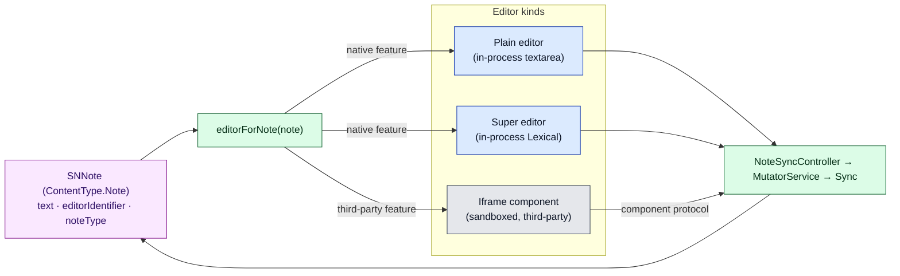
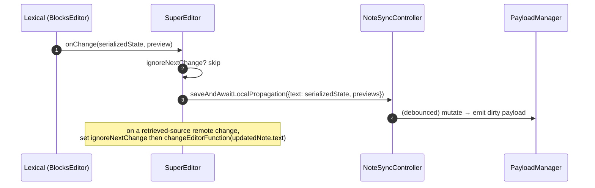
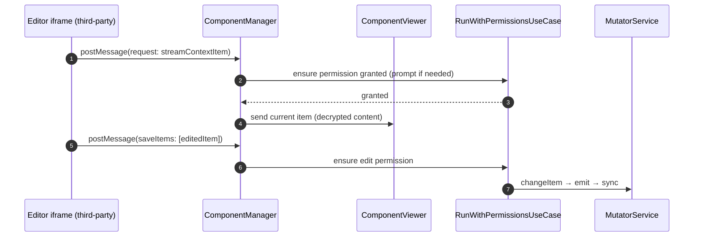
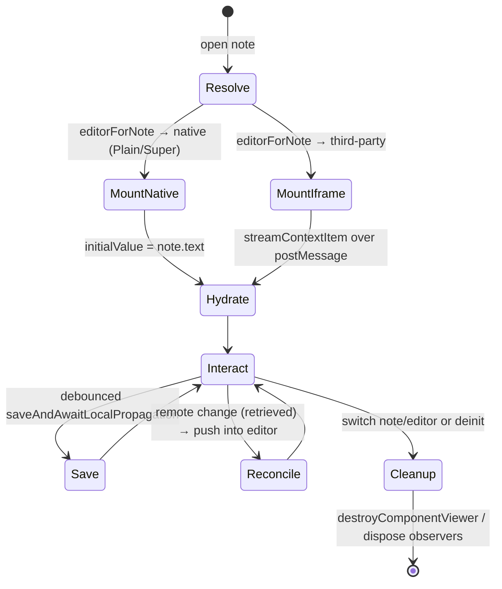

# Document 09 — Editor and Product Architecture

> **Prerequisites:** [04 — State](./04-state-architecture.md), [05 — Data Lifecycle](./05-data-lifecycle-and-e2e-traces.md), [10 — React](./10-react-architecture.md) (for the UI bridge).
> **Source version:** commit `e1ebcba3c32c7cb68fdf00bb48bac49a5c10f07d`, branch `main`.

## Purpose

Explain how the thing that *renders and edits* a note is decoupled from the note’s durable representation, the three editor kinds and their boundaries, and exactly how to add a new editor. Editors are the main extension surface of Standard Notes, and their sandboxing is a security boundary.

## Architectural questions answered

- What renders a note, and how is that decoupled from what a note *is*?
- What are the editor kinds, and what boundary does each run behind?
- How is an editor resolved, constructed, hydrated, and cleaned up?
- What prevents one editor from corrupting another content type?
- How do I add a new editor/product?

---

## 1. The core decoupling: content type vs editor

- *Problem:* a note is durable, encrypted, syncable data; the UI that edits it changes often and may be third-party. Coupling them would make the data format hostage to UI churn and would let untrusted editor code touch durable state directly.
- *Constraint:* the durable note must be a stable, editor-agnostic item; the editor must not be able to bypass the mutation/encryption pipeline.
- *Abstraction:* **all notes are `ContentType.Note`** regardless of editor. A note carries an `editorIdentifier` that *selects* which editor renders it; the editor writes back only through the standard save pipeline.



**The load-bearing rule:** whatever the editor, the only way durable state changes is the save pipeline (`NoteSyncController.saveAndAwaitLocalPropagation → MutatorService.changeItem → PayloadManager.emit → Sync`). Editors never write payloads directly. (Observed — all three kinds route through `saveAndAwaitLocalPropagation`; see §3–§5.)

---

## 2. Editor resolution

`NoteView` asks the `ComponentManager` to resolve the editor, which delegates to `EditorForNoteUseCase` (`packages/snjs/lib/Services/ComponentManager/UseCase/EditorForNote.ts`, Observed). The resolution order is: **`note.noteType` (Plain / Super) first**, then `note.editorIdentifier` (a native feature or an installed Component item), then legacy per-note component association, then a Plain fallback:

```ts
// EditorForNote.ts (cropped)
if (note.noteType === NoteType.Plain) return new UIFeature(GetPlainNoteFeature())
if (note.noteType === NoteType.Super) return new UIFeature(GetSuperNoteFeature())
if (note.editorIdentifier) { const r = componentOrNativeFeatureForIdentifier(note.editorIdentifier); if (r) return r }
return new UIFeature(GetPlainNoteFeature())
```

- If `editorForNote` returns a **native feature** (`NativeFeatureIdentifier` for Plain or Super), `NoteView` renders the corresponding in-process React component.
- Otherwise it creates a `ComponentViewer` and renders an **iframe** (`createComponentViewer(component, {uuid})`, `NoteView.tsx:473-478`).
- When `editorIdentifier`/`noteType` changes, the editor is re-resolved: the old viewer is destroyed and a new editor is mounted (`NoteView.tsx:314-352, 530-548`). (Observed.)

**Data-plane fact:** resolution is a **read** — the note is already decrypted in memory ([Document 05 §4](./05-data-lifecycle-and-e2e-traces.md)); switching editors never re-decrypts.

---

## 3. Kind 1 — Plain editor (in-process)

A simple React `textarea` component storing plain text in `note.text`. Its change handler debounces into `NoteViewController.saveAndAwaitLocalPropagation` ([Document 05 §3](./05-data-lifecycle-and-e2e-traces.md)). No sandbox — it is first-party code in the main document. (Observed — `PlainEditor.tsx`.)

---

## 4. Kind 2 — Super editor (in-process Lexical)

The Super editor is the modern rich “blocks” editor, built on **Lexical** and running **in the main React tree** (not an iframe) (`packages/web/src/javascripts/Components/SuperEditor/SuperEditor.tsx`, Observed).

- **Composition:** `BlocksEditorComposer` + `BlocksEditor` + a stack of Lexical **plugins** (`ItemSelectionPlugin`, `FilePlugin`, `ItemBubblePlugin`, `GetMarkdownPlugin`, `ChangeContentCallbackPlugin`, `NodeObserverPlugin`, `ReadonlyPlugin`, `AutoFocusPlugin`, `BlockPickerMenuPlugin`, `NoteFromSelectionPlugin`) (`SuperEditor.tsx:274-302`). Custom nodes (`FileNode`, `BubbleNode`) embed encrypted files and links to other items *inside* the document.
- **Content storage:** the serialized Lexical editor state is stored in the **same `note.text` field** as a plain note — but it is Lexical JSON, not plain text. `BlocksEditor initialValue={note.current.text}` hydrates; `onChange(value, preview)` yields the serialized state (`SuperEditor.tsx:277-279, 171-189`). A `noteType`/`editorIdentifier` distinguishes it as a Super note. Markdown export is available via `GetMarkdownPlugin` for interop.
- **Save path:** `handleChange` calls `controller.saveAndAwaitLocalPropagation({ text: value, isUserModified: true, previews: {previewPlain: preview} })` — **the exact same pipeline as the plain editor** (`SuperEditor.tsx:181-188`). This is invariant X1 in action.
- **Remote reconciliation:** the editor subscribes to inner note changes; when a change with a *retrieved* source arrives (a remote update), it sets `ignoreNextChange = true` and pushes the new text into Lexical via `changeEditorFunction`, so the incoming update doesn’t bounce back as a save loop (`SuperEditor.tsx:204-217`). This is the concrete mechanism behind [Document 05 Trace 6](./05-data-lifecycle-and-e2e-traces.md).
- **Entitlement gating:** Super is a paid native feature; `featureStatus` gates it to readonly with a banner when not entitled (`SuperEditor.tsx:75-103, 271-273`).



**Why in-process (not an iframe) for Super:** it needs deep integration — embedding other items/files as nodes, linking, command palette, keyboard shortcuts — which the arms-length iframe protocol cannot express efficiently. The tradeoff is that Super is first-party code with full main-thread access (no sandbox), justified because it *is* first-party. (Inferred rationale; the in-process structure is Observed.)

---

## 5. Kind 3 — Iframe components (third-party editors & themes)

Third-party editors (`@standardnotes/rich-text`, `bold-editor`, `spreadsheets`, `simple-task-editor`, `markdown-*`, `classic-code-editor`) and **themes** run in **sandboxed iframes**, orchestrated by `ComponentManager` over `postMessage` (`packages/snjs/lib/Services/ComponentManager/ComponentManager.ts:70-133`, Observed).

- **Per-component bridge:** `createComponentViewer(component, item)` builds a `ComponentViewer` holding references to `items`, `mutator`, `sync`, `preferences`, `features`, and the component’s URL (`ComponentManager.ts:173-208`). One viewer per live editor iframe.
- **Message transport:** `ComponentManager` listens on `window.addEventListener('message', onWindowMessage, true)` (`ComponentManager.ts:132`). Components send requests (stream the context item, save items, request permissions, set component data) and receive the current item and theme.
- **Permissions:** privileged actions run through `RunWithPermissionsUseCase`, which prompts the user to grant a component permission (e.g. “stream this note”, “edit items”) before the action executes (`ComponentManager.ts:86-92`). This is the trust gate for untrusted editor code.
- **Themes are components too:** active theme CSS URLs are pushed to every viewer (`postActiveThemesToAllViewers`), so iframe editors adopt the app theme (`ComponentManager.ts:117-122`). On mobile, native themes are provided as base64 (`ComponentManager.ts:94, 114`).
- **Where the assets live:** the third-party editor packages are **copied at build time** into the web output (`packages/web` `copy:components` → `scripts/CopyComponents.mjs`) and served locally; on desktop a local components server serves them; on mobile native component URLs are registered (`ComponentManager.ts:112-114`, [Document 13](./13-multi-platform-architecture.md), [Document 14](./14-build-system-and-delivery.md)). (Observed.)



**Security boundary:** the iframe cannot read the app’s memory, keys, or other items’ data — it only ever receives the *specific* item(s) it was granted, as decrypted content passed over `postMessage`, and can only write through permissioned `saveItems`. This is the primary **untrusted-code boundary** in the app ([Document 19](./19-security-boundaries.md)). The tradeoff vs Super’s in-process model is isolation-for-integration. (Observed structure; message-schema specifics are in the component protocol.)

---

## 6. Editor lifecycle



**Cleanup (Observed):** switching editor destroys the prior `ComponentViewer` (`NoteView.tsx:351-352, 514-518`); `ComponentManager.deinit` destroys all viewers and removes the `message`/focus listeners (`ComponentManager.ts:134-160`); the Super editor disposes its inner-value observer on unmount. A note is not deallocated mid-save ([Document 05 §3](./05-data-lifecycle-and-e2e-traces.md)).

---

## 7. What prevents one editor from corrupting another content type

Invariant **X2** (from [Document 20](./20-architectural-invariants.md)):

- Notes are always `ContentType.Note`; the `editorIdentifier` only selects rendering. An editor writing to `note.text` cannot change a note into a tag or an items key. (Observed — content type is fixed on the item.)
- Iframe components can only touch items they were granted via permissions; they cannot enumerate or write arbitrary items (`RunWithPermissionsUseCase`). (Observed.)
- All writes go through `MutatorService`, which produces a typed payload for the *existing* item; there is no path for an editor to overwrite a different item’s content type. (Observed — [Document 04](./04-state-architecture.md).)

So a buggy/malicious editor can corrupt *its own note’s text* (which conflict resolution + revisions can recover) but cannot cross content-type or item boundaries.

---

## 8. Adding a new editor/product

Two routes, depending on trust and integration depth:

### Route A — third-party iframe component (most editors)

| Step | What | Where |
| ---- | ---- | ----- |
| 1 | Build an HTML/JS component speaking the component `postMessage` protocol | external package |
| 2 | Register a feature descriptor (identifier, area=Editor, permissions) | `@standardnotes/features` |
| 3 | Ship/serve the assets | `scripts/CopyComponents.mjs` (web), components server (desktop), native URLs (mobile) |
| 4 | User selects it as the note’s editor → `editorIdentifier` set → `editorForNote` resolves it | runtime |

No changes to the domain or sync are needed — the component uses the existing permissioned protocol. This is the intended, low-risk extension path.

### Route B — first-party native editor (like Super)

| Step | What | Where |
| ---- | ---- | ----- |
| 1 | Add a `NativeFeatureIdentifier` + feature descriptor | `@standardnotes/features` |
| 2 | Build the React editor component | `packages/web/.../Components/...` |
| 3 | Teach `NoteView`/`editorForNote` to render it for that identifier | `NoteView.tsx` |
| 4 | Save through `NoteViewController.saveAndAwaitLocalPropagation` | reuse existing pipeline |
| 5 | Decide the on-disk representation (reuse `note.text`, as Super does, or a new field) | model impact |

Route B is more powerful (in-process, deep integration) but bypasses the sandbox — only for first-party code. Full extension guidance is in [Document 21](./21-extension-points.md).

**Contracts that must hold either way:** (1) write only through the save pipeline; (2) keep the note’s content type `Note`; (3) tolerate remote changes arriving mid-edit (adopt or conflict, don’t loop); (4) be entitlement-aware if gated.

---

## 9. Cross-platform editor notes

| Concern | Web | Desktop | Mobile |
| ------- | --- | ------- | ------ |
| Iframe components | served from build output | local components server | native component URLs / webview |
| Super editor | in-process Lexical | same | same (in the webview) |
| Themes | CSS URLs to iframes + app | same | native themes as base64 |

Detail in [Document 13](./13-multi-platform-architecture.md).

---

## What you should now understand

- Notes are content-type-stable; `editorIdentifier` selects the renderer.
- The three editor kinds and their boundaries (in-process plain/Super vs sandboxed iframe components).
- The Super editor stores serialized Lexical JSON in `note.text` and saves through the standard pipeline.
- The iframe component protocol (`ComponentManager`/`ComponentViewer`/`postMessage`/permissions) as the untrusted-code boundary.
- Exactly how to add either an iframe editor or a native editor, and the contracts either must satisfy.

## Architectural invariants learned

1. **Every editor writes durable state only through `NoteSyncController → MutatorService`; none writes payloads directly.**
2. **A note’s content type is fixed (`Note`); editors change only its content, never its type or another item.**
3. **Iframe components can access only permissioned items, over `postMessage`; they never see keys or the app heap.**
4. **Editors must tolerate remote changes mid-edit (adopt-or-conflict, no save loop) — enforced by the `ignoreNextChange`/retrieved-source pattern.**

## Open questions

- The exact component `postMessage` message schema (permission verbs, `streamContextItem`/`saveItems` payloads) — Observed at the transport level; the full schema lives in the component protocol and the third-party SDK.

## Source index

- `packages/web/src/javascripts/Components/NoteView/NoteView.tsx` — editor resolution & mounting.
- `packages/web/src/javascripts/Components/SuperEditor/SuperEditor.tsx` — Lexical editor + save/reconcile.
- `packages/snjs/lib/Services/ComponentManager/ComponentManager.ts` — iframe orchestration, permissions, themes.
- `packages/web/src/javascripts/Controllers/NoteSyncController.ts` — the shared save pipeline.

## Next document

Continue to **[Document 10 — React Architecture](./10-react-architecture.md)**.
