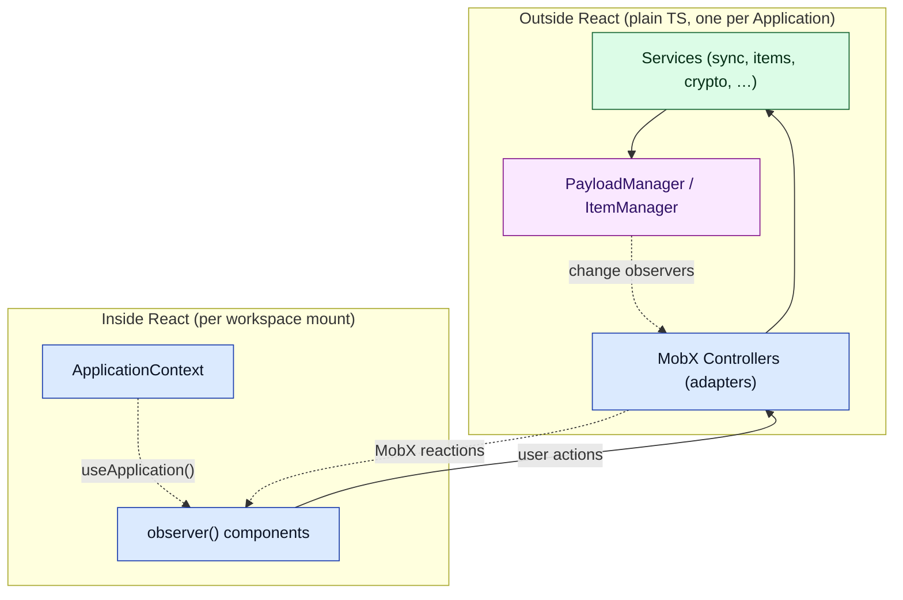
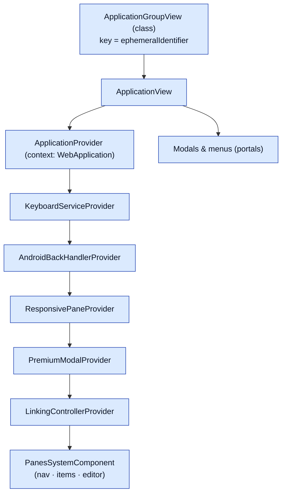
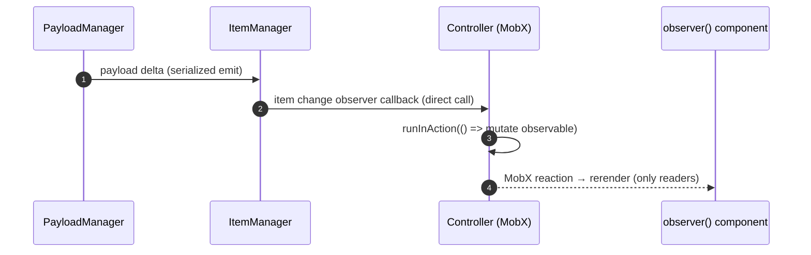
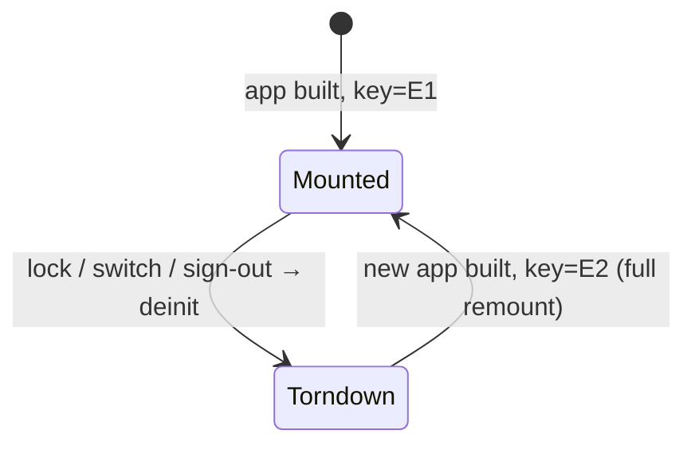

# Document 10 — React Architecture

> **Prerequisites:** [03 — Bootstrap](./03-bootstrap-and-dependency-construction.md), [04 — State](./04-state-architecture.md), [15 — Events](./15-events-and-internal-communication.md).
> **Source version:** commit `e1ebcba3c32c7cb68fdf00bb48bac49a5c10f07d`, branch `main`.
> **Assumes deep React knowledge** — no hooks/component basics here. Focus is on the *architecture*: boundaries, the service↔React bridge, and rerender propagation.

## Purpose

Explain how a domain that deliberately lives **outside** React is bridged into it, how rerenders propagate at fine granularity, and where the seams (providers, controllers, remounts) are. The key insight: **React is a subscriber, not the owner, of application state.**

## Architectural questions answered

- What is inside vs outside the React tree, and why?
- How do services reach React, and how does a domain change trigger a rerender?
- What is the provider/context architecture and the remount model?
- Where are code-splitting, error boundaries, portals, and cleanup?

---

## 1. The boundary: domain outside React

Almost all application logic — services, `PayloadManager`, `ItemManager`, sync, crypto — is plain TypeScript constructed by the DI container ([Document 03](./03-bootstrap-and-dependency-construction.md)), with **no React dependency**. React sits on top as a rendering layer that *observes* this domain.



**Why the domain is outside React (causal):** the durable model must be testable and portable (it runs identically on web, desktop, and mobile’s webview, and in the headless e2e server), and it must **survive React remounts**. If state lived in React, a workspace switch (which remounts the whole tree, [Document 03 §2](./03-bootstrap-and-dependency-construction.md)) would destroy it. By keeping state in services and treating React as a subscriber, the app can throw away and rebuild the entire React tree without losing a byte of application state. (Observed — the remount model, §6.)

---

## 2. The React tree and provider stack

The tree is mounted by `ApplicationGroupView` → `ApplicationView`, which wraps the app in a fixed provider stack (`ApplicationView.tsx:237-286`, Observed):



- **`ApplicationProvider`** exposes the `WebApplication` via context; `useApplication()` reads it and throws if used outside (`ApplicationProvider.tsx:6-15`, Observed). The provider is itself `observer()`-wrapped and memoizes children so providing the (stable) app reference doesn’t cascade rerenders (`ApplicationProvider.tsx:26-36`).
- Other providers inject specific controllers/services (`KeyboardServiceProvider`, `ResponsivePaneProvider`, `LinkingControllerProvider`, `PremiumModalProvider`). These are **dependency-injection into the tree**, not state stores — the state lives in the controllers.
- **Gating:** `ApplicationView` renders only the challenge modal until `!needsUnlock && launched` ([Document 03 §4](./03-bootstrap-and-dependency-construction.md)), then the full pane system.

---

## 3. The service→React bridge: MobX controllers

The adapter layer is a set of **controllers**, constructed in `WebDependencies` ([Document 03 §3](./03-bootstrap-and-dependency-construction.md)) and reachable via the `WebApplication` façade (`application.notesController`, etc.). They extend `AbstractViewController` (`packages/web/src/javascripts/Controllers/Abstract/AbstractViewController.ts`, Observed).

A controller does four things (Observed — `NotesController`):

1. **Holds MobX observable state.** `makeObservable(this, { field: observable, derived: computed, setter: action })` (`NotesController.ts:62-78`).
2. **Subscribes to the domain.** It observes item streams (`application.items` observers), app events (`application.events.addEventHandler(this, ApplicationEvent.PreferencesChanged)` — implementing `InternalEventHandlerInterface`), and preferences (`NotesController.ts:85-86`).
3. **Reacts.** MobX `reaction(() => this.selectedNotesCount, cb)` runs side-effects (e.g. re-registering keyboard commands) when derived values change (`NotesController.ts:89-96`).
4. **Cleans up.** `AbstractViewController.deinit()` disposes every registered disposer and clears observers (`AbstractViewController.ts:18-29`).

The precise bridge (control + data flow):



**The mechanism, stated exactly:** a domain change is a **direct callback** into the controller (not the event bus), the controller mutates a MobX observable inside an `action`, and MobX schedules a rerender of exactly the `observer()` components that *read* that observable. There is no global store diff and no top-down rerender. (Observed — [Document 04 §2](./04-state-architecture.md) + `NotesController`.)

---

## 4. Rerender propagation & granularity

Components are wrapped in `observer()` from `mobx-react-lite`. MobX tracks, per-render, which observables each component reads, and rerenders only those on change. Consequences:

- **A note edit rerenders the note editor and the one list row whose preview changed — not the tag list, not the account menu.** Because the tag list reads `tagDisplayController` observables and the editor reads the note, and MobX rerenders by read-set. (Observed — separate display controllers per content type, [Document 04 §2](./04-state-architecture.md).)
- **`computed`** values (e.g. `selectedNotes`, `selectedNotesCount`) are memoized by MobX and only recompute when their dependencies change, so components reading them don’t rerender on unrelated updates (`NotesController.ts:66-71`, Observed).
- **Selectors** are the `computed` getters; there is no Redux-style selector library — MobX’s dependency tracking *is* the selector mechanism.

**Performance implication:** the expensive trees are the item list (many rows) and the editor. The item list reads pre-sorted display-controller output ([Document 04](./04-state-architecture.md)), so it doesn’t sort on render; virtualization/large-list behavior is analyzed in [Document 16](./16-performance-engineering.md). (Observed that sorting is precomputed; virtualization specifics — Inferred, verified in Doc 16.)

---

## 5. Cross-controller communication

Controllers don’t call each other directly (that would couple them and complicate deinit). They publish on the **internal event bus** using `CrossControllerEvent`:

```ts
// AbstractViewController.ts:14-16 (verbatim)
protected async publishCrossControllerEventSync(name: CrossControllerEvent, data?): Promise<void> {
  await this.eventBus.publishSync({ type: name, payload: data }, InternalEventPublishStrategy.SEQUENCE)
}
```

e.g. `CrossControllerEvent.UnselectAllNotes` is published by one controller and handled by `NotesController` via `addEventHandler` (`NotesController.ts:86`, Observed). This reuses the same bus as the services ([Document 15](./15-events-and-internal-communication.md)) — the controllers are, architecturally, UI-layer services.

---

## 6. The remount model

`ApplicationGroupView` keys `ApplicationView` by `application.ephemeralIdentifier` ([Document 03 §2](./03-bootstrap-and-dependency-construction.md)). When the primary application changes (workspace switch, lock, sign-out), a new instance has a new `ephemeralIdentifier`, so React **unmounts the entire tree and mounts a fresh one**.



**Why this is safe and cheap:** because state lives in services (not React), remounting loses no data — the new tree simply subscribes to the (new) application’s controllers. This is the payoff of §1’s boundary decision. (Observed.)

---

## 7. Routing

There is no React Router. Routing is a thin `RouteParser`/`RouteService` (`@standardnotes/ui-services`) that parses `window.location` into a `RouteType` (App view, Demo, U2F, extension) (`App.tsx:80-84`, `ApplicationView.tsx:213-235`, Observed). `ApplicationView` branches on the route to render the normal app, the clipper view, or the U2F iframe. It is a small state machine, not a nested-route tree — appropriate for a single-page app whose “navigation” is pane/selection state held in controllers.

---

## 8. Code splitting, Suspense, error boundaries, portals

- **Code splitting / lazy:** `React.lazy(() => import(...))` is used for heavy/optional views, e.g. `LazyLoadedClipperView` (`ApplicationView.tsx:44`, Observed). Dynamic `import()` also loads the Super editor tooling and other optional chunks (webpack splits them — [Document 14](./14-build-system-and-delivery.md)).
- **Suspense:** used with the lazy views (React requires a Suspense boundary around `lazy`); there is no data-fetching Suspense — data comes from MobX, not Suspense resources. (Observed at the lazy sites.)
- **Error boundaries:** `ErrorBoundary` wraps risky subtrees such as the Super editor (`SuperEditor.tsx:274`, Observed) so a Lexical crash degrades to a boundary instead of blanking the app.
- **Portals:** modals, context menus, toasts, and the file preview render as overlays appended near the app root (`ApplicationView.tsx:250-276`), typical portal-style overlays layered above the pane system.

---

## 9. Where the domain intentionally stays outside React (and why)

| Concern | Lives outside React in… | Why |
| ------- | ----------------------- | --- |
| Item/payload truth | `PayloadManager`/`ItemManager` | must survive remount; testable headless |
| Sync, crypto, storage | services | platform-portable; no DOM needed |
| Selection/pane/UI state | MobX controllers | shared across components; survives child unmounts |
| Keyboard commands | `KeyboardService` | global, not tied to a component |
| Theme | `ThemeManager` | applies to iframes + document, pre-React |

React holds only: transient component-local UI (`useState`), the provider references, and the rendered projection of controller observables. (Observed.)

---

## 10. Cleanup semantics

- **Controllers** implement `deinit()` disposing all `disposers` (item observers, MobX reactions, command registrations, event handlers) — called when `WebDependencies.deinit()` runs on application teardown (`AbstractViewController.ts:18-29`; `WebApplication.deinit` → `deps.deinit()`, [Document 03 §7](./03-bootstrap-and-dependency-construction.md)).
- **Components** dispose their own subscriptions in `useEffect` returns (e.g. `SuperEditor` disposes its inner-value observer; `ApplicationView` removes app observers) (Observed).
- **Editors/viewers** are destroyed on switch/unmount ([Document 09 §6](./09-editor-and-product-architecture.md)).

The deinit chain is what makes the remount model leak-free — analyzed further in [Document 17](./17-memory-architecture.md).

---

## What you should now understand

- The domain lives outside React; React is a subscriber that can be discarded/rebuilt without losing state.
- The bridge is: domain change → direct callback → controller mutates a MobX observable in an `action` → `observer()` readers rerender.
- Rerender granularity is per-observable-read; unrelated UI doesn’t rerender.
- The provider stack injects the app/controllers; cross-controller comms use the event bus.
- The `ephemeralIdentifier`-keyed remount model and why it’s safe.
- Where lazy loading, error boundaries, and portals sit.

## Architectural invariants learned

1. **Application state lives in services/controllers outside React; React never owns durable state.**
2. **Domain→UI updates flow through MobX observables mutated inside actions; components are `observer()` projections.**
3. **The whole React tree can be remounted (workspace switch/lock) without state loss.**
4. **Controllers must `deinit()` their disposers; leaking a subscription leaks across remounts.**

## Open questions

- Exact list virtualization strategy for very large note lists — verified in [Document 16](./16-performance-engineering.md).

## Source index

- `packages/web/src/javascripts/Components/ApplicationProvider.tsx` — context + `useApplication`.
- `packages/web/src/javascripts/Controllers/Abstract/AbstractViewController.ts` — controller base + deinit.
- `packages/web/src/javascripts/Controllers/NotesController/NotesController.ts` — MobX observable/computed/action + subscriptions.
- `packages/web/src/javascripts/Components/ApplicationView/ApplicationView.tsx` — provider stack, routing, lazy, portals.

## Next document

Continue to **[Document 11 — Workers, Concurrency and WASM](./11-workers-concurrency-and-wasm.md)**.
