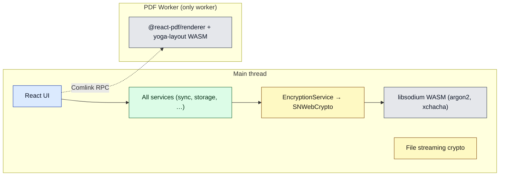
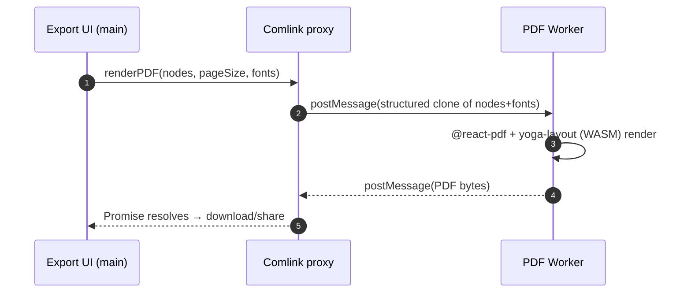
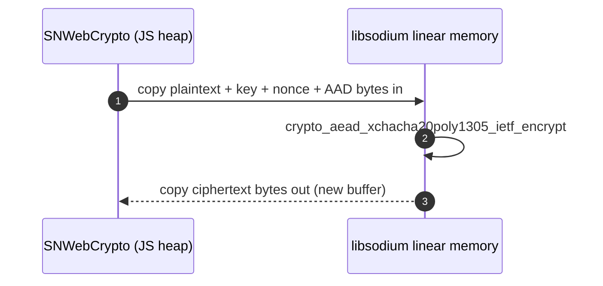

# Document 11 — Workers, Concurrency, and WASM

> **Prerequisites:** [07 — Cryptography](./07-cryptographic-architecture.md), [10 — React](./10-react-architecture.md).
> **Source version:** commit `e1ebcba3c32c7cb68fdf00bb48bac49a5c10f07d`, branch `main`.
> **Verification:** exhaustive `rg` searches for `new Worker`, `Comlink`, `.worker.`, `serviceWorker`, and WASM were run (see §1, §5). Absences are stated as confirmed absences.

## Purpose

Inventory every concurrency mechanism and WASM boundary, and — crucially — establish what runs on the **main thread**. The surprising, load-bearing fact for performance: **cryptography runs on the main thread**, and there is exactly **one** Web Worker in the whole web app.

## Architectural questions answered

- What Web/Shared/Service Workers exist? What runs where?
- Why WASM, how is it loaded, and what crosses the JS↔WASM boundary?
- What stays on the main thread, and what are the concurrency consequences?

---

## 1. Concurrency inventory (measured)

An exhaustive search of the repository (`rg 'new Worker|new SharedWorker|\.worker\.|Comlink' --glob '*.{ts,tsx}'`) yields:

| Mechanism | Count | What | Evidence |
| --------- | ----- | ---- | -------- |
| **First-party Web Worker** | **1** | PDF export (Super editor) via Comlink | `SuperEditor/.../PDFExport/PDFWorker.worker.tsx` |
| **Dependency-spawned Web Workers** | **≥1 (transitive)** | `@zip.js/zip.js` spawns its own deflate/inflate workers (default `useWebWorkers: true`, not disabled) for backup/import zip archives | `FilesController.ts:827` (`await import('@zip.js/zip.js')`) |
| **Shared Worker** | **0** | — | no matches |
| **Service Worker** | **0** | — | no matches (see [Document 12](./12-pwa-and-service-worker.md)) |
| **WASM module** | **1 primary** | libsodium (crypto); plus yoga-layout in the PDF worker | `sncrypto-web/src/libsodium.ts`; `web.webpack.config.js:110` |

**The headline:** the app is essentially **single-threaded** for its own logic. All domain logic, all storage, and — importantly — **all cryptography** run on the main thread. The only *first-party* off-main-thread work is PDF export. (A dependency, `@zip.js/zip.js`, transparently spawns its own workers for zip archive deflate/inflate during backup export/import — off-main-thread but not app-authored.) (Observed.)

---

## 2. The one Web Worker: PDF export

**Why it exists:** rendering a note to PDF with `@react-pdf/renderer` (which uses the yoga-layout flexbox engine) is CPU-heavy and would freeze the UI for large documents. It is offloaded to a worker (`packages/web/src/javascripts/Components/SuperEditor/Lexical/Utils/PDFExport/`, Observed).

- **Creation:** `import PDFWorker from './PDFWorker.worker'` then `const PDFWorkerComlink = wrap<PDFWorkerInterface>(pdfWorker)` (`PDFExport.tsx:27-28, 661`). The worker exposes `renderPDF` via Comlink `expose` (`PDFWorker.worker.tsx:19`).
- **Message contract:** `PDFWorkerComlink.renderPDF(pdfDataNodes, pageSize, fontFamilies, useCustomFonts)` → PDF bytes (`PDFExport.tsx:690`). Comlink turns this into `postMessage` request/response with a Promise on the caller side.
- **What is serialized:** the `pdfDataNodes` (a plain structured-cloneable representation of the document) and font data go **in**; the rendered PDF comes **out**. Everything crosses by **structured clone** — no `Transferable`/`SharedArrayBuffer` is used (Observed — plain Comlink call, no transfer list). For very large documents this clone cost is real (§6).
- **Bundling:** `worker-loader` with `inline: 'fallback'` (`web.webpack.config.js:96-102`) bundles the worker inline (a Blob URL) rather than a separate file, so it needs no separate asset request. (Observed.)

**Cancellation/failure:** Comlink calls are Promises; there is no explicit cancellation token — a started render runs to completion (Observed; the caller simply awaits). A worker error rejects the Promise, surfaced to the export UI.

---

## 3. WASM: libsodium (the crypto engine)

The primary WASM module is **libsodium**, re-exported by `packages/sncrypto-web/src/libsodium.ts` from `libsodium-wrappers` (Observed). All `004` crypto ([Document 07](./07-cryptographic-architecture.md)) ultimately calls into it.

- **Why WASM:** Argon2id and XChaCha20-Poly1305 are unavailable/awkward in WebCrypto; libsodium provides audited, constant-time implementations compiled to WASM at near-native speed ([Document 07 §2](./07-cryptographic-architecture.md)).
- **Loading:** `libsodium-wrappers` **embeds** the WASM binary (base64) inside its JS module and instantiates it internally; `ready` is a Promise resolved when instantiation completes (`libsodium.ts:25`). There is **no separate `.wasm` HTTP fetch** and no webpack WASM loader configured — which is why `web.webpack.config.js` has no `asyncWebAssembly`/`.wasm` rule. `SNWebCrypto.initialize()` awaits `ready` (`crypto.ts:46-56`), and this is the first step of `prepareForLaunch` ([Document 03 §4](./03-bootstrap-and-dependency-construction.md)). (Observed.)
- **Thread:** the same main thread as everything else. There is **no crypto worker**. (Observed — no worker imports libsodium.)

### The JS↔WASM boundary (what crosses)

libsodium.js exposes typed functions; the ABI is: JavaScript passes `Uint8Array`/strings, libsodium **copies** them into WASM linear memory, runs the primitive, and copies the result back out as a new `Uint8Array`/hex/base64 string.

- **What is copied:** every call copies its inputs into WASM memory and its outputs back — there is no zero-copy sharing. For bulk operations (decrypting thousands of items on load) this is many small copies plus many primitive invocations. (Observed — `crypto.ts:236-289`; the copy semantics are libsodium.js’s standard behavior — Inferred from the library.)
- **What stays inside WASM:** transient key/nonce/state buffers during a call; libsodium’s internal state (e.g. `crypto_secretstream` state handles for file streaming, referenced by `StateAddress`). (Observed — `StateAddress` usage, `crypto.ts:291-347`.)
- **GC interaction:** JS-side key material is ordinary `Uint8Array`/`string` reclaimed by GC, not explicitly zeroed; WASM linear memory persists for the module’s lifetime. Residency/zeroization is analyzed in [Document 17](./17-memory-architecture.md).

### One real crossing: argon2id at login

`SNWebCrypto.argon2(password, salt, iters, memLimit, length)` → `sodium.crypto_pwhash(...)` (`crypto.ts:236-247`). With `004` params (5 iters, **64 MiB**, 64-byte output, [Document 07 §4](./07-cryptographic-architecture.md)), this single call allocates ~64 MiB in WASM memory and does heavy computation **on the main thread**, blocking it for the duration. This is the dominant cost of login/unlock and is measured in [Document 16](./16-performance-engineering.md). (Observed.)

---

## 4. What runs on the main thread (and why it matters)

| Work | Thread | Consequence |
| ---- | ------ | ----------- |
| Argon2id KDF (login/unlock) | main | UI frozen ~hundreds of ms during unlock |
| Item AEAD encrypt/decrypt | main | bulk decrypt on load blocks; mitigated by batching+sleep |
| File streaming crypto (`files`) | main | large files chunked to yield ([Document 07 §9](./07-cryptographic-architecture.md)) |
| Sync request building/response applying | main | large sync batches block briefly |
| React render + MobX reactions | main | competes with the above |
| PDF export | **worker** | the only thing that doesn’t block |

**Why crypto isn’t in a worker (Inferred rationale):** moving crypto to a worker would require serializing keys and payloads across the worker boundary (structured-clone cost + a key-residency question in a second context) and a substantial async refactor of the synchronous `PureCryptoInterface`. The chosen mitigation is **cooperative yielding**: bulk work is chunked with `sleep(sleepBetweenBatches)` so the event loop can paint between batches ([Document 05 §1](./05-data-lifecycle-and-e2e-traces.md), `SyncService.ts:353-359`). This keeps the app *responsive-ish* without threads, at the cost of hard main-thread stalls for indivisible ops like a single argon2. (Observed mitigation; rationale Inferred — a genuine architectural tradeoff, revisited in [Document 16](./16-performance-engineering.md).)

---

## 5. Confirmed absences

- **No Service Worker.** `rg 'serviceWorker.register|navigator.serviceWorker|workbox|InjectManifest|GenerateSW'` over `web/src`, `snjs/lib`, and webpack configs returns nothing. Consequences in [Document 12](./12-pwa-and-service-worker.md). (Verified.)
- **No Shared Worker.** No `new SharedWorker`. (Verified.)
- **No crypto/sync worker.** libsodium and all services run on the main thread. (Verified.)

---

## 6. Cost model for the boundaries

| Boundary | Dominant cost | When it bites |
| -------- | ------------- | ------------- |
| JS↔WASM (per crypto call) | input/output byte copies + primitive compute | bulk decrypt (thousands of items) |
| Argon2id | 64 MiB alloc + compute (main thread) | every login/unlock |
| Main↔PDF worker | structured clone of document nodes + fonts | exporting large notes |
| Worker startup | inline Blob worker instantiation | first PDF export in a session |

Reproducible probes for these are designed in [Document 16](./16-performance-engineering.md).

---

## What you should now understand

- The app is effectively single-threaded; the only Web Worker is PDF export (Comlink, inlined).
- libsodium WASM runs on the main thread, embedded in the JS bundle (no `.wasm` fetch), awaited at boot.
- Every crypto call copies bytes across the JS↔WASM boundary; argon2 allocates ~64 MiB and blocks the main thread.
- There is no Service/Shared Worker and no crypto worker; responsiveness relies on cooperative chunking, not threads.

## Architectural invariants learned

1. **All cryptography executes on the main thread via libsodium WASM; there is no worker offload.**
2. **The JS↔WASM boundary copies bytes in and out; nothing is shared zero-copy.**
3. **The only Web Worker is PDF export; the app otherwise runs on one thread.**
4. **Bulk main-thread work must chunk-and-yield (`sleepBetweenBatches`) to stay responsive.**

## Open questions

- Whether `@react-pdf/renderer`’s yoga-layout uses a separate `.wasm` asset or an embedded build — Observed only that `yoga-layout` is babel-included (`web.webpack.config.js:110`); the exact bundling is a build detail ([Document 14](./14-build-system-and-delivery.md)).
- Explicit zeroization of key buffers — [Document 17](./17-memory-architecture.md) (Inferred: none).

## Source index

- `packages/web/src/javascripts/Components/SuperEditor/Lexical/Utils/PDFExport/PDFWorker.worker.tsx`, `PDFExport.tsx` — the PDF worker.
- `packages/sncrypto-web/src/libsodium.ts`, `crypto.ts` — libsodium WASM.
- `packages/web/web.webpack.config.js:96-110` — worker-loader + babel include list.

## Next document

Continue to **[Document 12 — PWA and Service Worker](./12-pwa-and-service-worker.md)**.
