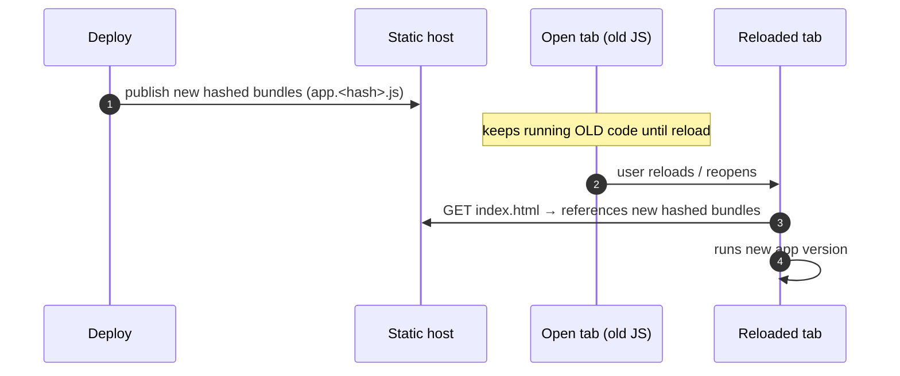

# Document 12 — PWA and Service Worker Architecture

> **Prerequisites:** [08 — Persistence](./08-persistence-architecture.md), [11 — Workers & WASM](./11-workers-concurrency-and-wasm.md).
> **Source version:** commit `e1ebcba3c32c7cb68fdf00bb48bac49a5c10f07d`, branch `main`.
> **Verification:** confirmed by exhaustive search; the key finding is an **absence**.

## Purpose

Clarify what “offline” actually means for Standard Notes, because the intuitive PWA answer is wrong here. The load-bearing finding: **there is no Service Worker.** Offline capability comes entirely from the **data layer** (IndexedDB), not from asset caching.

## Architectural questions answered

- Is there a Service Worker? What is the caching/offline strategy?
- How do app updates propagate on web?
- What does “offline” include and exclude?

---

## 1. The finding: no Service Worker

Searches across `packages/web/src`, `packages/snjs/lib`, and all webpack configs for `serviceWorker.register`, `navigator.serviceWorker`, `workbox`, `InjectManifest`, and `GenerateSW` return **nothing** (Verified — [Document 11 §5](./11-workers-concurrency-and-wasm.md)). `index.html` loads `app.js`/`app.css` directly with no registration script (`packages/web/src/index.html:44-45`, Observed).

```mermaid
flowchart LR
    B["Browser"]:::ui -->|GET| HTML["index.html"]:::network
    HTML -->|GET app.js/app.css<br/>(HTTP cache only)| ASSETS["hashed bundles"]:::network
    B -. NO service worker .-> X["(no interception / no offline shell)"]:::worker
    APP["Running SPA"]:::ui ==> IDB["IndexedDB / localStorage<br/>(offline data)"]:::storage
    classDef ui fill:#dbeafe,stroke:#1e40af,color:#0b1324;
    classDef network fill:#fee2e2,stroke:#991b1b,color:#1c1917;
    classDef storage fill:#ffedd5,stroke:#9a3412,color:#1c1917;
    classDef worker fill:#e5e7eb,stroke:#374151,color:#0b1324;
```

**Conclusion:** the browser fetches assets normally (subject only to the standard HTTP cache). There is no offline shell, no precache, no network interception, no background sync, and no web push via a worker. (Observed/Verified.)

---

## 2. The manifest is (mostly) a legacy Chrome-app manifest

`packages/web/src/manifest.webmanifest` mixes fields (Observed):

```jsonc
{
  "app": { "launch": { "urls": ["https://app.standardnotes.com/"], "container": "tab" } }, // Chrome-app
  "offline_enabled": true,           // Chrome-app field, NOT a service worker
  "manifest_version": 2,             // Chrome-app manifest version
  "requirements": { "3D": { "features": [] } }, // Chrome-app
  "icons": [ /* 192, 512 maskable */ ],         // PWA-ish
  "display": "standalone", "start_url": ".."    // PWA-ish
}
```

- `offline_enabled: true` and `manifest_version: 2` are **Chrome hosted/packaged-app** concepts, not PWA/service-worker features. They do not enable a service worker.
- The PWA-ish fields (`icons`, `display: standalone`, `theme_color`) let the app be “installed”/added to home screen and open chromeless, but installation here does **not** bring offline asset caching, because there is no service worker to provide it. (Observed; the Chrome-app lineage is Inferred from the field set.)

So Standard Notes is *installable-ish* but is **not a full offline PWA** in the service-worker sense.

---

## 3. What “offline” actually means

Offline capability is real but comes from a different layer than a typical PWA:

| Capability | Provided by | Works offline? |
| ---------- | ----------- | -------------- |
| Read/edit existing notes | IndexedDB local replica ([Document 08](./08-persistence-architecture.md)) | **Yes** — the app is offline-first at the *data* layer |
| Create notes, mutate, dirty-track | in-memory + local DB | **Yes**, uploads on reconnect ([Document 06](./06-synchronization-architecture.md)) |
| Load the app’s **code** while offline (cold, uncached) | nothing (no SW precache) | **No** — a cold load with no HTTP cache fails |
| Load the app’s code while offline (warm HTTP cache) | browser HTTP cache | **Maybe** — best-effort, not guaranteed |
| Server change notifications | WebSocket while the tab is open | only while online & open |
| Background sync when tab closed | — | **No** (no SW background sync) |

**The precise statement:** *your data is available offline once the app is loaded; the app’s assets are not guaranteed to load offline.* Standard Notes solves the hard problem (never lose data offline) at the data layer and simply doesn’t attempt the asset-caching problem a SW would solve. (Observed.)

---

## 4. App updates on web (no SW update lifecycle)

Because there is no service worker, the classic install→waiting→activate update dance **does not apply**. Instead:



- **Cache-busting:** production bundles use content-hashed filenames (webpack, [Document 14](./14-build-system-and-delivery.md)), and `index.html` references the current hashes; a reload fetches the new `index.html` and thus the new bundles. (Observed — the `index.html` template + webpack output.)
- **Stale clients:** a long-open tab runs the **old** JS indefinitely until reloaded. There is no SW `skipWaiting`/`clientsClaim` to force-activate a new version, and no in-app “new version available, reload?” prompt tied to a SW. (Observed absence.)
- **Version awareness:** the app tracks the snjs/app version for **storage migrations** ([Document 08 §7](./08-persistence-architecture.md)) and desktop uses `@standardnotes/releases` + `electron-updater` for native updates ([Document 13](./13-multi-platform-architecture.md)) — but the *web* code-update path is “reload the page.” (Observed.)

---

## 5. Why this design is defensible

- The **hard requirement** is *never lose user data offline*. That is satisfied by the offline-first data layer (local DB + dirty tracking + reconnect sync), independent of any service worker. ([Documents 06](./06-synchronization-architecture.md), [08](./08-persistence-architecture.md).)
- A service worker’s main added value here would be **asset availability offline** and **update control**. The app instead relies on the browser HTTP cache for assets and page-reload for updates — simpler, with fewer stale-cache footguns (SW cache bugs are a common PWA failure mode).
- Native offline/asset concerns are handled by the **desktop/mobile shells** ([Document 13](./13-multi-platform-architecture.md)), which bundle the app locally — so the platforms that most need robust offline don’t depend on a web SW at all.

(Inferred rationale; the absence of a SW and the presence of the data-layer offline story are Observed.)

---

## 6. Subtle failure modes

| Scenario | Behavior | Why |
| -------- | -------- | --- |
| Offline, never visited before | app won’t load | no SW precache |
| Offline, visited recently | may load from HTTP cache | browser-dependent, not guaranteed |
| Long-open tab after deploy | runs old code until reload | no SW to activate new version |
| Private window | IndexedDB may be unavailable → data errors | app alerts ([Document 08 §9](./08-persistence-architecture.md)) |
| Two tabs, one deletes DB | `deleteDatabase` blocked | alert to close other tabs ([Document 08 §9](./08-persistence-architecture.md)) |

---

## What you should now understand

- There is **no** Service Worker; the intuitive PWA offline/update model does not apply.
- The manifest is largely a legacy Chrome-app manifest; `offline_enabled` is not a SW feature.
- “Offline” = data-layer (IndexedDB) availability of already-loaded app; assets are best-effort via HTTP cache.
- Updates propagate by reload of content-hashed bundles; long-open tabs stay stale until reload.

## Architectural invariants learned

1. **The web build ships no Service Worker; offline capability is a data-layer property, not an asset-cache property.**
2. **Web app-code updates take effect on reload of content-hashed bundles; there is no SW-driven activation.**
3. **Robust offline for desktop/mobile is provided by their native shells bundling the app, not by a web SW.**

## Open questions

- Whether upstream ever shipped a SW historically — out of scope at this pinned commit; the analyzed commit has none (Observed). Historical inference belongs in [Document 23](./23-legacy-architecture-and-technical-debt.md).

## Source index

- `packages/web/src/index.html` — direct asset loading, no SW registration.
- `packages/web/src/manifest.webmanifest` — legacy Chrome-app manifest.
- `packages/web/web.webpack*.js` — no `GenerateSW`/`InjectManifest`; content-hashed output ([Document 14](./14-build-system-and-delivery.md)).

## Next document

Continue to **[Document 13 — Multi-Platform Architecture](./13-multi-platform-architecture.md)**.
