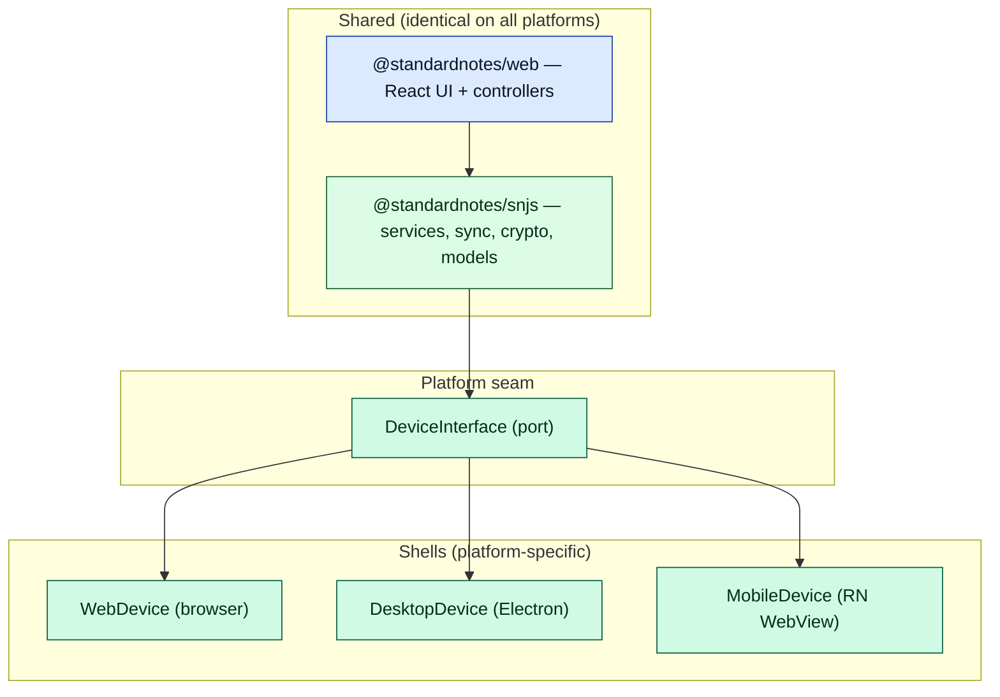
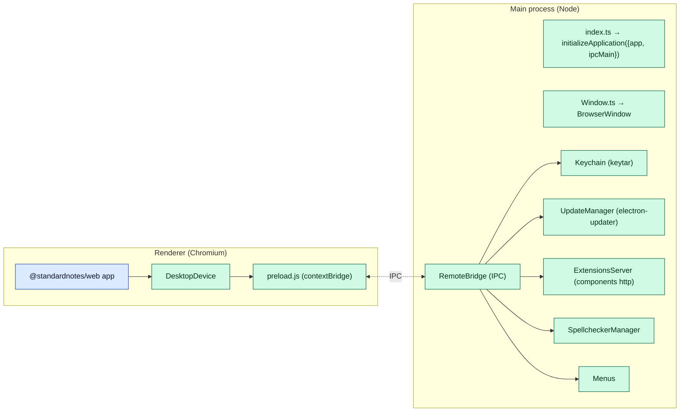
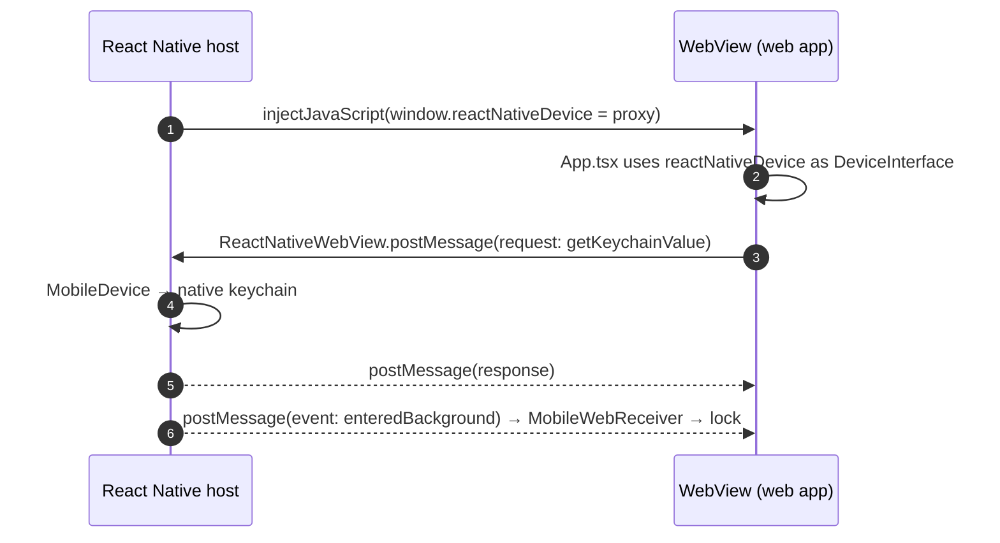

# Document 13 — Multi-Platform Architecture

> **Prerequisites:** [03 — Bootstrap](./03-bootstrap-and-dependency-construction.md), [08 — Persistence](./08-persistence-architecture.md).
> **Source version:** commit `e1ebcba3c32c7cb68fdf00bb48bac49a5c10f07d`, branch `main`.

## Purpose

Explain how one codebase serves Web, Desktop, and Mobile, what is shared vs platform-specific, and the exact seam (`DeviceInterface`) that makes it possible. The defining fact: **there is one UI — the web React app — and three shells around it.**

## Architectural questions answered

- What is shared across platforms, and what is platform-specific?
- How does the web app run inside Electron and inside a React Native WebView?
- What is the `DeviceInterface` port, and what must each platform implement?
- What are the per-platform capabilities and unavoidable compromises?

---

## 1. The strategy: one web app, three shells

- *Problem:* ship a consistent, full-featured notes app on browser, macOS/Windows/Linux, iOS, and Android without maintaining three UIs.
- *Constraint:* each platform has different storage, secure key storage, filesystem, and lifecycle APIs; the shared code must not depend on any of them directly.
- *Abstraction:* the **web React app (`@standardnotes/web`) is the single UI on all platforms.** Desktop wraps it in Electron; mobile wraps it in a React Native **WebView**. The only platform-specific seam is the **`DeviceInterface`** (storage, keychain, capabilities), injected at bootstrap ([Document 03 §1](./03-bootstrap-and-dependency-construction.md)).



**Adding a platform ≈ implementing `DeviceInterface`** and providing a host for the web bundle. (Observed — every shell provides a `DeviceInterface`; the web app consumes it via `window.reactNativeDevice ?? new WebDevice(...)` / desktop injection, `App.tsx:120-121`.)

---

## 2. The `DeviceInterface` port

Every platform implements the same contract (three storage sinks + capability hooks — [Document 08 §2](./08-persistence-architecture.md)):

| Method group | Purpose | Web | Desktop | Mobile |
| ------------ | ------- | --- | ------- | ------ |
| `get/setRawStorageValue` | small KV | `localStorage` | `localStorage` (renderer) | native store (bridged) |
| `get/save/removeDatabaseEntries`, `getDatabaseLoadChunks` | payload DB | IndexedDB | IndexedDB (renderer) | native DB (bridged) |
| `get/set/clearNamespacedKeychainValue` | secrets | `localStorage` | OS keychain (`keytar`) | OS keychain / biometrics |
| capability hooks (backups, spellcheck, updates, share, background) | native features | none | Electron IPC | RN bridge |

`WebOrDesktopDevice` is the shared base (localStorage raw KV + IndexedDB payloads); `WebDevice` and `DesktopDevice` extend it, and `MobileDevice` implements the interface over the RN bridge. (Observed — `WebOrDesktopDevice.ts`, `WebDevice.ts`, `MobileDevice.ts:69`.)

---

## 3. Web platform (baseline)

The plain browser case, fully covered elsewhere: `WebDevice` uses `localStorage` (raw KV + keychain) and IndexedDB (payloads) ([Document 08](./08-persistence-architecture.md)); no OS secure storage, no filesystem beyond the File System Access API used by `filepicker`, no auto-update (reload-based, [Document 12](./12-pwa-and-service-worker.md)). It is the lowest-capability shell and the reference implementation. (Observed.)

---

## 4. Desktop (Electron)

The desktop app is an Electron wrapper whose **renderer loads the web bundle** and whose **main process provides native capabilities over IPC** (`packages/desktop/app/`, Observed).



**Security posture (Observed — `Window.ts:160-173`):**

```ts
const window = new BrowserWindow({ webPreferences: {
  nodeIntegration: isTesting(),  // false in production
  contextIsolation: true,        // renderer isolated from Node
  sandbox: true,                 // renderer sandboxed
  preload: Paths.preloadJs,      // controlled bridge only
}})
```

- `contextIsolation: true` + `sandbox: true` + `nodeIntegration: false` means the web app cannot touch Node directly; it talks to the main process through two channels: **(a)** the **`RemoteBridge`** — a bound method surface exposed via **`@electron/remote`** (`RemoteBridge.exposableValue`) and `contextBridge` as `window.electronRemoteBridge`, for renderer→main *capability calls*; and **(b)** one-way `webContents.send` → `ipcRenderer.on` *events* (`MessageToWebApp.*`, e.g. `WindowFocused`, `UpdateAvailable`) wired to `window.webClient`/`DesktopManager`. A tiny classic `ipcMain` channel exists only for Linux keychain-consent. (Observed — `Preload.ts`, `RemoteBridge.ts`, `IpcMessages.ts`; `WebApplicationGroup.ts:45-47`.)
- Native capabilities, each a main-process module (Observed — `Main/` files):
  - **Keychain** (`Keychain/Keychain.ts`) — OS secure storage via **`keytar`** (`getPassword`/`setPassword`); on Linux/Snap it can fall back to `localStorage` (with a consent BrowserWindow). There is **no** Electron `safeStorage` usage.
  - **Auto-update** (`UpdateManager.ts`) — `electron-updater`, config in `dev-app-update.yml`, packaged by `electron-builder`.
  - **Components server** (`ExtensionsServer.ts`) — serves editor/theme components over local `http` on `127.0.0.1:45653` (`sn://` URLs are rewritten to this host) so iframe editors load from a local origin ([Document 09 §5](./09-editor-and-product-architecture.md)).
  - **Spellchecker** (`SpellcheckerManager.ts`) — with dictionary download from `dictionaries.standardnotes.org`.
  - **Menus** (`Menus/Menus.ts`), **Store** (settings), **PackageManager** (download/install components), **text/file backups**.
- **Storage:** the renderer still uses IndexedDB/localStorage (it *is* Chromium), so `DesktopDevice` mostly reuses `WebOrDesktopDevice`, overriding the **keychain** to use the OS keystore and adding file backups. The Snap package migrates `userData` to the shared `common` dir so updates don’t orphan IndexedDB (`index.ts:52-133`, Observed).

---

## 5. Mobile (React Native WebView)

Mobile is **not** a native UI. It is a thin React Native app hosting the web bundle in a `WebView`, with native services bridged in (`packages/mobile/src/MobileWebAppContainer.tsx`, Observed).

```ts
// MobileWebAppContainer.tsx:36-43 (cropped)
const sourceUri = (Platform.OS === 'android' ? 'file:///android_asset/' : '') + 'Web.bundle/src/index.html'
const device = new MobileDevice(stateService, androidBackHandlerService, colorSchemeService)
// <WebView source={{uri: sourceUri}} ... />
```

- **The web bundle is embedded** (`Web.bundle/src/index.html`) and loaded from local assets — so on mobile the app’s *code* is available offline (unlike web, [Document 12](./12-pwa-and-service-worker.md)).
- **Bridge (native ↔ web):** native → web via `webViewRef.current.postMessage(...)` and `injectJavaScript(...)`; web → native via `window.ReactNativeWebView.postMessage(...)` handled by the WebView `onMessage`. The web side receives native events through `MobileWebReceiver` ([Document 15 §7](./15-events-and-internal-communication.md); `MobileWebAppContainer.tsx:69-70`). (Observed.)
- **`MobileDevice`** (`src/Lib/MobileDevice.ts`) implements `MobileDeviceInterface` (a `DeviceInterface`) using native modules — native keychain (`react-native-keychain`), biometrics (`react-native-fingerprint-scanner`), storage (**AsyncStorage**, keyed `{identifier}-Item-{uuid}`, not IndexedDB) for raw KV and the payload DB, share handling (`react-native-share`/`react-native-fs`), notifications (`notifee`), app-state/lifecycle, color scheme, Android back handling.
- **The RPC proxy is Observed, not Inferred:** before content load, the RN host injects a `WebProcessDeviceInterface` onto `window.reactNativeDevice` whose every method stub calls `ReactNativeWebView.postMessage({functionName, args, messageId})`; the native side invokes the real `MobileDevice[functionName](...args)` and posts `{messageId, returnValue}` back, resolving the pending promise. `environment` is hard-coded to `3` (Mobile) in the injected proxy. Crucially, **crypto stays in the WebView** (WebCrypto/libsodium WASM); there is no `react-native-sodium`. (Observed — `MobileWebAppContainer.tsx:252-362`.)
- **Mobile-specific app options (Observed — `WebApplication.ts:124-131`):**
  - `apiVersion: v0` on iOS/Android (vs `v1` on web) — because “iOS `file://` based origin does not work with production cookies.”
  - `loadBatchSize: 250`, `sleepBetweenBatches: 250` (vs defaults) — tuned hydration for mobile.
  - `allowMultipleSelection: false`, note-selection persistence disabled on mobile.
- **Lifecycle:** `AppStateObserverService` forwards foreground/background/lock events; `WebApplication.handleMobileEnteringBackgroundEvent` locks per the passcode/biometric timing ([Document — `WebApplication.ts:315-473`], Observed).



---

## 6. Environment & platform detection

`Environment` (Web, Desktop, Mobile, Clipper) and `Platform` (Ios, Android, MacDesktop, WindowsDesktop, LinuxDesktop, etc.) are enums resolved at bootstrap from the device (`App.tsx:120-123`, `getPlatform(device)`; `WebApplication` branches on `environment`/`platform` throughout). Services request platform behavior via these enums or via optional DI dependencies that resolve to `undefined` on platforms lacking a capability ([Document 03 §3](./03-bootstrap-and-dependency-construction.md)). (Observed.)

---

## 7. Capability matrix

| Capability | Web | Desktop (Electron) | Mobile (RN WebView) |
| ---------- | --- | ------------------ | ------------------- |
| UI | web React app (tab) | web app in BrowserWindow | web app in WebView |
| Raw KV storage | `localStorage` | `localStorage` | native store (bridged) |
| Payload DB | IndexedDB | IndexedDB | native DB (bridged) |
| Secure key storage | `localStorage` (none) | OS keychain (`keytar`), localStorage fallback | OS keychain + biometrics |
| Filesystem | File System Access API | full (Node fs) | native share/save |
| Editor components | served from build | local components server | native component URLs |
| Auto-update | reload (hashed bundles) | `electron-updater` | App/Play Store |
| Background execution | none | main process | limited (RN) |
| Web Workers | yes (PDF) | yes | yes (in WebView) |
| WASM (libsodium) | yes | yes | yes (in WebView) |
| App-code offline | best-effort (HTTP cache) | bundled locally | bundled locally |
| Screenshot privacy, biometrics | — | — | yes |

---

## 8. Architectural limitations & compromises

- **Mobile is a WebView, not native.** Pros: one UI, feature parity, offline code. Cons: WebView performance ceiling, platform WebView quirks (there is even an Android WebView-too-old update prompt, `MobileWebAppContainer.tsx:45`), and native integrations must be marshaled over `postMessage`. (Observed.)
- **Web keychain is `localStorage`.** No browser secure enclave; the wrapped root key sits in `localStorage`. Passcode wrapping mitigates but doesn’t equal an OS keystore ([Document 19](./19-security-boundaries.md)). (Observed.)
- **iOS cookie/origin constraint** forces `apiVersion: v0` — a real API-shape compromise driven by `file://` origins. (Observed.)
- **Two DI containers per platform-agnostic app** (snjs + web) plus per-shell native code — more surfaces to keep in sync ([Document 23](./23-legacy-architecture-and-technical-debt.md)).

---

## What you should now understand

- One web UI, three shells; `DeviceInterface` is the only platform seam.
- Desktop = Electron (context-isolated renderer + main-process native capabilities over `RemoteBridge` IPC).
- Mobile = RN WebView hosting the embedded web bundle, with `MobileDevice` bridged via `postMessage`/`injectJavaScript`.
- The per-platform capability matrix and the concrete compromises (WebView ceiling, web keychain, iOS `apiVersion`).

## Architectural invariants learned

1. **The web React app is the single UI on all platforms; shells never reimplement it.**
2. **All platform-specific behavior enters through `DeviceInterface` (and optional DI dependencies), never through platform checks in the domain.**
3. **Desktop renderer is context-isolated; native power is reached only via the preload `RemoteBridge`.**
4. **Mobile native capabilities are marshaled over the WebView `postMessage` bridge.**

## Open questions

- Desktop `RemoteBridge` full method surface (keychain, backups, directory picker, component sync, home server, media, search, destroy-all-data) — Observed to exist; enumerated in [Document 24](./24-per-package-deep-dives.md) as needed.
- Whether mobile relies on any background-sync worker — Observed absence: sync runs only while the WebView JS is alive; RN has no background sync worker.

## Source index

- `packages/desktop/app/index.ts`, `app/javascripts/Main/Window.ts`, `Main/Remote/RemoteBridge.ts`, `Main/Keychain/Keychain.ts`, `Main/ExtensionsServer.ts`, `Main/UpdateManager.ts` — Electron shell.
- `packages/mobile/src/MobileWebAppContainer.tsx`, `src/Lib/MobileDevice.ts` — RN WebView shell.
- `packages/web/src/javascripts/Application/Device/*` — `WebDevice`/`WebOrDesktopDevice`.
- `packages/web/src/javascripts/Application/WebApplication.ts:124-131` — mobile app options.

## Next document

Continue to **[Document 14 — Build System and Delivery](./14-build-system-and-delivery.md)**.
