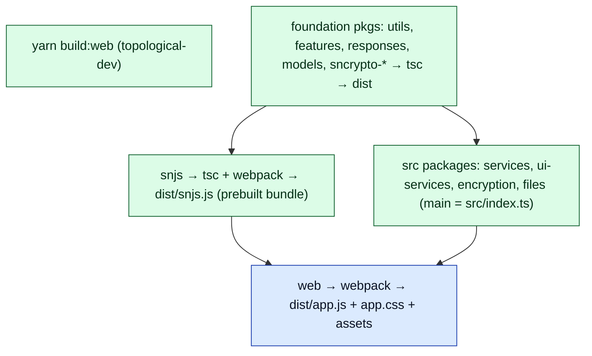
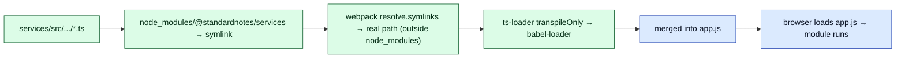

# Document 14 — Build System and Delivery

> **Prerequisites:** [02 — Packages](./02-repository-and-package-architecture.md), [11 — Workers & WASM](./11-workers-concurrency-and-wasm.md), [13 — Platforms](./13-multi-platform-architecture.md).
> **Source version:** commit `e1ebcba3c32c7cb68fdf00bb48bac49a5c10f07d`, branch `main`.

## Purpose

Explain how source becomes shippable artifacts on each platform, the consequences of the `src`-vs-`dist` consumption split ([Document 02 §2](./02-repository-and-package-architecture.md)), and where the build has sharp edges (no content hashing, a likely-stale cycle check, probable domain duplication).

## Architectural questions answered

- What builds what, in what order, with which tools?
- How are the raw-TypeScript packages compiled into the app?
- How are workers, WASM, editors, and assets handled?
- Trace one source file from `.ts` to a loaded chunk.

---

## 1. Workspace & orchestration

- **Package manager:** Yarn 3 (`yarn@3.2.1`), `workspaces: ["packages/*"]`. **Versioning:** Lerna-Lite, `independent` (each package versions separately) (`package.json`, `lerna.json`, Observed).
- **Topological builds:** `build:web` = `yarn workspaces foreach -pt --topological-dev -R --from @standardnotes/web run build` — builds `@standardnotes/web` and everything it (recursively) depends on, in dependency order (`package.json:23-27`, Observed). Analogous `build:desktop`, `build:mobile`, `build:snjs`.
- **Babel roots:** root `babel.config.js` sets `babelrcRoots: ['.', './packages/*']` so each package’s babel config applies (Observed).

---

## 2. Two consumption modes and how source packages compile

Recall from [Document 02 §2](./02-repository-and-package-architecture.md): some packages ship `dist/*.js` (prebuilt), others ship `main: ./src/index.ts` (raw TypeScript). The web build handles both:

- **Prebuilt packages** (`models`, `api`, `snjs`, …) are imported as compiled JS.
- **Source packages** (`services`, `ui-services`, `encryption`, `files`, `filepicker`, `toast`) are symlinked into `node_modules/@standardnotes/*`. Webpack’s default `resolve.symlinks: true` resolves the symlink to the real path under `packages/…/src`, which is **outside** `node_modules`, so the module rule applies and they are transpiled by `ts-loader` + `babel-loader` (`web.webpack.config.js:104-119`, Observed).

The module rule’s `exclude` compiles `node_modules` **only** for a short allow-list (`@standardnotes/common`, `@standardnotes/domain-core`, `webextension-polyfill`, `yoga-layout`) that ship modern syntax needing transpilation; everything else in `node_modules` is assumed already-ES5-ish (`web.webpack.config.js:108-110`, Observed).

**Type-checking is decoupled from bundling.** `ts-loader` runs `transpileOnly: true` (fast, no type errors), and the web `build` script runs `webpack … && yarn tsc` — a **separate** `tsc --project tsconfig.json` pass does the actual type-checking (`web/package.json:12`, `web.webpack.config.js:114-118`, Observed). So a type error fails `yarn tsc`, not webpack.

---

## 3. The web webpack pipeline

`packages/web/web.webpack.config.js` (base) + `web.webpack.prod.js` (`mode: production, devtool: source-map`) / `web.webpack.dev.js` (`mode: development, devtool: inline-source-map`, dev server on 3001, HMR + React Refresh) (Observed).

| Concern | Config | Note |
| ------- | ------ | ---- |
| Entry | `./src/javascripts/index.ts` | single entry |
| Output JS | **`./app.js`** (fixed name) | **no content hash**; clipper target uses `[name].bundle.js` |
| Output CSS | `MiniCssExtractPlugin` → `./app.css` | Tailwind via `postcss-loader` |
| Chunk splitting | `optimization: {}` for web (only clipper sets `splitChunks: {chunks:'all'}`) | web has **no vendor split**; everything in `app.js` except dynamic `import()` chunks |
| Workers | `worker-loader` for `*.worker.tsx?`, `inline: 'fallback'` | PDF worker inlined ([Document 11](./11-workers-concurrency-and-wasm.md)) |
| WASM | none configured | libsodium embeds its own WASM ([Document 11 §3](./11-workers-concurrency-and-wasm.md)) |
| Constants | `DefinePlugin({ __WEB_VERSION__ })` | build-time version |
| Copied assets | `CopyWebpackPlugin`: favicon, vendor, error HTMLs, `index.html`, `manifest.webmanifest`, `.well-known`, and **`src/components` → `components`** | editors served locally |
| Node polyfills | `resolve.fallback: { crypto:false, path:false, url:false, fs:false }` | pure browser build |
| Cycle check | `CircularDependencyPlugin({ failOnError:true, include:/app\/assets\/javascripts/ })` | **`include` path looks stale** — see §7 |
| Config | `dotenv` + `web.webpack-defaults.js` (`platform:'web'`) | `DEFAULT_SYNC_SERVER` overrides in dev |

**Consequence of no content hashing + no vendor split:** the web app is essentially one large `app.js`, cache-busted only by HTTP headers ([Document 12 §4](./12-pwa-and-service-worker.md)), and there is no long-term-cacheable vendor chunk. Only `React.lazy`/dynamic `import()` sites (e.g. `ClipperView`, Super editor tooling, the PDF path) produce separate lazily-loaded chunks. (Observed.)

---

## 4. Editor/component bundling

Third-party editors are npm packages copied into the build in two hops (Observed):

1. **`scripts/CopyComponents.mjs`** (run via `yarn copy:components` before build) copies each editor’s `index.html`, `dist`, `build`, `package.json` from `node_modules/@standardnotes/<editor>` into `src/components/<org.standardnotes.identifier>/`. The mapping covers: `authenticator` (token-vault), `bold-editor`, `classic-code-editor` (code-editor), `markdown-basic/hybrid/math/minimal/visual`, `rich-text` (plus-editor), `simple-task-editor`, `spreadsheets` (standard-sheets) (`CopyComponents.mjs:9-27`).
2. **`CopyWebpackPlugin`** copies `src/components` → `dist/components`, so the built app serves editor iframes from `/components/...` ([Document 09 §5](./09-editor-and-product-architecture.md)).

On desktop these are also served by the local `ExtensionsServer`; on mobile via native component URLs ([Document 13](./13-multi-platform-architecture.md)).

---

## 5. snjs: the prebuilt bundle

`@standardnotes/snjs` is built by `tsc && webpack --config webpack.prod.js` (`mode: production`) into `dist/snjs.js`, with types generated via `tsc … && tscpaths … -o dist/@types` (`snjs/package.json:30-33`, Observed). It **pre-bundles** the domain+services it depends on (all via devDependencies, [Document 02](./02-repository-and-package-architecture.md)).

**The duplication concern (Inferred, flagged for [Document 23](./23-legacy-architecture-and-technical-debt.md)):** the web app imports `@standardnotes/snjs` (which contains a *bundled* copy of `services`, `encryption`, `models`, …) **and** `@standardnotes/ui-services` (source), which imports `@standardnotes/services` **from source**. Because one path is a prebuilt bundle and the other is compiled-from-source, the final `app.js` likely contains **two copies** of the `services`/`encryption` code. Runtime singletons still work (each container builds its own instances), but duplicated classes inflate the bundle and could break cross-boundary `instanceof` checks if any exist. This is not runtime-verified here (no build was inspected byte-for-byte); it is strongly implied by the import graph and should be confirmed before relying on it. (Inferred.)

---

## 6. Desktop & mobile builds

- **Desktop:** webpack builds the Electron **main** and **renderer** (`desktop.webpack.*.js`), the renderer embeds `@standardnotes/web`’s output; `electron-builder` (`electron-builder.unsigned.cjs`) packages platform installers, with code signing (`jsign`) and auto-update feeds (`dev-app-update.yml`, `@standardnotes/releases`) ([Document 13 §4](./13-multi-platform-architecture.md), Observed dirs/scripts).
- **Mobile:** React Native **Metro** (`metro.config.js`) bundles the RN host; the web app is embedded as `Web.bundle` (loaded by the WebView, [Document 13 §5](./13-multi-platform-architecture.md)); native builds via Xcode/Gradle, release automation via `fastlane` (Observed).
- **Clipper:** the web webpack with `BUILD_TARGET=clipper` emits `[name].bundle.js` + a `popup.html` via `HtmlWebpackPlugin` and enables `splitChunks` (`web.webpack.config.js:36-78`, Observed).

---

## 7. Tracing one source file end-to-end

Take `packages/services/src/Domain/Sync/…` (a source package):

Contrast a prebuilt file: `packages/models/src/...` is compiled to `models/dist/*.js` by its own `tsc` first, and webpack consumes that `dist` JS directly (no re-transpile). And a snjs symbol (`SyncService`) is consumed from `snjs/dist/snjs.js` (prebuilt) — potentially a *second* copy vs the source-compiled one (§5).

---

## 8. Build-system sharp edges (tech-debt signals)

| Signal | Evidence | Impact |
| ------ | -------- | ------ |
| **No content hashing / no vendor split (web)** | `output.filename: './app.js'`, `optimization: {}` | cache-bust relies on HTTP headers; no long-cache vendor chunk ([Document 12](./12-pwa-and-service-worker.md)) |
| **Likely-stale cycle check** | `CircularDependencyPlugin include:/app\/assets\/javascripts/` while source is `src/javascripts` | the cycle guard may match **no files**, so `failOnError` never triggers — cycles could pass unnoticed (Inferred) |
| **Probable domain duplication** | snjs prebuilt bundle + source-consumed `services` via `ui-services` | bundle bloat; possible `instanceof` hazards (Inferred, §5) |
| **`transpileOnly` bundling** | `ts-loader transpileOnly:true` | type errors only caught by the separate `yarn tsc` — a broken CI step could ship type-unsafe code |

These are catalogued with historical context in [Document 23](./23-legacy-architecture-and-technical-debt.md).

---

## What you should now understand

- The Yarn+Lerna workspace, topological builds, and the `src`-vs-`dist` compile paths (symlink resolution + a node_modules allow-list).
- The web webpack pipeline: single `app.js` (no hash/no vendor split), `transpileOnly` + separate `tsc`, inlined worker, embedded WASM, copied editors.
- How editor components are copied and served.
- That snjs is a prebuilt bundle, with a likely domain-duplication side effect.
- The concrete build sharp edges to watch.

## Architectural invariants learned

1. **Source packages are compiled by the app bundler via symlink resolution; editing their `src` is picked up without a separate build.**
2. **Type-checking is a separate `tsc` pass from webpack bundling (`transpileOnly`).**
3. **The web app ships as one `app.js` (plus lazy chunks) with no content-hash cache-busting.**
4. **Editors are bundled by copying npm packages into `src/components` → `dist/components`.**

## Open questions

- Whether the domain is actually duplicated in the final bundle (snjs prebuilt vs source `services`) — Inferred; needs a byte-level bundle inspection to confirm.
- Whether the `CircularDependencyPlugin` `include` path is intentional or stale — Inferred stale; confirm against build logs.

## Source index

- `package.json`, `lerna.json`, `babel.config.js` — workspace + orchestration.
- `packages/web/web.webpack.config.js` / `.prod.js` / `.dev.js` / `web.webpack-defaults.js` — web build.
- `packages/web/scripts/CopyComponents.mjs` — editor bundling.
- `packages/snjs/package.json` (`build`/`tsc` scripts) — prebuilt bundle.
- `packages/desktop/*.webpack.*.js`, `electron-builder.unsigned.cjs`; `packages/mobile/metro.config.js` — platform builds.

## Next document

Continue to **[Document 16 — Performance Engineering](./16-performance-engineering.md)**, or revisit any subsystem. (Document 15 — Events — was covered earlier.)
