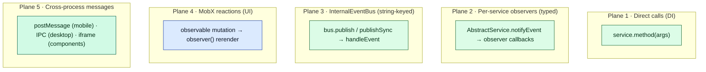
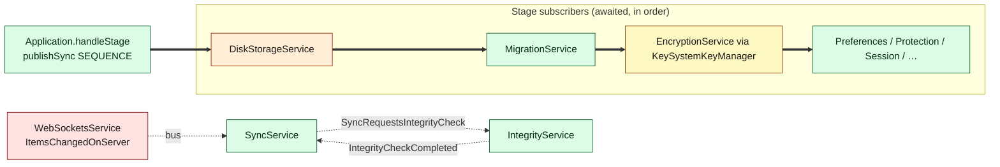

# Document 15 — Events, Commands, Observers, and Internal Communication

> **Prerequisites:** [02 — Packages](./02-repository-and-package-architecture.md), [03 — Bootstrap](./03-bootstrap-and-dependency-construction.md), [04 — State](./04-state-architecture.md).
> **Source version:** commit `e1ebcba3c32c7cb68fdf00bb48bac49a5c10f07d`, branch `main`.

## Purpose

Standard Notes uses *five* distinct communication mechanisms, each for a reason. Confusing them is a top source of “why didn’t my handler fire / fire twice / fire out of order” bugs. This document names each mechanism, explains why it exists, gives its ordering and reentrancy guarantees, and builds an event taxonomy.

## Architectural questions answered

- What are the internal communication mechanisms and why does each exist?
- Which events are synchronous, asynchronous, ordered, or replayable?
- What are the ordering guarantees and reentrancy risks?
- How does a change cross the service→React and web→native boundaries?

---

## 1. The five communication planes



| Plane | Mechanism | Coupling | Why it exists |
| ----- | --------- | -------- | ------------- |
| 1 | Direct method call via DI-injected reference | tight | Hot paths where ordering & return values matter (sync calls encryption, item lookups) |
| 2 | Per-service typed observer list (`addEventObserver`) | medium | A service announces state changes to *known* subscriber types (app, controllers) |
| 3 | `InternalEventBus` string-keyed pub/sub | loose | Cross-service reactions without import cycles (e.g. many services react to a stage change) |
| 4 | MobX observables/reactions | UI-only | Fine-grained rerender of exactly the components that read changed state |
| 5 | `postMessage` / IPC / iframe bridge | process boundary | Web↔native (mobile), main↔renderer (desktop), host↔editor component |

The crucial and easily-missed fact is that **Planes 2 and 3 fire together**.

---

## 2. The dual-dispatch base: `AbstractService`

Every service extends `AbstractService`. Its `notifyEvent` does **two** things at once:

```ts
// packages/services/src/Domain/Service/AbstractService.ts:30-39 (verbatim, cropped)
protected async notifyEvent(eventName, data?) {
  for (const observer of this.eventObservers) {   // Plane 2: typed observers
    await observer(eventName, data)
  }
  this.internalEventBus?.publish({                 // Plane 3: string bus
    type: eventName as unknown as string,
    payload: data,
  })
}
```

So when `SyncService` calls `notifyEvent(SyncEvent.LocalDataLoaded)`:
1. every `addEventObserver` callback runs first, **awaited in registration order** (Plane 2);
2. then the same event is published on the bus for any registered handler (Plane 3, fire-and-forget).

There is also `notifyEventSync`, which awaits observers *and* uses `publishSync(SEQUENCE)` for the bus so bus handlers are also awaited in order (`AbstractService.ts:41-53`). **Choosing `notifyEvent` vs `notifyEventSync` is choosing whether bus handlers block the emitter** — a subtle correctness lever. (Observed.)

**Reentrancy risk:** because Plane-2 observers are awaited inside `notifyEvent`, an observer that triggers another `notifyEvent` on the same service re-enters synchronously through the microtask queue. Observers must not assume the service’s state is quiescent while they run. (Inferred from the loop structure; no guard exists in `notifyEvent`.)

---

## 3. The `InternalEventBus` (Plane 3)

A minimal string-keyed multimap of handlers (`packages/services/src/Domain/Internal/InternalEventBus.ts`, Observed):

- `addEventHandler(handler, eventType)` — subscribe (`eventType` is just a `string`; `InternalEventType = string`).
- `publish(event)` — **fire-and-forget**: iterates handlers with `void handler.handleEvent(event)`; does not await; ignores unknown types (`InternalEventBus.ts:29-38`).
- `publishSync(event, strategy)`:
  - `SEQUENCE` → `await` each handler **in registration order** (used for ordered stages),
  - `ASYNC` → `Promise.all` of all handlers (used for fan-out where order is irrelevant) (`InternalEventBus.ts:40-60`).

### Where bus subscriptions are declared

Almost all cross-service bus wiring is centralized in one function, `RegisterApplicationServicesEvents`, called from the `SNApplication` constructor (`packages/snjs/lib/Application/Dependencies/DependencyEvents.ts:15-54`, Observed). A representative slice:

```ts
// DependencyEvents.ts (cropped)
events.addEventHandler(container.get(TYPES.DiskStorageService), ApplicationEvent.ApplicationStageChanged)
events.addEventHandler(container.get(TYPES.SyncService), WebSocketsServiceEvent.ItemsChangedOnServer)
events.addEventHandler(container.get(TYPES.IntegrityService), SyncEvent.SyncRequestsIntegrityCheck)
events.addEventHandler(container.get(TYPES.SyncService), IntegrityEvent.IntegrityCheckCompleted)
events.addEventHandler(container.get(TYPES.NotificationService), SyncEvent.ReceivedNotifications)
events.addEventHandler(container.get(TYPES.SharedVaultService), NotificationServiceEvent.NotificationReceived)
```

**Two architectural observations:**

1. **The stage ladder is a bus broadcast.** A dozen services subscribe to `ApplicationEvent.ApplicationStageChanged` (DiskStorage, Features, KeyRecovery, KeySystemKeyManager, Migration, Preferences, Protection, SelfContactManager, Session, Subscription, and optionally FilesBackup/HomeServer). Because stages are published with `publishSync(SEQUENCE)` (`Application.handleStage`, `Application.ts:510-518`), each service’s stage handler runs **awaited and in order** — this is the primary sequencing mechanism during boot. (Observed.)
2. **Feedback loops exist by design.** `SyncService` both *emits* `SyncEvent.SyncRequestsIntegrityCheck` (consumed by `IntegrityService`) and *consumes* `IntegrityEvent.IntegrityCheckCompleted` (emitted back by `IntegrityService`). This request/response over the bus decouples integrity checking from the sync loop. Similarly, `WebSocketsServiceEvent.ItemsChangedOnServer` → `SyncService` triggers a sync when the server pushes a change notification. (Observed.)



---

## 4. The application event plane

`SNApplication` is itself an event hub. `notifyEvent` iterates its own `eventHandlers` (registered via `addEventObserver`), then publishes on the bus (`Application.ts:540-558`, Observed). Two convenience wrappers exist: `addSingleEventObserver(event, cb)` filters for one event type. UI subscribes here (`ApplicationView` observes `Started`/`Launched`/DB errors — `ApplicationView.tsx:123-154`).

**Sync→App translation.** Sync events are converted to application events via `applicationEventForSyncEvent` inside the app’s sync observer, which also calls `encryption.onSyncEvent` and, on `CompletedFullSync`, advances to `FullSyncCompleted_13` exactly once (`Application.ts:280-294`, Observed). So a low-level `SyncEvent` fans out to: encryption bookkeeping → an `ApplicationEvent` → possibly a stage.

---

## 5. The payload/item observer plane (domain → UI)

Separate from `AbstractService`’s observers, the domain has its own **change-observer** channels tuned for high-frequency data:

- **`PayloadManager.addObserver(types, callback, priority)`** — content-type-filtered, priority-ordered notifications of `{changed, inserted, discarded, ignored, unerrored}` (`PayloadManager.ts:230-286`, Observed). Priority lets, e.g., encryption react before UI.
- **`ItemManager`** subscribes to `Any` and re-emits item-level change observers to controllers (`ItemManager.ts:44-52`, Observed).

This plane is deliberately **not** the event bus: it is a direct, synchronous callback fan-out inside the serialized emit step, so the entire domain settles before control returns to the emitter. (Observed — [Document 04 §2](./04-state-architecture.md).)

---

## 6. MobX plane (UI reactions)

Controllers hold `@observable` state; components wrap in `observer()` from `mobx-react-lite`. A controller’s item-change observer mutates an observable inside a MobX `action`, and only the components that *read* that observable rerender. This is why a note edit does not rerender the tag list. Details and the exact bridge in [Document 10](./10-react-architecture.md).

`WebApplication.notifyWebEvent(WebAppEvent, data)` is a small extra web-only observer list for view concerns (panel resize, window focus/blur, mobile keyboard frame) that also publishes to the bus (`WebApplication.ts:230-236`, Observed).

---

## 7. Cross-process plane

- **Mobile (web ↔ native):** the web app posts strings via `window.ReactNativeWebView.postMessage(...)`, and native→web messages are received by `MobileWebReceiver` (`WebApplication.ts:97-101, 522-529`; `packages/web/src/javascripts/NativeMobileWeb/MobileWebReceiver.ts`). One-way string channels in both directions. See [Document 13](./13-multi-platform-architecture.md).
- **Desktop (renderer ↔ main):** a bridge object is exposed on `window.webClient` / `DesktopManager` (context-isolated) for filesystem, keychain, backups, and update actions. See [Document 13](./13-multi-platform-architecture.md).
- **Editor components (host ↔ iframe):** legacy editors run in sandboxed iframes and speak a `postMessage` component protocol via `ComponentManager`. See [Document 09](./09-editor-and-product-architecture.md).

---

## 8. Event taxonomy

| Category | Examples | Plane | Sync? | Ordered? | Replayable? |
| -------- | -------- | ----- | ----- | -------- | ----------- |
| **Lifecycle stages** | `ApplicationStageChanged` (0…13) | Bus (`publishSync SEQUENCE`) | yes | **yes** | no (fire-once per boot) |
| **Application events** | `Started`, `Launched`, `SignedIn`, `SignedOut`, `KeyStatusChanged`, `CompletedFullSync`, `PreferencesChanged`, `LocalDatabaseReadError` | App observers + bus | observers awaited | reg order | no |
| **Sync events** | `SyncEvent.LocalDataLoaded`, `PaginatedSyncRequestCompleted`, `SyncRequestsIntegrityCheck`, `ReceivedNotifications`, `ReceivedRemoteSharedVaults` | Plane 2 + bus | mixed | reg order | no |
| **Session/account** | `SessionEvent.Restored/Revoked/UserKeyPairChanged`, `AccountEvent.SignedInOrRegistered/SignedOut` | Plane 2 + bus | awaited | reg order | no |
| **Encryption** | `EncryptionServiceEvent.RootKeyStatusChanged` | Plane 2 + bus | awaited | — | no |
| **WebSocket (server push)** | `ItemsChangedOnServer`, `NotificationAddedForUser`, `UserInvitedToSharedVault`, `MessageSentToUser` | Bus | fire-and-forget | no | no |
| **State-change (domain)** | payload `{changed,inserted,discarded}`; item observers | Domain observer plane | synchronous | **priority order** | no |
| **UI reactions** | MobX observable changes; `WebAppEvent.PanelResized`, `WindowDidFocus` | MobX + web observers | sync | n/a | no |
| **Cross-process** | mobile `appLoaded`/lifecycle strings; desktop IPC; component `postMessage` | Plane 5 | async | per channel | no |

**No events are replayable** — there is no event log/store; a late subscriber misses prior events. Services that must “catch up” instead query current state (e.g. `ApplicationView` checks `application.isStarted()`/`isLaunched()` before subscribing, to handle the already-fired case — `ApplicationView.tsx:114-121`, Observed). This is the standard pattern for the non-replayable design.

---

## 9. Ordering & reentrancy guarantees (summary)

| Guarantee | Holds? | Basis |
| --------- | ------ | ----- |
| Plane-2 observers run in registration order, awaited | **Yes** | `notifyEvent` for-loop with `await` (`AbstractService.ts:31-33`) |
| Bus `publish` handlers run in registration order | order yes, **not awaited** | `void handler.handleEvent` (`InternalEventBus.ts:35-37`) |
| Bus `publishSync(SEQUENCE)` awaited in order | **Yes** | `InternalEventBus.ts:46-50` |
| Bus `publishSync(ASYNC)` order | **No** (concurrent) | `Promise.all` (`InternalEventBus.ts:52-59`) |
| Domain payload observers run in priority order | **Yes** | sort by priority (`PayloadManager.ts:261-263`) |
| Cross-plane global ordering (Plane 2 vs Plane 3 for the same emit) | **Plane 2 before Plane 3** | `notifyEvent` runs observers, then publishes |
| Reentrancy protection | **None built-in** | callers guard manually (e.g. `handledFullSyncStage`, `revokingSession` flags in `Application.ts`) |

The manual guards (`handledFullSyncStage`, `revokingSession`) are the tell that reentrancy is a real, handled concern — not a theoretical one. (Observed — `Application.ts:178, 288-291, 836-848`.)

---

## What you should now understand

- The five communication planes and the exact purpose of each.
- That `notifyEvent` fires typed observers **and** the bus, in that order.
- Where cross-service bus subscriptions are centrally declared and how the stage ladder sequences boot.
- The event taxonomy and which events are ordered/awaited/replayable.
- The reentrancy model: no framework guard, manual flags where needed.

## Architectural invariants learned

1. **A service state change is announced on two planes (typed observers, then the bus); handlers must be idempotent because both may run and order across planes is fixed but non-obvious.**
2. **Lifecycle stages are the one totally-ordered, awaited broadcast; correctness-sensitive init must hook a stage, not a fire-and-forget event.**
3. **No event is replayable; late subscribers must self-heal by querying current state.**
4. **Domain payload/item notifications are synchronous within the serialized emit and independent of the event bus.**

## Open questions

- Whether any bus handler relies on `publish` (fire-and-forget) completing before the emitter proceeds — such a dependency would be a latent bug. Not exhaustively audited (Unknown).

## Source index

- `packages/services/src/Domain/Service/AbstractService.ts` — dual-dispatch `notifyEvent`.
- `packages/services/src/Domain/Internal/InternalEventBus.ts` — bus + strategies.
- `packages/snjs/lib/Application/Dependencies/DependencyEvents.ts` — bus subscriptions.
- `packages/snjs/lib/Application/Application.ts` — app event hub, stage publishing, reentrancy guards.
- `packages/snjs/lib/Services/Payloads/PayloadManager.ts` — domain observer plane.

## Next document

If reading in order, return to **[Document 05 — Data Lifecycle and End-to-End Traces](./05-data-lifecycle-and-e2e-traces.md)**; or jump to [Document 10 — React Architecture](./10-react-architecture.md) for the MobX plane in depth.
