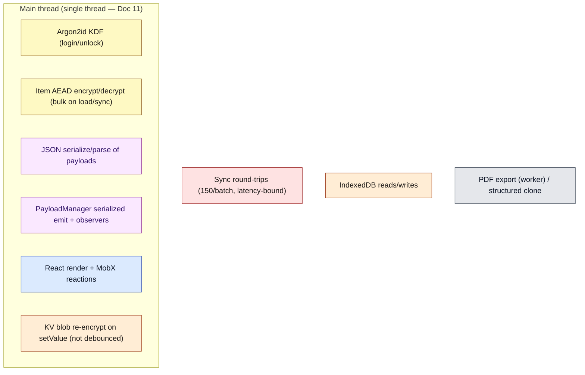

# Document 16 — Performance Engineering

> **Prerequisites:** [05 — Data Lifecycle](./05-data-lifecycle-and-e2e-traces.md), [07 — Cryptography](./07-cryptographic-architecture.md), [11 — Workers & WASM](./11-workers-concurrency-and-wasm.md).
> **Source version:** commit `e1ebcba3c32c7cb68fdf00bb48bac49a5c10f07d`, branch `main`.

## Purpose

A measurement-driven performance model. Per the methodology, this document **first builds a cost model**, then reports **measured** results where a probe was practical, and clearly separates *measured bottlenecks* from *code-inspection suspects* from *hypothetical optimizations*. It does not claim an optimization is beneficial without a cost basis.

## Architectural questions answered

- What dominates cold start, login, large-account sync, and editing latency?
- What are the real crypto costs (measured)?
- Which suspected hotspots are real, and which optimizations are worth trying?

---

## 1. Cost model (what can be expensive, and why)

The single most important structural fact: **almost everything above runs on one thread** ([Document 11](./11-workers-concurrency-and-wasm.md)). So CPU-bound crypto/JSON and rendering compete for the same thread; the app’s responsiveness strategy is *cooperative chunking* (`sleepBetweenBatches`), not parallelism.

---

## 2. Measured: crypto primitive costs (runtime-verified)

A micro-benchmark using the repository’s `libsodium-wrappers` with the exact `V004Algorithm` parameters ([Document 07 §4](./07-cryptographic-architecture.md)).

| Field | Value |
| ----- | ----- |
| Scenario | Argon2id KDF + XChaCha20-Poly1305 AEAD at the real `004` params |
| Environment | This analysis VM (cloud), **Node v22.14.0**, libsodium 1.0.18, single thread. **Not a browser or phone.** |
| Instrumentation | `process.hrtime` around `sodium.crypto_pwhash` / `crypto_aead_xchacha20poly1305_ietf_encrypt/decrypt`; warmup + averaged |
| Confidence | High for orders of magnitude; absolute ms is device-specific |

| Operation | Result (measured) |
| --------- | ----------------- |
| **Argon2id** (5 iters, 64 MiB, 64B out) | **≈ 667 ms/derivation** (avg of 8) |
| XChaCha20-Poly1305, 1 KiB | enc ≈ 0.073 ms, dec ≈ 0.015 ms |
| …100 KiB | enc ≈ 1.2 ms, dec ≈ 1.1 ms |
| …1 MiB | enc ≈ 12.1 ms, dec ≈ 11.3 ms (**≈ 87 MB/s**) |
| …5 MiB | enc ≈ 58 ms (**≈ 90 MB/s**) |
| **Per-item `004` envelope** (2 KB note: random key + 2 AEAD) | **≈ 177 µs/item → ≈ 5,650 items/s** |
| Extrapolated bulk AEAD | 1k items ≈ 0.18 s · 10k ≈ 1.8 s · 50k ≈ 8.8 s (pure AEAD only) |

**Conclusions (measured):**

- **Login/unlock is dominated by a single ~0.67 s main-thread stall** (argon2id, [Document 07 §4](./07-cryptographic-architecture.md); runs on the main thread, [Document 11 §3](./11-workers-concurrency-and-wasm.md)). On a phone (memory-bound, weaker CPU) expect **1–3 s**. This is the biggest single blocking op in the app and it is **unavoidable by design** (the KDF is the security control) — but it is a hard freeze, not chunkable.
- **Bulk decrypt is linear and non-trivial:** a 10k-item account is ~1.8 s of *pure AEAD* on this VM, before JSON parsing, emit, and paint. This is exactly why hydration is **batched with `sleep`** so the ~1.8 s is spread across frames instead of one freeze ([Document 05 §1](./05-data-lifecycle-and-e2e-traces.md)). The batching doesn’t reduce total CPU (the source comment says as much) — it trades total time for responsiveness.
- **Per-note AEAD is cheap** (~0.1 ms for a normal note); item encryption is *not* the editing bottleneck. Large notes (MBs) are where AEAD time shows (12 ms/MB), which is one reason large notes get special treatment (§4).

---

## 3. Cost model per lifecycle path

| Path | Dominant cost | `N` = | Measured / Inferred |
| ---- | ------------- | ----- | ------------------- |
| Cold start (empty) | libsodium init + React mount | — | Inferred small |
| Login / unlock | **Argon2id KDF ≈ 0.67 s** | — | **Measured** |
| Hydrate account | AEAD (≈177 µs/item) + JSON + emit + paint, batched | items | **Measured** AEAD; rest Inferred |
| Open note | none (already decrypted) | — | Observed O(1) ([Document 05 §4](./05-data-lifecycle-and-e2e-traces.md)) |
| Keystroke edit (normal note) | debounced mutate + AEAD (~0.1 ms) | — | Measured AEAD; negligible |
| Keystroke edit (large note >1.5 MB) | AEAD 12 ms/MB + full re-serialize | note size | Measured AEAD |
| Initial sync (large account) | **network round-trips** (⌈items/150⌉) | items | Inferred latency-bound |
| KV `setValue` persist | re-serialize + AEAD of whole Unwrapped blob | blob size | Inferred (see §5) |
| PDF export | worker render + structured clone | doc size | Inferred |

---

## 4. Why large notes are throttled (validated)

The measured 12 ms/MB AEAD plus full re-serialization on every keystroke explains the design in `NoteSyncController` ([Document 05 §3](./05-data-lifecycle-and-e2e-traces.md)): notes over `LargeNoteThreshold = 1.5 MB` are **saved locally often but uploaded only every 60 s** (`EditorSaveTimeoutDebounce.LargeNote = 60_000`). At, say, 5 MB, each save is ~58 ms of AEAD *plus* JSON stringify *plus* a network POST of the ciphertext — doing that per keystroke would drop frames and saturate the connection. The 60 s upload cadence is a **measured-justified** tradeoff: keystroke-local durability, lazy server convergence. (Measured AEAD cost + Observed policy.)

---

## 5. Code-inspection suspects (not yet measured end-to-end)

These are real code paths whose cost is argued from inspection; each needs a browser probe to confirm impact.

| Suspect | Mechanism | Argued cost | How to confirm |
| ------- | --------- | ----------- | -------------- |
| **Non-debounced KV persist** | `DiskStorageService.persistValuesToDisk` re-serializes + re-encrypts the **entire Unwrapped domain** on every `setValue`, with an explicit `@todo …debounced` (`DiskStorageService.ts:209`) | proportional to blob size × setValue frequency; small blobs cheap, but bursty writes repeat full-blob work | instrument `setValue` call frequency + blob size in a real session |
| **Single `app.js`, no vendor split** | webpack `optimization: {}` for web ([Document 14 §3](./14-build-system-and-delivery.md)) | large initial JS parse/eval; no long-cache vendor chunk | measure bundle size + TTI |
| **Probable domain duplication** | snjs prebuilt bundle + source `services` via `ui-services` ([Document 14 §5](./14-build-system-and-delivery.md)) | extra bundle bytes; possible `instanceof` hazards | byte-inspect built `app.js` |
| **Main-thread crypto** | all AEAD/KDF on main thread ([Document 11](./11-workers-concurrency-and-wasm.md)) | competes with render; hydration freezes without batching | profile main thread during load |
| **Item list render at scale** | many MobX `observer()` rows | rerender cost if not virtualized | profile scroll on a 10k-note list |

---

## 6. Hypothetical optimizations (with required validation)

Following the mandated shape *current → cost → proposed → expected → tradeoff → risk → measurement*:

1. **Move crypto to a Web Worker.**
   - Current: AEAD/KDF on main thread (measured 0.67 s KDF, ~1.8 s/10k decrypt).
   - Proposed: a crypto worker owning libsodium; services call it via Comlink.
   - Expected: main thread freed during login and bulk decrypt → smoother frames.
   - Tradeoff/risk: keys reside in a second context; large structured-clone traffic of payloads; big async refactor of the synchronous `PureCryptoInterface`; possible net-negative for many tiny items due to messaging overhead.
   - Validation required: compare main-thread long-task time and clone overhead before/after on 1k/10k-item accounts. **Do not assume a win** — small-item messaging cost could dominate.

2. **Content-hash + vendor split the web bundle.**
   - Current: `app.js` fixed name, no split ([Document 14](./14-build-system-and-delivery.md)); cache-bust via headers ([Document 12](./12-pwa-and-service-worker.md)).
   - Proposed: `[contenthash]` filenames + a vendor chunk.
   - Expected: long-term caching of vendor code; reliable update invalidation.
   - Tradeoff/risk: must ensure `index.html` references hashed assets (build change); more chunks.
   - Validation: measure repeat-visit transfer size.

3. **Debounce KV persist.**
   - Current: full-blob re-encrypt per `setValue`.
   - Proposed: coalesce writes over a short window (the code’s own `@todo`).
   - Expected: fewer redundant encrypt+write cycles during bursts.
   - Risk: a crash within the debounce window loses the last values (bounded by criticality gates).
   - Validation: count `setValue`→persist ratio in a session.

4. **Virtualize the note list** (if not already).
   - Validation: profile a 10k-row list first — the display controllers already pre-sort ([Document 04](./04-state-architecture.md)), so the question is DOM node count, not sort cost.

---

## 7. Reproducible probes

| Probe | How |
| ----- | --- |
| Crypto costs (done) | the §2 micro-benchmark against `libsodium-wrappers` with `V004Algorithm` params |
| Hydration | instrument `SyncService.loadDatabasePayloads` batch timings; vary `loadBatchSize`/`sleepBetweenBatches` |
| Sync round-trips | count `AccountSyncOperation.run` iterations vs item count (⌈N/150⌉) |
| Bundle size | `webpack --profile --json` on `web.webpack.prod.js` |
| Editing frames | Chrome performance trace while typing in a normal vs 5 MB note |

---

## 8. Performance matrix (summary)

| Path | CPU | Memory | I/O | Main thread | Likely bottleneck |
| ---- | --- | ------ | --- | ----------- | ----------------- |
| Login/unlock | high (argon2) | +64 MiB transient | none | **blocks ~0.67 s** | **KDF (measured)** |
| Hydrate 10k items | high (AEAD) | large retained graph | IndexedDB reads | batched | AEAD + emit/paint |
| Edit normal note | low | low | debounced write | negligible | none |
| Edit 5 MB note | med (58 ms AEAD) | note size ×N copies | 60 s upload | brief | serialize+AEAD |
| Initial sync large acct | med | med | network | brief per batch | **network latency** |
| PDF export | high | doc clone | none | offloaded to worker | clone + render |

---

## What you should now understand

- The measured crypto costs and that **login is a ~0.67 s main-thread stall** dominated by argon2id (device-dependent, larger on phones).
- That bulk decrypt is linear (~1.8 s/10k items here) and is chunked to preserve responsiveness, not reduced.
- Which suspected hotspots (non-debounced KV persist, single bundle, main-thread crypto) are real vs need measurement.
- Concrete, cost-justified optimization candidates and the measurement each requires before adoption.

## Architectural invariants learned

1. **The KDF is a deliberate, unavoidable main-thread cost; it cannot be made cheap without weakening security.**
2. **Total decrypt work is fixed by item count; batching trades latency for responsiveness, not total CPU.**
3. **Editing cost is dominated by note size, which is why large notes are throttled.**
4. **Sync at scale is network-latency-bound (150/batch round-trips), not CPU-bound.**

## Open questions

- Browser/phone absolute numbers (this probe is Node on a server CPU) — needs on-device measurement.
- Real KV `setValue` frequency and blob size in production — needs session instrumentation.
- Whether the note list is virtualized — needs a scroll profile ([Document 10](./10-react-architecture.md)).

## Source index

- `packages/encryption/src/Domain/Algorithm.ts` (`V004Algorithm` params).
- `packages/sncrypto-web/src/crypto.ts` (primitive calls benchmarked).
- `packages/snjs/lib/Services/Sync/SyncService.ts:321-364` (batched hydration).
- `packages/web/src/javascripts/Controllers/NoteSyncController.ts` (large-note throttling).
- `packages/snjs/lib/Services/Storage/DiskStorageService.ts:209` (non-debounced persist `@todo`).

## Next document

Continue to **[Document 17 — Memory Architecture](./17-memory-architecture.md)**.
