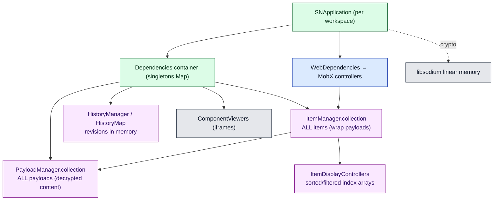
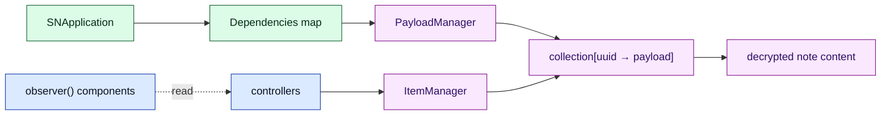

# Document 17 — Memory Architecture

> **Prerequisites:** [04 — State](./04-state-architecture.md), [10 — React](./10-react-architecture.md), [11 — Workers & WASM](./11-workers-concurrency-and-wasm.md), [16 — Performance](./16-performance-engineering.md).
> **Source version:** commit `e1ebcba3c32c7cb68fdf00bb48bac49a5c10f07d`, branch `main`.

## Purpose

A memory-oriented view: the large retained object graphs, what keeps them alive, the leak surfaces, and the cleanup mechanisms. This is the document for “what is the largest in-memory footprint of a big account, and what prevents it from being collected?”

## Architectural questions answered

- What are the large retained graphs, and what roots them?
- Where are the duplicated representations and caches?
- What are the leak surfaces, and how does cleanup work?

---

## 1. The retained object graph

**The root of everything is the `SNApplication` and its two DI containers.** As long as the application instance lives, its `Dependencies` map holds every constructed service singleton, and `PayloadManager.collection` holds every payload. Kill the application (`deinit`) and the whole graph becomes collectable — *if* every observer/timer was unregistered (§4). (Observed — `Dependencies.dependencies` map, `PayloadManager.collection`.)

---

## 2. The largest footprint: a big account

For an account with **N** items, the dominant retained memory is (Observed structure; sizes Inferred):

| Structure | Size ~ | Notes |
| --------- | ------ | ----- |
| `PayloadManager.collection` | O(N) payloads, each holding **decrypted** `content` | the authoritative copy; the actual note text lives here |
| `ItemManager.collection` | O(N) item objects wrapping those payloads | items are thin wrappers around the *same* payload objects — see §3 |
| Display controller arrays | O(N) references across per-type controllers (Notes+Files, Tags, …) | references, not copies, but multiple arrays |
| `HistoryMap` revisions | O(R) recent revisions per item held in memory | grows with editing/session |
| MobX controllers | O(selection/UI) | small relative to items |

So the **largest in-memory representation is roughly one decrypted copy of every item’s content** (in payloads) plus O(N) wrapper/index overhead. For a 10k-item account with average content of a few KB, this is on the order of tens of MB of decrypted note data resident in the JS heap — by design, because the app is offline-first and keeps the whole replica in memory ([Document 04](./04-state-architecture.md)). (Inferred magnitude; the structure is Observed.)

**There is no partial/paged in-memory model** — the entire decrypted replica is resident once hydrated. This is the memory cost of instant local search/sort and offline availability. (Observed — hydration loads all payloads into the collection, [Document 05 §1](./05-data-lifecycle-and-e2e-traces.md).)

---

## 3. Duplicated representations

| Duplication | Reality | Cost |
| ----------- | ------- | ---- |
| Payload vs Item | An item **wraps** its payload (shares the same immutable `content` object); it is not a second copy of the content | low — mostly wrapper overhead |
| Immutable copies on mutation | Each mutation creates a **new** payload; the old is replaced in the collection and becomes collectable | transient — old versions freed after emit |
| snjs bundle vs source `services` | Likely two copies of the *code* (classes) in `app.js` ([Document 14 §5](./14-build-system-and-delivery.md)) | code bytes, not per-item data (Inferred) |
| WASM linear memory | libsodium keeps its own memory region; argon2 transiently allocates ~64 MiB ([Document 16 §2](./16-performance-engineering.md)) | 64 MiB spike during KDF, released after |

The key reassurance: **decrypted note content is not duplicated between payloads and items** — the item holds a reference to the same immutable content. Immutability means old payload versions are dropped from the collection on emit and become garbage. (Observed — items wrap payloads; `PayloadManager.applyPayloads` replaces by uuid.)

---

## 4. Leak surfaces and what prevents them

Every leak surface has a corresponding cleanup; a leak is a *missed* cleanup. (Observed cleanups.)

| Surface | Kept alive by | Cleanup | Miss = leak |
| ------- | ------------- | ------- | ----------- |
| Service observers | `AbstractService.eventObservers` | `deinit()` clears; unregister fns returned by `addEventObserver` | a service that never unregisters an observer on another service |
| Event-bus handlers | `InternalEventBus.eventHandlers` map | `bus.deinit()` nulls the map | handler holding a ref after app deinit |
| MobX reactions | controller `disposers[]` | `AbstractViewController.deinit()` runs all disposers | a `reaction`/`autorun` not pushed to `disposers` |
| Item stream observers | `ItemManager`/`PayloadManager` observer arrays | disposer fns; `deinit` clears arrays | UI subscription not disposed on unmount |
| Component viewers (iframes) | `ComponentManager.viewers[]` | `destroyComponentViewer` / `ComponentManager.deinit` destroys all | switching editors without destroying prior viewer (guarded, [Document 09 §6](./09-editor-and-product-architecture.md)) |
| Window listeners | `ComponentManager` `message`/focus/blur | removed in `deinit` (`ComponentManager.ts:153-156`) | listener added without removal |
| Timers | `SyncService.autoSyncInterval`, `NoteSyncController` timeouts | cleared in `deinit`/`deinit` | a `setInterval` not cleared |
| Detached DOM | portals, iframes | React unmount + viewer destroy | an iframe kept referenced after removal |

**The deinit chain (Observed):** `SNApplication.deinit` → uninstall service observers + `dependencies.deinit()` (calls `deinit` on every `Deinitable` singleton) → `WebApplication.deinit` → `deps.deinit()` (controllers) → each controller’s `disposers`. Because the whole tree is rebuilt on workspace switch/lock ([Document 10 §6](./10-react-architecture.md)), a single missed disposer leaks **per switch** — so cleanup correctness is load-bearing for long sessions. (Observed — `Application.ts:738-763`, `AbstractViewController.ts:18-29`.)

---

## 5. Ownership diagram: what roots a note in memory

A note’s decrypted content is rooted by `PayloadManager.collection`. React components and controllers hold *references* but are not the root — unmounting a component does not free the note (correct: the note is still in the replica). Freeing a note requires either removing it from the collection (delete/discard) or deiniting the application. (Observed.)

---

## 6. WASM & worker memory

- **libsodium linear memory** persists for the module’s lifetime on the main thread; key/nonce buffers are transient per call, argon2 spikes ~64 MiB ([Document 16 §2](./16-performance-engineering.md)). **Key bytes in the JS heap are not explicitly zeroed** — they are ordinary `Uint8Array`/`string` reclaimed by GC when references drop (Inferred; no `memzero` on JS-side key material was observed). This is a residency consideration for [Document 19](./19-security-boundaries.md).
- **PDF worker** memory is separate and short-lived: it holds the cloned document nodes + fonts during a render and is otherwise idle; the inlined worker itself persists once created ([Document 11 §2](./11-workers-concurrency-and-wasm.md)).

---

## What you should now understand

- The retained graph is rooted at `SNApplication`; `PayloadManager.collection` holds the whole decrypted replica.
- The largest footprint is ~one decrypted copy of all item content plus O(N) wrapper/index overhead; there is no paging.
- Payload and item do **not** duplicate content; immutability makes old versions collectable.
- Every leak surface has a `deinit`/disposer cleanup, and the remount model makes missed cleanups leak per switch.
- WASM memory and key residency (no explicit zeroization) are the notable low-level concerns.

## Architectural invariants learned

1. **The entire decrypted item replica is memory-resident once hydrated; memory scales O(N) with item count.**
2. **Items reference (not copy) their payload content; mutation replaces payloads, freeing old versions.**
3. **Long-session memory health depends on complete `deinit`/disposer cleanup across remounts.**
4. **Key material in the JS heap is GC-reclaimed, not zeroed.**

## Open questions

- Actual heap sizes for a 10k/50k-item account — needs a browser heap snapshot (Inferred magnitude here).
- Whether any subscription is missed on remount in practice — needs a leak profile across repeated workspace switches.

## Source index

- `packages/snjs/lib/Services/Payloads/PayloadManager.ts` — the collection (retained root).
- `packages/snjs/lib/Services/Items/ItemManager.ts` — item wrappers + display controllers.
- `packages/snjs/lib/Application/Dependencies/Dependencies.ts:201-212` — container deinit.
- `packages/web/src/javascripts/Controllers/Abstract/AbstractViewController.ts` — disposer cleanup.
- `packages/snjs/lib/Services/ComponentManager/ComponentManager.ts:134-160` — viewer/listener cleanup.

## Next document

Continue to **[Document 18 — Error Handling and Resilience](./18-error-handling-and-resilience.md)**.
