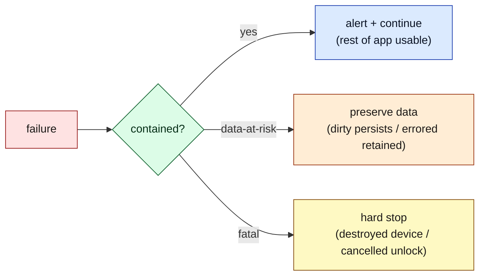
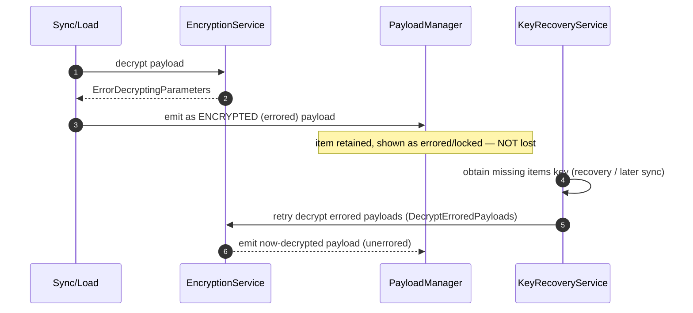

# Document 18 — Error Handling and Resilience

> **Prerequisites:** [06 — Sync](./06-synchronization-architecture.md), [08 — Persistence](./08-persistence-architecture.md), [07 — Cryptography](./07-cryptographic-architecture.md).
> **Source version:** commit `e1ebcba3c32c7cb68fdf00bb48bac49a5c10f07d`, branch `main`.

## Purpose

Map how failures originate, propagate, are caught, and are recovered. The recurring theme is **degrade, don’t crash**: a broken subsystem should surface an alert and keep the rest of the app usable, and — critically — should **never lose user data**.

## Architectural questions answered

- Where does each class of failure originate and how does it propagate?
- What is user-visible, what retries, and what recovers?
- How are undecryptable items handled without data loss?

---

## 1. The resilience posture



Only two things hard-stop the app: a **destroyed secure device** and a **cancelled unlock challenge** ([Document 03 §6](./03-bootstrap-and-dependency-construction.md)). Everything else degrades. (Observed.)

---

## 2. Failure taxonomy

| Failure | Origin | Propagation | User-visible | Retry / recovery |
| ------- | ------ | ----------- | ------------ | ---------------- |
| **Network failure (sync)** | `ApiService` | rejected promise → `SyncService` | note status “Changes saved offline”; toast on rate limit | dirty persists locally; next `sync()`/reconnect uploads ([Document 06](./06-synchronization-architecture.md)) |
| **Sync rate limit** | `SyncFrequencyGuard` | `SyncTooManyRequests` app event | toast “Too many requests” | backs off; auto-retries later (`ApplicationView.tsx:148-153`) |
| **Storage read error** | `Database.openDatabase` | `LocalDatabaseReadError` event | “Unable to load local database” alert | app continues with no/partial DB ([Document 08 §9](./08-persistence-architecture.md)) |
| **Storage write / quota** | IndexedDB txn abort | `LocalDatabaseWriteError` / `QuotaExceededError` | “out of space” alert | write rejects; user frees space |
| **Corrupt local payload** | `CreatePayload` parse | try/catch in load loop | none (silent skip) | payload skipped, hydration continues (`SyncService.ts:305-311`) |
| **Undecryptable item** | operator decrypt | `ErrorDecryptingParameters` → **errored payload** | item shows as errored/locked | retained; `KeyRecoveryService` can decrypt later (§3) |
| **Sync conflict** | server `ConflictingData` | `ConflictDelta` | possibly a “conflicted copy” note | both versions preserved by duplication ([Document 06 §6](./06-synchronization-architecture.md)) |
| **Expired/revoked session** | API 401 / `SessionEvent.Revoked` | app observer → `handleRevokedSession` | alert “session revoked”; sign-out | user re-authenticates (`Application.ts:836-848`) |
| **Storage decrypt fail (launch)** | wrong wrapping key | `decryptStorage` throws | alert; continue wrapped | retry unlock ([Document 03 §6](./03-bootstrap-and-dependency-construction.md)) |
| **Crypto/WASM init fail** | `crypto.initialize` | rejected launch promise | `console.error` (launch aborts) | reload |
| **Editor (Super/Lexical) crash** | render error | React `ErrorBoundary` | boundary UI instead of blank | reload editor ([Document 10 §8](./10-react-architecture.md)) |
| **PDF worker error** | worker exception | rejected Comlink promise | export fails with error | user retries |
| **Migration failure** | `MigrationService` stage handler | thrown in stage | boot may block on that stage | must be fixed to proceed (Observed risk) |
| **Destroyed device** | secure memory wiped | `ApplicationGroupView` ctor | “Secure memory destroyed… restart” | hard stop; restart |

---

## 3. The errored-payload pattern (no data loss on decrypt failure)

The most architecturally important recovery mechanism. When an item cannot be decrypted (wrong/missing items key, corruption), the operator returns `ErrorDecryptingParameters`, and the payload becomes an **encrypted/errored payload** that is *kept in the collection* rather than dropped (`PayloadManager.invalidPayloads`, `ItemManager.invalidItems`, Observed).



- Errored items are retained and flagged; the UI shows them as undecryptable rather than deleting them. (Observed — `invalidPayloads`/`invalidItems`.)
- `KeyRecoveryService` (wired at `Dependencies.ts`; exposed via `application.presentKeyRecoveryWizard` / `canAttemptDecryptionOfItem`, `Application.ts:919-927`) obtains missing keys (e.g., an items key that arrives in a later sync, or via a recovery flow) and re-attempts decryption via the `DecryptErroredPayloads` use case. On success, the payload transitions **encrypted → decrypted** (`applyPayloads` marks it `unerrored`, [Document 04 §2](./04-state-architecture.md)).
- **Invariant:** *a decryption failure never destroys the ciphertext.* This is what lets a device that temporarily lacks a key still round-trip and later recover the data. (Observed.)

---

## 4. Session/auth failure path

Multiple concurrent API calls can each return 401. The app dedupes revocation so sign-out happens once (`revokingSession` guard, `Application.ts:836-848`, Observed):

```mermaid
sequenceDiagram
    autonumber
    participant API as ApiService
    participant SM as SessionManager
    participant APP as SNApplication
    API-->>SM: 401 (revoked) x many
    SM-->>APP: SessionEvent.Revoked
    APP->>APP: if revokingSession return; else set flag
    APP->>APP: user.signOut(true) + alert "session revoked"
```

Token refresh is attempted first (`ApiServiceEvent.SessionRefreshed` → `SessionManager`, `DependencyEvents.ts:31`); only a hard revocation forces sign-out. (Observed.)

---

## 5. Boot resilience (degrade-first)

Recapping [Document 03 §6](./03-bootstrap-and-dependency-construction.md) as a resilience property: a failed local DB open, a failed first sync, or a storage-decrypt error all **alert and continue**. The app becomes usable with whatever state it has. The stage ladder means a service that fails during its stage can throw, but most stage handlers are defensive. (Observed.)

---

## 6. Telemetry & logging

- **`SNLog`** is the central log/error sink; `App.tsx` wires `SNLog.onLog = console.log` / `SNLog.onError = console.error` (`App.tsx:57-59`, Observed). The base `Application` constructor throws if these aren’t set.
- Services use an injected `Logger` (`TYPES.Logger`, set to level `error` by default, `Application.ts:228-229`).
- On mobile, `console.log` is redirected to the native bridge (`WebApplication.ts:183-185`, Observed).
- There is no observable third-party crash-reporting integration in the client at this commit (Observed absence; error surfacing is via alerts + console).

---

## 7. Retry & backoff summary

| Mechanism | Behavior | Reference |
| --------- | -------- | --------- |
| Sync rate limit | `SyncFrequencyGuard` caps calls/min | [Document 06 §9](./06-synchronization-architecture.md) |
| Per-item sync backoff | `SyncBackoffService` defers failing items | [Document 06 §9](./06-synchronization-architecture.md) |
| Download-first retry | `downloadFirstSync(waitTimeOnFailureMs)` up to max tries | `SyncService.ts:565-583` |
| Network push (git-like) | app-level retries with exponential backoff (ops guidance) | — |
| Integrity self-heal | periodic hash check re-syncs mismatches | [Document 06 §8](./06-synchronization-architecture.md) |

---

## What you should now understand

- The degrade-don’t-crash posture and the two genuine hard stops.
- The full failure taxonomy with origin → propagation → visibility → recovery.
- The errored-payload pattern that guarantees decrypt failures never lose ciphertext, with `KeyRecoveryService` retry.
- The deduped session-revocation path, boot degradation, and where logging goes.

## Architectural invariants learned

1. **A decryption failure retains the ciphertext as an errored item; data is never dropped and can be recovered when the key arrives.**
2. **Local writes fail loudly (alert) but never silently lose already-persisted data; unsynced edits stay dirty.**
3. **Session revocation triggers a single, deduped sign-out.**
4. **Only a destroyed device or cancelled unlock hard-stops; all else degrades.**

## Open questions

- Migration-failure behavior at a specific stage — Observed the stage-handler structure; the exact user-facing outcome of a thrown migration is Inferred (likely a blocked stage) and warrants a test.
- Absence of third-party crash reporting — Observed at this commit; historical/other builds Unknown.

## Source index

- `packages/snjs/lib/Application/Application.ts` — revoked-session dedupe, boot degradation, SNLog requirement.
- `packages/web/src/javascripts/Components/ApplicationView/ApplicationView.tsx` — DB error alerts, rate-limit toast.
- `packages/snjs/lib/Services/Payloads/PayloadManager.ts` — errored/invalid payloads.
- `packages/services/src/Domain/Encryption/UseCase` (`DecryptErroredPayloads`) + `KeyRecovery` — recovery.
- `packages/web/src/javascripts/Application/Database.ts` — storage error handling.

## Next document

Continue to **[Document 19 — Security Boundaries](./19-security-boundaries.md)**.
