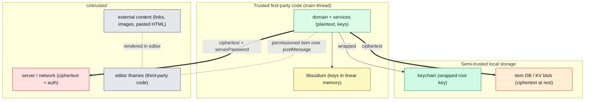

# Document 19 — Security Boundaries

> **Prerequisites:** [07 — Cryptography](./07-cryptographic-architecture.md), [08 — Persistence](./08-persistence-architecture.md), [09 — Editors](./09-editor-and-product-architecture.md), [13 — Platforms](./13-multi-platform-architecture.md).
> **Source version:** commit `e1ebcba3c32c7cb68fdf00bb48bac49a5c10f07d`, branch `main`.
> This document identifies architectural security *seams*. It does **not** invent vulnerabilities; where a seam is weaker on a platform, that is stated as an Observed property, not an exploit.

## Purpose

Draw the security-relevant boundaries: what is a secret, which processes are trusted, where untrusted input enters, and where secrets are stored per platform. This is the map a security reviewer uses to decide where to look.

## Architectural questions answered

- What are the secrets, and where do they live at rest and in memory?
- What are the trust boundaries (network, editor, worker, platform)?
- Where does untrusted input enter, and what validates it?

---

## 1. Security-oriented architecture diagram

---

## 2. Secrets inventory

| Secret | In memory | At rest | Leaves device? |
| ------ | --------- | ------- | -------------- |
| Password | transient during login | never | never (only argon2 output) |
| `masterKey` (root key) | `RootKeyManager` | wrapped by passcode key in keychain, or absent | **never** ([Document 07 §1](./07-cryptographic-architecture.md)) |
| Derived enc/sign keypairs | in root key object | derived from masterKey (not stored) | public keys only |
| Items keys | decrypted in memory | encrypted under root key (as items) | only as ciphertext |
| `serverPassword` | transient | not persisted (used for auth) | **yes** — to server for auth (half of argon2 output; not reversible) |
| Session tokens | `SessionManager` | KV storage (session mapper) | bearer to API |
| Per-item content keys | transient during crypto | inside `enc_item_key` ciphertext | only as ciphertext |

**Memory residency:** decrypted keys/content live only in the JS heap and libsodium WASM memory; they are dropped on `deinit` ([Document 07 §6](./07-cryptographic-architecture.md), [Document 17 §6](./17-memory-architecture.md)) but **not explicitly zeroed** (Inferred — GC-reclaimed). (Observed for the drop; zeroization absence Inferred.)

---

## 3. Trust boundaries

### 3a. Network boundary (strongest)

Only ciphertext and `serverPassword` cross to the server ([Document 07](./07-cryptographic-architecture.md)). Incoming server data is **untrusted**: item ciphertext is validated by the AEAD tag on decrypt (tampering fails and yields an errored payload, [Document 18 §3](./18-error-handling-and-resilience.md)), and the AAD binds each ciphertext to its `uuid`/`content_type` so the server cannot swap ciphertexts between items ([Document 07 §5](./07-cryptographic-architecture.md)). A malicious server can withhold/reorder/delete items (a denial/rollback surface) but cannot read or forge content. (Observed.)

### 3b. Editor boundary (the main untrusted-code seam)

Third-party editors run in **sandboxed iframes** and can only touch items granted via `RunWithPermissionsUseCase`, communicated as decrypted content over `postMessage` ([Document 09 §5](./09-editor-and-product-architecture.md)). They cannot read the app heap, keys, or other items. The Super editor and plain editor, by contrast, are **first-party in-process** code with full access — justified because they are first-party ([Document 09 §4](./09-editor-and-product-architecture.md)). (Observed.)

### 3c. Worker boundary

The PDF worker receives only a structured-clone copy of the document to render; it holds no keys and cannot reach the main heap ([Document 11 §2](./11-workers-concurrency-and-wasm.md)). (Observed.)

### 3d. Platform process boundary

- **Desktop:** the renderer is **context-isolated** (`contextIsolation: true`, `nodeIntegration: false`) and reaches native power only through the preload `RemoteBridge` ([Document 13 §4](./13-multi-platform-architecture.md)) — the web app cannot directly execute Node. (Observed.)
- **Mobile:** the web app in the WebView reaches native capabilities only through the `postMessage` bridge to `MobileDevice` ([Document 13 §5](./13-multi-platform-architecture.md)). (Observed.)

---

## 4. Persistent secret storage per platform (a real asymmetry)

| Platform | Keychain sink backed by | Strength |
| -------- | ----------------------- | -------- |
| **Web** | **`localStorage`** (`WebDevice.ts:12-26`) | weakest — no OS enclave; the wrapped root key sits in `localStorage`, readable by any script with access to that origin/storage |
| **Desktop** | OS keychain via `safeStorage` | OS-backed |
| **Mobile** | OS keychain + biometrics | OS-backed, biometric-gated |

**The web keychain is `localStorage`.** Mitigations: (a) a passcode wraps the root key so the stored value is a *wrapped* key, not the raw key ([Document 07 §7](./07-cryptographic-architecture.md)); (b) with no passcode, the root key wrapper is effectively at rest in `localStorage`. This is an inherent browser limitation, not a bug, but it is the single most important platform security asymmetry to keep in mind. (Observed.)

---

## 5. Untrusted inputs and their validators

| Input | Enters via | Validated by |
| ----- | ---------- | ------------ |
| Server item ciphertext | sync download | AEAD tag + AAD binding ([Document 07 §5](./07-cryptographic-architecture.md)) |
| Server conflict signals | sync response | client conflict rules (never blind-trust; both versions kept) ([Document 06](./06-synchronization-architecture.md)) |
| Editor `saveItems` | iframe `postMessage` | permission gate + mutation pipeline (typed payload for the granted item) ([Document 09](./09-editor-and-product-architecture.md)) |
| External links / images in notes | Super editor | in-app link handling intercepts non-absolute links (`SuperEditor.tsx:228-235`); images may be fetched/uploaded ([Document — `WebApplication.handleReceivedLinkEvent`]) |
| Pasted/rendered rich content | editors | editor-specific sanitization (Lexical nodes; iframe isolation for third-party) |
| Clipboard | copy/export actions | app-initiated; export goes through `ArchiveManager`/download |
| Imported backup files | `ImportData` use case | decrypted with a provided password; produces dirty payloads ([Document 05 §8](./05-data-lifecycle-and-e2e-traces.md)) |

**Content Security Policy:** `index.html` carries a CSP script hash comment for its inline config script (`index.html:33`), indicating a CSP is expected in production hosting (the exact header is host-side, Unknown from this repo). (Observed comment; header Unknown.)

---

## 6. Security-sensitive seams to review (no vulnerabilities asserted)

| Seam | Why it’s sensitive | What to check |
| ---- | ------------------ | ------------- |
| Web keychain (`localStorage`) | weakest secret store | that a passcode meaningfully wraps; no raw key in clear |
| Editor `postMessage` protocol | untrusted code ↔ decrypted item | origin checks, permission enforcement, message schema validation |
| External content in editors | XSS surface in rich editors | sanitization of pasted/linked HTML; iframe `sandbox` attributes |
| Storage `Nonwrapped` domain | pre-unlock-readable KV | that only non-secret values are placed there ([Document 08 §5](./08-persistence-architecture.md)) |
| Key residency | keys not zeroed in JS/WASM | acceptable per browser constraints; note for high-assurance contexts |
| Server-controlled `pw_nonce`/salt | KDF salt partly server-provided | mixed with client identifier to defend against uniform-salt attacks ([Document 07 §4](./07-cryptographic-architecture.md)) |

---

## What you should now understand

- The secret inventory and that `masterKey`/plaintext never leave the device; only ciphertext + `serverPassword` do.
- The four trust boundaries (network, editor iframe, worker, platform process) and how each is enforced.
- The platform secret-storage asymmetry — web’s keychain is `localStorage`.
- Where untrusted input enters and what validates it (AEAD/AAD, permission gates, editor sandboxing).

## Architectural invariants learned

1. **Only `004` ciphertext and the non-reversible `serverPassword` cross the network boundary.**
2. **Untrusted server ciphertext is authenticated by AEAD + AAD; it cannot be forged or item-swapped.**
3. **Third-party editor code is confined to sandboxed iframes with permissioned, per-item access — never the heap or keys.**
4. **Desktop renderer and mobile WebView reach native power only through a controlled bridge (no direct Node/native access).**
5. **On web, the root-key wrapper resides in `localStorage`; a passcode is the only additional at-rest protection.**

## Open questions

- Exact production CSP and iframe `sandbox` attributes — host/runtime-side, Unknown from this repo.
- Whether editor `postMessage` handlers enforce origin checks strictly — Observed the transport; per-message validation should be audited.

## Source index

- `packages/web/src/javascripts/Application/Device/WebDevice.ts` — web keychain in `localStorage`.
- `packages/desktop/app/javascripts/Main/Window.ts` — context isolation; `Main/Keychain/Keychain.ts` — OS keychain.
- `packages/snjs/lib/Services/ComponentManager/ComponentManager.ts` — editor permission/postMessage seam.
- `packages/encryption/.../GenerateEncryptedProtocolString.ts` — AEAD/AAD binding.
- `packages/web/src/index.html:33` — CSP script-hash comment.

## Next document

Continue to **[Document 21 — Extension Points](./21-extension-points.md)** (Document 20 — Invariants — was covered earlier).
