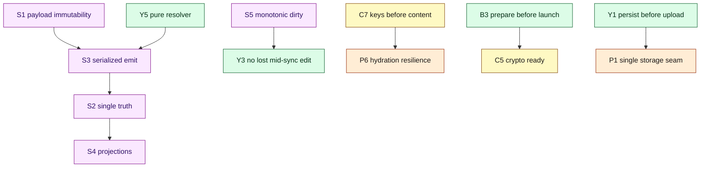

# Document 20 — Architectural Invariants

> **Prerequisites:** most subsystem documents (01–08, 15). This document consolidates their invariants.
> **Source version:** commit `e1ebcba3c32c7cb68fdf00bb48bac49a5c10f07d`, branch `main`.

## Purpose

An **invariant** is a property that must remain true for the system to be correct. This document is the consolidated, code-referenced list — the checklist to run against any PR that touches core subsystems. Each invariant has: a statement, why it matters, the enforcing/relying code, and how to check it in review.

## How to use this document

When reviewing a change, find the subsystem it touches below and verify none of that subsystem’s invariants are violated. Many bugs in this codebase are invariant violations, not logic errors.

Legend for **Enforcement**: 🔒 structurally enforced (hard to violate), ⚠️ convention (easy to violate, watch closely), 🧪 covered by tests.

---

## 1. Domain state invariants

| # | Invariant | Why | Enforcement | Reference |
| - | --------- | --- | ----------- | --------- |
| S1 | **Payloads are immutable; mutation produces a new payload.** | Conflict detection, caching, and dirty-tracking rely on old/new coexisting. | 🔒 payloads are value objects with `copy`/`copyAsSyncResolved`; no setters | `models/.../Payload/*`, [04](./04-state-architecture.md) |
| S2 | **`PayloadManager.collection` is the sole in-memory source of truth.** | Everything else is a projection; two truths would diverge. | ⚠️ convention — do not cache items as truth elsewhere | `PayloadManager.ts:40-51` |
| S3 | **All payload changes enter via `emit*` and are applied one delta at a time (FIFO).** | Prevents interleaving of concurrent emits (local edit vs remote batch). | 🔒 serialized `emitQueue`/`popQueue` | `PayloadManager.ts:104-173` |
| S4 | **`ItemManager` and display controllers are pure projections of `PayloadManager`.** | UI consistency; single writer. | 🔒 `ItemManager` only observes; never a truth source | `ItemManager.ts:44-52` |
| S5 | **“Dirty” is a monotonic `dirtyIndex`, not a boolean.** | Detects edits made during an in-flight sync. | 🔒 `getIncrementedDirtyIndex` + `globalDirtyIndexAtLastSync` | `PayloadManager.ts:20`, [06 §3](./06-synchronization-architecture.md) |

**Review check:** any code that mutates an item must route through `MutatorService`/`emitPayloads`. A direct write to `collection` or an item field is a bug.

---

## 2. Encryption & key invariants

| # | Invariant | Why | Enforcement | Reference |
| - | --------- | --- | ----------- | --------- |
| C1 | **Only `004` ciphertext and `serverPassword` leave the device.** | The E2EE guarantee. | ⚠️ only Storage & Sync cross the boundary | [07 §1,§6](./07-cryptographic-architecture.md) |
| C2 | **`masterKey` never directly encrypts item content.** | Envelope layering enables rotation/sharing. | 🔒 operators use items key → per-item content key | `GenerateEncryptedParameters.ts:44-70` |
| C3 | **Every `004` ciphertext authenticates its item metadata (AEAD AAD).** | Prevents moving ciphertext across uuid/content_type. | 🔒 AAD passed to `xchacha20Encrypt` | `GenerateEncryptedProtocolString.ts:39` |
| C4 | **Only `EncryptionService`/operators produce or consume `004` strings.** | Single audited crypto boundary. | ⚠️ convention | [07 §6](./07-cryptographic-architecture.md) |
| C5 | **Crypto cannot run before `crypto.initialize()` awaits libsodium `ready`.** | WASM must be instantiated first. | 🔒 first step of `prepareForLaunch` | `Application.ts:379`, `crypto.ts:46-56` |
| C6 | **Root key is dropped from memory on `deinit` (lock/sign-out).** | Limits key residency. | 🔒 `crypto.deinit()` + RootKeyManager cleared | `Application.ts:750` |
| C7 | **Items keys must be in memory before their items are decrypted.** | Cannot decrypt without the key. | 🔒 hydration loads keys first | `SyncService.ts:293-320` |

**Review check:** any new durable field or network payload must be verified not to contain plaintext derived from item content. Any new place that calls `crypto.*` must be after initialize.

---

## 3. Sync invariants

| # | Invariant | Why | Enforcement | Reference |
| - | --------- | --- | ----------- | --------- |
| Y1 | **Dirty payloads are persisted locally before upload.** | Edits survive network failure (“saved offline”). | 🔒 persist precedes operation | `SyncService.ts:630-633` |
| Y2 | **At most one sync operation is in flight (single-flight + coalescing).** | Prevents duplicate network requests & racey applies. | 🔒 `syncLock` + `syncInProgress` + queue strategies | `SyncService.ts:650-688` |
| Y3 | **Edits made during an in-flight sync are re-synced (never lost).** | Correctness under concurrent typing. | 🔒 `frozenDirtyIndex` freeze | `SyncService.ts:609-614` |
| Y4 | **“Both changed” conflicts resolve by duplication, never last-write-wins.** | No content is ever dropped. | 🔒🧪 `ConflictDelta` strategies | `Conflict.ts`, `Conflict.spec.ts` |
| Y5 | **The response resolver is pure; deltas are computed then emitted as one batch.** | Consistent, testable application. | 🔒 `ServerSyncResponseResolver` returns `DeltaEmit[]` | `ResponseResolver.ts:22-46` |
| Y6 | **Sync never runs before the local database is loaded.** | Avoids uploading an empty/partial state. | 🔒 `databaseLoaded` guard | `SyncService.ts:653-655` |

**Review check:** any new sync entry point must go through `sync()` (not the operation directly) so locks/guards apply. Any new conflict path must preserve both versions.

---

## 4. Bootstrap & lifecycle invariants

| # | Invariant | Why | Enforcement | Reference |
| - | --------- | --- | ----------- | --------- |
| B1 | **Platform pieces (`DeviceInterface`, `AlertService`, `Crypto`) are injected; all else is built from them.** | The multi-platform seam. | 🔒 DI seeds only these 3 | `Dependencies.ts:193-196` |
| B2 | **Service construction is triggered by first access (lazy singletons).** | Init order = access order. | 🔒 `Dependencies.get` memoizes | `Dependencies.ts:218-238` |
| B3 | **`prepareForLaunch` (crypto+storage+encryption) completes before `launch`.** | Services must be ready before unlock/sync. | 🔒 sequential awaits | `Application.ts:374-404` |
| B4 | **`launch` must not require the item DB to be fully hydrated.** | Fast interactive start on large accounts. | 🔒 `loadDatabasePayloads` not awaited | `Application.ts:462-484` |
| B5 | **Every teardown goes through `deinit()`, releasing keys and stopping observers/timers.** | No leaks across lock/sign-out/switch. | ⚠️🔒 `deinit` chains + `Deinitable` | `Application.ts:738-763` |
| B6 | **In-flight critical writes complete before deinit (`blockDeinit`).** | Durability across lock/sign-out. | 🔒 `executeCriticalFunction` + `prepareForDeinit` | `AbstractService.ts:88-92`, `Application.ts:709-718` |

**Review check:** a new long-lived service with timers/observers must implement `deinit`; a new durable write on a sensitive path should be an `executeCriticalFunction`.

---

## 5. Persistence invariants

| # | Invariant | Why | Enforcement | Reference |
| - | --------- | --- | ----------- | --------- |
| P1 | **All local persistence flows through `DiskStorageService → DeviceInterface`.** | Single durable seam per platform. | 🔒 services call the facade | [08 §1](./08-persistence-architecture.md) |
| P2 | **Everything durable is namespaced by workspace identifier.** | Workspace isolation. | 🔒 `namespacedKey` + per-identifier DB | `DiskStorageService.ts:344-346` |
| P3 | **With a root key present, both storage tiers encrypt at rest.** | At-rest confidentiality. | 🔒 encrypt-on-persist | `DiskStorageService.ts:254-282, 399-451` |
| P4 | **The `Nonwrapped` KV domain is the only state readable before unlock.** | Bootstrapping needs some clear values. | ⚠️ put only non-secret values there | `DiskStorageService.ts:369-376` |
| P5 | **KV persistence is disabled until `Launched_10`.** | Avoids persisting a half-built blob. | 🔒 `storagePersistable` gate | `DiskStorageService.ts:91-100` |
| P6 | **A corrupt/undecryptable payload never aborts hydration.** | Resilience. | 🔒 try/catch skip; errored retained | `SyncService.ts:305-311` |

**Review check:** never put secret-derived values in the `Nonwrapped` domain (P4). Any new persistence must be namespaced (P2).

---

## 6. Communication invariants

| # | Invariant | Why | Enforcement | Reference |
| - | --------- | --- | ----------- | --------- |
| E1 | **`notifyEvent` fires typed observers *and* the bus, observers first.** | Two planes, fixed order. | 🔒 base class | `AbstractService.ts:30-39` |
| E2 | **Lifecycle stages are the only totally-ordered, awaited broadcast.** | Correct init sequencing. | 🔒 `publishSync(SEQUENCE)` | `Application.ts:510-518` |
| E3 | **No event is replayable; late subscribers self-heal by querying state.** | Non-replayable design. | ⚠️ pattern (`isStarted()`/`isLaunched()` checks) | `ApplicationView.tsx:114-121` |
| E4 | **Reentrancy is guarded manually where it matters.** | No framework guard exists. | ⚠️ flags (`handledFullSyncStage`, `revokingSession`) | `Application.ts:178, 836-848` |

**Review check:** correctness-sensitive init must hook a **stage** (E2), not a fire-and-forget event. New observers must be idempotent (E1) and self-healing (E3).

---

## 7. Cross-cutting invariants (established in later documents)

These are stated here for completeness and proven in the referenced documents; treat as provisional until you’ve read the source there.

| # | Invariant | Reference |
| - | --------- | --------- |
| X1 | Editor code cannot directly write durable items; it goes through the save controller → mutator. | [09](./09-editor-and-product-architecture.md) |
| X2 | One content type cannot corrupt another (content-type routing + per-type item classes). | [09](./09-editor-and-product-architecture.md), [21](./21-extension-points.md) |
| X3 | Domain/services run outside React; UI is a subscriber. | [10](./10-react-architecture.md) |
| X4 | Worker/WASM boundaries copy bytes; no shared mutable object graph crosses them. | [11](./11-workers-concurrency-and-wasm.md) |
| X5 | The web build has no service worker; “offline” is data-layer, not asset-cache. | [12](./12-pwa-and-service-worker.md) |

---

## 8. The invariant dependency map

Some invariants depend on others; violating a base one cascades.

**Reading:** if you break S1 (payload immutability), you break S3 (serialized emit relies on distinct old/new), which breaks S2 (single truth), which breaks S4 (projections) — i.e. the whole domain-state model unravels. The most load-bearing invariants are **S1, S3, C1, Y4**. Guard them most carefully.

---

## What you should now understand

- The consolidated invariant set, per subsystem, with enforcement strength and code references.
- Which invariants are structurally enforced vs conventions you must actively protect.
- The dependency map identifying the most load-bearing invariants (S1, S3, C1, Y4).

## Architectural invariants learned

- This document *is* the invariant list; the meta-invariant is: **most core bugs are invariant violations — check them explicitly in review.**

## Open questions

- Cross-cutting invariants X1–X5 are provisional until their source documents (09–12) are read; they are confirmed there.

## Source index

- All files referenced above; the authoritative per-invariant sources are the subsystem documents 01–08 and 15.

## Next document

Continue to **[Document 21 — Extension Points](./21-extension-points.md)** (how to change the system without breaking these invariants), or return to any subsystem document.
