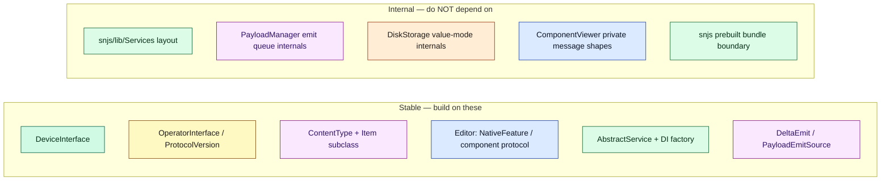

# Document 21 — Extension Points

> **Prerequisites:** [09 — Editors](./09-editor-and-product-architecture.md), [13 — Platforms](./13-multi-platform-architecture.md), [20 — Invariants](./20-architectural-invariants.md).
> **Source version:** commit `e1ebcba3c32c7cb68fdf00bb48bac49a5c10f07d`, branch `main`.

## Purpose

Show how a maintainer safely extends the system, and — equally important — which abstractions are **stable contracts** to build on versus **internal mechanisms** you must not depend on. Each extension is framed as: contract to implement, registration point, and the invariants ([Document 20](./20-architectural-invariants.md)) you must not break.

## Architectural questions answered

For each extension: what contract, which registration point, what build/security/sync impact, and what is stable vs internal?

---

## 1. Stable contracts vs internal mechanisms

---

## 2. Add a new editor / product

Covered in depth in [Document 09 §8](./09-editor-and-product-architecture.md). Summary:

| Route | Contract | Registration | Sandbox |
| ----- | -------- | ------------ | ------- |
| **Third-party iframe component** (preferred) | the `postMessage` component protocol (permissions, `streamContextItem`, `saveItems`) | feature descriptor in `@standardnotes/features`; assets via `CopyComponents.mjs` / components server | sandboxed iframe |
| **First-party native editor** (like Super) | React component + save via `NoteViewController.saveAndAwaitLocalPropagation` | `NativeFeatureIdentifier` + `editorForNote` branch in `NoteView` | in-process (first-party only) |

**Invariants to preserve:** X1 (write only via the save pipeline), X2 (content type stays `Note`), and the remote-change reconciliation pattern ([Document 09 §7](./09-editor-and-product-architecture.md)). **Do not** depend on the `ComponentViewer`’s private message shapes (I4).

---

## 3. Add a new item/content type

- **Contract:** define a `ContentType` value and a corresponding `Item` subclass (extending the model base) plus, if needed, a mutator (`packages/models`). The `content_type` string is the discriminator that routes payloads to your item class ([Document 01 §3](./01-first-principles-and-mental-model.md)).
- **Registration:** add the content type to the model’s type map so `CreateDecryptedItemFromPayload` builds your class; add an `ItemDisplayController` in `ItemManager` if it needs a maintained list ([Document 04 §2](./04-state-architecture.md)).
- **Sync/persistence:** **none required** — sync, encryption, and storage are content-type-agnostic; a new type flows through the existing pipeline automatically. This is the payoff of the generic object model.
- **Conflict behavior:** override `strategyWhenConflictingWithItem` if the default duplicate-on-diff isn’t right (e.g. singletons return `KeepBase`, [Document 06 §6](./06-synchronization-architecture.md)).
- **Stable:** `ContentType`, the item base, `DeltaEmit`. **Internal:** the emit-queue mechanics (I2) — just call `emit*`.

---

## 4. Add a new persistence backend (new platform storage)

- **Contract:** implement `DeviceInterface` — the three sinks (raw KV, payload DB, keychain) plus capability hooks ([Document 08 §2](./08-persistence-architecture.md), [Document 13 §2](./13-multi-platform-architecture.md)).
- **Registration:** inject your device as `options.deviceInterface` at bootstrap (it is one of the three seeded DI dependencies, [Document 03 §3](./03-bootstrap-and-dependency-construction.md)).
- **Invariants to preserve:** P1 (all persistence via the facade), P2 (namespace by identifier), key-first hydration ordering (C7), and the new-database detection contract (`isNewDatabase`).
- **Stable:** `DeviceInterface`. **Internal:** `DiskStorageService`’s value-mode/wrapping internals (I3) — you provide raw bytes; the facade handles encryption.

---

## 5. Add a new platform

- **Contract:** a shell that (a) hosts the web bundle and (b) provides a `DeviceInterface` ([Document 13 §1](./13-multi-platform-architecture.md)).
- **Registration:** set the `Environment`/`Platform` and inject the device; provide native capabilities via a bridge (IPC or `postMessage`).
- **Invariants:** the web UI is the single UI (don’t reimplement it); all platform behavior enters via `DeviceInterface`/optional DI deps ([Document 13 invariants](./13-multi-platform-architecture.md)).
- **Stable:** `DeviceInterface`, `Environment`/`Platform`, the bootstrap `ApplicationOptions`. **Internal:** the desktop `RemoteBridge` method surface and mobile RPC wiring (platform-specific).

---

## 6. Add a new sync operation / server interaction

- **Contract:** extend the API layer (`packages/api`) with the new endpoint, and route results through the sync **delta** model so they enter `PayloadManager` as `DeltaEmit`s (like `DeltaRemoteRetrieved`, [Document 06 §5](./06-synchronization-architecture.md)).
- **Registration:** wire into `SyncService`/`ResponseResolver` or a dedicated service; trigger via `sync()` (never call the operation directly — invariant Y2/Y6).
- **Invariants:** Y1 (persist before upload), Y2 (single-flight), Y4 (conflicts by duplication), Y5 (pure resolver → then emit).
- **Stable:** `sync()`, `DeltaEmit`, `ServerSyncResponseResolver` shape. **Internal:** `AccountSyncOperation` round-trip internals — extend, don’t bypass.

---

## 7. Add a background worker

- **Contract:** a `*.worker.tsx` module exposing a Comlink interface (the PDF worker is the template, [Document 11 §2](./11-workers-concurrency-and-wasm.md)); the host `wrap`s it.
- **Registration:** the `worker-loader` rule bundles `*.worker.tsx?` automatically ([Document 14 §3](./14-build-system-and-delivery.md)).
- **Design constraints:** everything crossing the boundary is structured-cloned (or transferred) — keep messages small; no keys/heap access from the worker (security, [Document 19](./19-security-boundaries.md)); handle failures as rejected promises.
- **When to use:** CPU-heavy, batchable, isolatable work (rendering, parsing). **Not** for crypto without measuring the messaging cost first ([Document 16 §6](./16-performance-engineering.md)).

---

## 8. Add a new cryptographic primitive / protocol version

- **Contract:** implement `OperatorInterface` for the new version (model on `Operator004`, [Document 07 §3](./07-cryptographic-architecture.md)); register it in the operator map keyed by `ProtocolVersion`; add its algorithm constants.
- **Compatibility:** **never remove old operators** — old ciphertext (001–004) must remain decryptable (invariant, [Document 23](./23-legacy-architecture-and-technical-debt.md)); add an upgrade path (like `upgradeProtocolVersion`).
- **Registration:** `EncryptionOperators` (DI `TYPES.EncryptionOperators`); primitives go in `PureCryptoInterface`/`sncrypto-web`.
- **Tests:** add a `00x.test.js` protocol round-trip and coverage ([Document 22](./22-tests-as-architecture.md)); the 100% threshold forces it.
- **Invariants:** C1–C4 (the crypto boundary, envelope, AEAD/AAD). **Stable:** `OperatorInterface`, `ProtocolVersion`, `PureCryptoInterface`. **Internal:** operator use-case decomposition (mirror it, but it may change).

---

## 9. Add a new application-level service

- **Contract:** extend `AbstractService` (gives you observers + bus + `deinit`/`blockDeinit`, [Document 15](./15-events-and-internal-communication.md)); implement `deinit` to release observers/timers (invariant B5).
- **Registration:** add a factory in the DI container (`Dependencies` for domain services, `WebDependencies` for UI controllers, [Document 03 §3](./03-bootstrap-and-dependency-construction.md)); if it reacts to events, subscribe in `RegisterApplicationServicesEvents` or via `addEventObserver`.
- **Lifecycle:** hook the right **stage** ([Document 15 §3](./15-events-and-internal-communication.md)) if init ordering matters (e.g. after `StorageDecrypted_09`).
- **Invariants:** E1 (idempotent handlers), B5/B6 (deinit + critical writes). **Stable:** `AbstractService`, the DI factory pattern, stages. **Internal:** whether it lives in `snjs/lib/Services` vs `services/src` (I1) — that boundary is mid-migration ([Document 23](./23-legacy-architecture-and-technical-debt.md)); prefer `packages/services`.

---

## 10. Extension risk map

| Extension | Blast radius | Danger | Safe if… |
| --------- | ------------ | ------ | -------- |
| iframe editor | low | poisoning its own note | uses permissions + save pipeline |
| native editor | medium | main-thread access | first-party, follows X1/X2 |
| content type | low | wrong conflict behavior | correct `strategyWhenConflictingWithItem` |
| persistence backend | high | data loss/corruption | honors P1–P6, key-first load |
| platform | high | secret storage weakness | proper keychain, bridge isolation |
| sync operation | high | lost/duplicated data | Y1/Y2/Y4/Y5 preserved |
| worker | low | messaging overhead | small messages, no keys |
| crypto version | **critical** | data unrecoverable | never drop old operators; add tests |
| app service | medium | leaks / init races | `deinit` + correct stage |

---

## What you should now understand

- The stable contracts to build on and the internal mechanisms to avoid.
- The concrete recipe, registration point, and invariant set for each extension type.
- Why content types and sync operations extend cheaply (generic object model + delta pipeline), while crypto versions and persistence backends are high-risk.

## Architectural invariants learned

1. **Extend through the published contracts (`DeviceInterface`, `OperatorInterface`, `ContentType`/Item, editor protocols, `AbstractService`+DI); never bypass the emit queue, sync single-flight, or crypto boundary.**
2. **Never remove a protocol operator — old ciphertext must stay decryptable forever.**
3. **New content types require no sync/storage changes; the object model is generic by design.**

## Open questions

- Whether new services should go in `snjs/lib/Services` or `packages/services` — the migration is incomplete; prefer `packages/services` ([Document 23](./23-legacy-architecture-and-technical-debt.md)).

## Source index

- `packages/models` (content types, items, deltas), `packages/encryption` (operators), `packages/services`/`snjs/lib/Services` (services + DI), `packages/web/.../Device` (`DeviceInterface`), `CopyComponents.mjs` (editor assets).

## Next document

Continue to **[Document 23 — Legacy Architecture and Technical Debt](./23-legacy-architecture-and-technical-debt.md)**.
