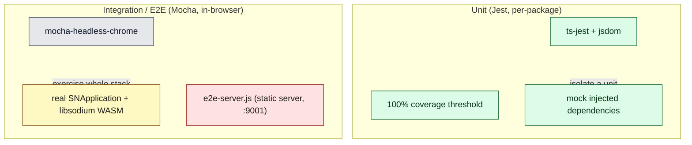
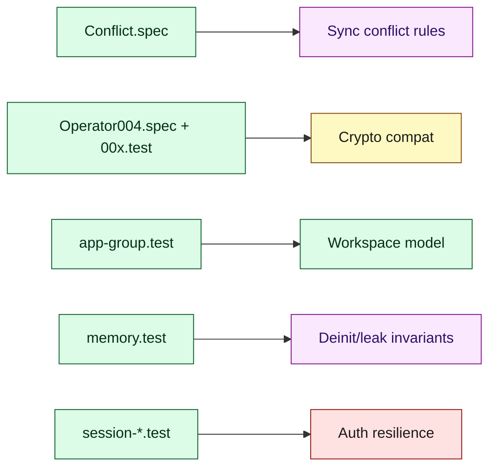

# Document 22 — Tests as Architecture

> **Prerequisites:** [02 — Packages](./02-repository-and-package-architecture.md), and the subsystem documents whose behavior the tests pin.
> **Source version:** commit `e1ebcba3c32c7cb68fdf00bb48bac49a5c10f07d`, branch `main`.

## Purpose

Use the test suite as evidence for intended behavior. Tests often encode semantics that the implementation structure alone leaves ambiguous — especially conflict resolution, protocol-version compatibility, and singleton behavior. This document maps the testing architecture and points to the tests that are worth reading as specifications.

## Architectural questions answered

- What are the unit/integration/E2E boundaries and infrastructure?
- What do tests reveal that the code structure does not?
- What does the coverage discipline imply about how to change the code?

---

## 1. Two test layers

### Layer 1 — Jest unit tests (per package)

- Config: `common.jest.json` + per-package `jest.config.js`; `ts-jest` transform; `testRegex` matches `.test`/`.spec`/`__tests__` (`common.jest.json`, Observed).
- **Coverage threshold is 100%** for branches, functions, lines, and statements globally (`index.ts` excluded) (`common.jest.json:11-18`, Observed). This is a strong discipline signal (§4).
- Distribution (spec file counts, Observed): `snjs` 105, `services` 28, `web` 25, `models` 24, `desktop` 11, `ui-services` 10, `files`/`encryption` 9 each. The domain-heavy packages carry the most tests.
- Units mock their injected dependencies (constructor-injected interfaces make this straightforward — the DI design is test-friendly, [Document 03](./03-bootstrap-and-dependency-construction.md)).

### Layer 2 — Mocha in-browser integration/E2E (snjs)

- The `snjs/mocha` suite runs in a **real browser** via `mocha-headless-chrome` against `e2e-server.js` — a `connect` + `serve-static` server on port 9001 serving `mocha/test.html` (`snjs/e2e-server.js`, Observed). Root scripts: `yarn e2e` (start server) + `yarn e2e:test` (`package.json:30-31`).
- These tests construct **real `SNApplication` instances** with real libsodium WASM and real storage (jsdom/browser), exercising the full stack end-to-end (`snjs/mocha/application.test.js`, `app-group.test.js`, `sync_tests/`, etc., Observed). This is where cross-package behavior (bootstrap → crypto → storage → sync) is validated together.

---

## 2. Tests worth reading as specifications

The following tests encode semantics that the code alone underspecifies:

| Test | Pins down | Why read it |
| ---- | --------- | ----------- |
| `models/.../Deltas/Conflict.spec.ts` | conflict strategies + the 20s “actively editing” rule | the exact duplication outcomes ([Document 06 §6](./06-synchronization-architecture.md)) |
| `encryption/.../Operator/004/Operator004.spec.ts` | `004` encrypt/decrypt round-trips + key handling | crypto correctness ([Document 07](./07-cryptographic-architecture.md)) |
| `snjs/mocha/000–004.test.js` | per-protocol-version behavior | back-compat of legacy operators ([Document 23](./23-legacy-architecture-and-technical-debt.md)) |
| `snjs/mocha/payload_encryption.test.js` | payload encrypt/decrypt pipeline | the storage/sync crypto boundary |
| `snjs/mocha/upgrading.test.js` | protocol upgrade (e.g. 003→004) | key rotation / upgrade semantics |
| `snjs/mocha/recovery.test.js` | key recovery of errored items | the errored-payload recovery path ([Document 18 §3](./18-error-handling-and-resilience.md)) |
| `snjs/mocha/singletons.test.js` | singleton item resolution | why `UserPreferences` never duplicates ([Document 06](./06-synchronization-architecture.md)) |
| `snjs/mocha/session-invalidation.test.js`, `session.test.js`, `auth-fringe-cases.test.js` | session lifecycle + revocation edge cases | auth resilience ([Document 18 §4](./18-error-handling-and-resilience.md)) |
| `snjs/mocha/app-group.test.js` | workspace/descriptor behavior | multi-account model ([Document 03 §2](./03-bootstrap-and-dependency-construction.md)) |
| `snjs/mocha/memory.test.js` | deinit/cleanup expectations | leak invariants ([Document 17](./17-memory-architecture.md)) |
| `web/.../NoteViewController.spec.ts` | save/debounce behavior | autosave semantics ([Document 05 §3](./05-data-lifecycle-and-e2e-traces.md)) |
| `services/.../Internal/InternalEventBus.spec.ts` | publish/publishSync ordering | event guarantees ([Document 15](./15-events-and-internal-communication.md)) |

**Where tests resolve ambiguity:** the conflict spec is the clearest example — the implementation’s branching in `strategyWhenConflictingWithItem` is intricate, but the spec enumerates concrete before/after states, making the intended semantics unambiguous. Similarly, the `000–004` protocol tests are the authoritative statement that old ciphertext must remain decryptable — a fact not obvious from any single operator file. (Observed.)

---

## 3. Test infrastructure & fixtures

- **Test registry / factories:** `snjs/mocha/TestRegistry`, `lib`, and helper modules construct applications, fake credentials, and seed items for integration tests (Observed dirs). These act as the “fake services”/fixtures layer for E2E.
- **Real vs mocked server:** the mocha tests run against a static server; sync interactions are exercised either against a configured server or via fixtures (the suite includes `sync_tests/`, `subscriptions.test.js`, etc.). The exact server dependency per test is a detail (Inferred: a mix of mocked HTTP via `nock` — a snjs devDependency — and fixture data).
- **jsdom / dom-storage:** snjs devDependencies include `jsdom` and `dom-storage`, used to provide DOM + `localStorage` in the Node/Jest context (Observed in `snjs/package.json`).

---

## 4. What the coverage discipline implies

The **100% coverage threshold** (`common.jest.json`) is itself an architectural constraint:

- Every branch in the domain/services packages must be exercised — so adding a code path *requires* adding a test, which pushes contributors to keep logic testable (constructor injection, pure functions like `ConflictDelta`/`ServerSyncResponseResolver`).
- It explains why so much logic is factored into **use-cases** and **pure resolvers**: pure functions are trivially coverable. The purely-functional `ServerSyncResponseResolver` ([Document 06 §5](./06-synchronization-architecture.md)) and the stateless operators ([Document 07](./07-cryptographic-architecture.md)) are as much a testability decision as an architectural one.
- For a maintainer: **a change that drops coverage below 100% fails CI**; plan a test for every new branch. (Observed threshold; CI enforcement Inferred from the config.)

---

## 5. Test → architecture map

---

## What you should now understand

- The two test layers (per-package Jest units with 100% coverage; in-browser Mocha E2E running the real app + WASM).
- Which tests to read as authoritative specifications for ambiguous semantics (conflicts, protocol compat, singletons, sessions).
- How the coverage discipline shapes the code toward pure, injectable units.

## Architectural invariants learned

1. **The conflict, crypto-compat, and singleton semantics are pinned by tests, not just code — read those specs before changing them.**
2. **100% coverage is required; every new branch needs a test, which is why core logic is factored into pure use-cases/resolvers.**
3. **Full-stack behavior is validated in-browser (real WASM/storage) via the snjs Mocha suite, not only in mocked units.**

## Open questions

- Per-test server dependency (mocked `nock` vs fixture vs live) — Inferred mixed; confirm per test file.

## Source index

- `common.jest.json` — shared Jest config + coverage threshold.
- `packages/snjs/e2e-server.js`, `packages/snjs/mocha/*` — E2E suite.
- `packages/models/.../Deltas/Conflict.spec.ts`, `packages/encryption/.../Operator004.spec.ts` — spec-as-evidence.
- `package.json:30-31` — e2e scripts.

## Next document

Continue to **[Document 23 — Legacy Architecture and Technical Debt](./23-legacy-architecture-and-technical-debt.md)**.
