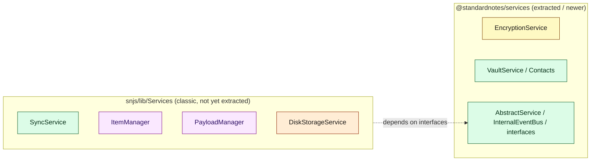
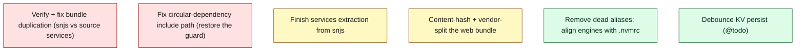

# Document 23 — Legacy Architecture and Technical Debt

> **Prerequisites:** [02 — Packages](./02-repository-and-package-architecture.md), [14 — Build](./14-build-system-and-delivery.md).
> **Source version:** commit `e1ebcba3c32c7cb68fdf00bb48bac49a5c10f07d`, branch `main`.
> This document distinguishes **Observed** facts from **Inferred** history. It does not hide inconsistencies, but it also does not assume malice where age suffices.

## Purpose

Catalog the deprecated mechanisms, in-progress migrations, duplicated abstractions, and historical naming — so a maintainer knows what is load-bearing, what is vestigial, and what is mid-refactor. Being explicit about this prevents “fixing” something that is intentionally legacy for compatibility.

## Architectural questions answered

- What is deprecated or mid-migration, and why does it likely exist?
- Where are the duplicated/competing abstractions?
- What historical naming and dead code should I not be surprised by?

---

## 1. The big one: services are mid-extraction from `snjs`

The clearest architectural-migration signal. The **canonical implementations of the classic core services live in `packages/snjs/lib/Services/`** (SyncService, ItemManager, PayloadManager, MutatorService, DiskStorageService, SessionManager, ComponentManager, HistoryManager, Features, Preferences, Settings, Protection, Challenge, Migration, Actions, Listed, Singleton, KeyRecovery, Mfa, Api), while `@standardnotes/services` holds the **base classes, interfaces, and newer services** (EncryptionService, ItemsEncryption, RootKeyManager, Vaults, Contacts, AsymmetricMessage, Status, Integrity, Subscription, User, Backups, HomeServer). (Observed — [Document 02](./02-repository-and-package-architecture.md) file layout.)

**Likely history (Inferred):** `snjs` began as a monolith; the team is extracting services into a standalone `@standardnotes/services` package. Newer features (vaults, contacts) were built directly in `services`; older core services haven’t been moved yet. **Guidance:** new services should go in `packages/services`; don’t assume a service’s package from its name. (Inferred migration; Observed layout.)

---

## 2. `snjs` is overloaded

`@standardnotes/snjs` simultaneously is (Observed):

- a **re-export barrel** (`import { ... } from '@standardnotes/snjs'`),
- a **prebuilt bundle** (`dist/snjs.js`),
- the **composition root** (`SNApplication`, DI container),
- the home of **classic services** (§1),
- the **migrations** home (`lib/Migrations`),
- the **e2e test server** (`e2e-server.js`, `bin`),
- and the app **version** source (`Version.ts`).

This breadth is why §1’s extraction matters and why the bundle-duplication issue (§3) exists. It is a “god package” analogous to the `SNApplication` god-object ([Document 02 §7](./02-repository-and-package-architecture.md)).

---

## 3. Probable domain duplication in the web bundle

Because the web app imports both `@standardnotes/snjs` (prebuilt bundle containing `services`) and `@standardnotes/ui-services` (source, importing `services` from source), the final `app.js` likely contains **two copies** of the `services`/`encryption` code ([Document 14 §5](./14-build-system-and-delivery.md)). Runtime singletons still work, but this inflates the bundle and risks `instanceof` mismatches across the boundary. **Status: Inferred** — strongly implied by the import graph; needs a byte-level bundle inspection to confirm. This is the highest-value debt item to verify.

---

## 4. Build-config debt

| Item | Evidence | Impact |
| ---- | -------- | ------ |
| **Dead webpack aliases** | `resolve.alias` maps `@Controllers → src/javascripts/controllers`, `@Services → src/javascripts/services` (**lowercase**), but the real dirs are `Controllers`/`Services` (capitalized; verified no lowercase dir exists) | the aliases resolve to non-existent paths; code uses the `@` alias instead. Harmless but misleading; would break if used on a case-sensitive FS (`web.webpack.config.js:88-92`, Observed) |
| **Stale circular-dependency include** | `CircularDependencyPlugin({ include:/app\/assets\/javascripts/ })` while source is `src/javascripts` | the cycle guard likely matches no files, so `failOnError` never triggers — cycles can slip through (Inferred, [Document 14 §8](./14-build-system-and-delivery.md)) |
| **No content-hash cache-busting** | `output.filename: './app.js'` | update reliability depends on HTTP headers ([Document 12](./12-pwa-and-service-worker.md)) |
| **`transpileOnly` bundling** | `ts-loader transpileOnly:true` + separate `tsc` | type errors only caught by the separate pass |
| **Engines mismatch** | root `engines.node: >=12.19 <17`, snjs `>=16 <17`, but `.nvmrc: 22.14.0` | declared engines are stale vs actual toolchain (Observed) |

---

## 5. Legacy crypto & API layers (intentional compatibility)

- **Operators 001–003** (PBKDF2-based, `V001/2/3Algorithm`, [Document 07 §3](./07-cryptographic-architecture.md)) are retained **on purpose** — old accounts’ ciphertext must remain decryptable, and the upgrade path (003→004) relies on them. This is *compatibility*, not rot; the `000–004` E2E tests enforce it ([Document 22](./22-tests-as-architecture.md)). **Do not remove.** (Observed.)
- **`DeprecatedHttpService` + `LegacyApiService`** coexist with the newer `HttpService`/API services (`Dependencies.ts`, Observed). The `Legacy`/`Deprecated` names mark an API-layer migration; `Application.ts` still exposes `legacyApi`. New code should use the newer API services. (Observed.)

---

## 6. Competing / duplicated abstractions

| Duplication | Detail | Status |
| ----------- | ------ | ------ |
| Two editor systems | iframe components ([Document 09 §5](./09-editor-and-product-architecture.md)) vs in-process native/Super editor ([Document 09 §4](./09-editor-and-product-architecture.md)) | Super is the modern path; iframe components remain for third-party/legacy editors |
| Two DI containers | `Dependencies` (domain) + `WebDependencies` (UI) | intentional layering, but two mechanisms to learn ([Document 03 §3](./03-bootstrap-and-dependency-construction.md)) |
| Two event planes | typed observers + string bus, fired together ([Document 15 §2](./15-events-and-internal-communication.md)) | intentional but subtle |
| Two “storage” shapes | KV blob vs payload DB ([Document 08](./08-persistence-architecture.md)) | intentional (different access patterns) |

---

## 7. Historical naming & dead code

| Artifact | Evidence | Note |
| -------- | -------- | ---- |
| Default workspace id `'standardnotes'` | `ApplicationGroup.ts:94` (“reused because this was the database name of Standard Notes web/desktop”) | deliberate back-compat naming |
| Chrome-app-style manifest | `manifest.webmanifest` (`manifest_version:2`, `app.launch`, `requirements.3D`) | vestigial from a Chrome-app era ([Document 12 §2](./12-pwa-and-service-worker.md)) |
| IE event handlers | `ComponentManager.ts:64-66,127-130` (`attachEvent`/`detachEvent`, `onfocusout`) | dead on modern browsers; harmless fallback |
| Deprecated Android editor URLs | `ComponentManager.registerDeprecatedEditorUrlsForAndroid()` | back-compat for old mobile editors |
| `TagsToFolders` migration applicator | `snjs/lib/Migrations/Applicators/TagsToFolders.ts` | one-time historical data migration |
| `@Controllers`/`@Services` aliases | §4 | dead |
| Unused `src/vendor/*.bundle.js` (legacy libsodium) | copied to `dist/` but **not referenced** by `index.html` or app imports | dead artifact from an older SNCrypto build; safe-to-remove candidate |
| `SyncBackoffService.backoffItem()` | never called from production (only tests) | per-item sync backoff is scaffolding, effectively **inactive** ([Document 06 §9](./06-synchronization-architecture.md)) |
| `SyncOpStatus.startTimingMonitor()` | never invoked | dead latency hook; `SyncTakingTooLong` can never fire |

---

## 8. Debt priority (for a maintainer)

**Not debt (do not “fix”):** legacy operators 001–003, the `'standardnotes'` id, the two DI containers, the two event planes — these are intentional. (Observed/reasoned.)

---

## What you should now understand

- The services-extraction migration (`snjs/lib/Services` → `packages/services`) and why service location is inconsistent.
- The overloaded `snjs` package and the probable bundle duplication it causes.
- The build-config debt (dead aliases, stale cycle guard, no content hash, engines mismatch).
- Which “legacy” items are intentional compatibility (operators, naming) vs actual debt.

## Architectural invariants learned

1. **Legacy protocol operators (001–003) are compatibility, not debt — never remove them.**
2. **Service location is currently inconsistent (mid-extraction); prefer `packages/services` for new work.**
3. **`snjs` is a god package (barrel + bundle + composition root + services + migrations); treat its boundaries with care.**

## Open questions

- Confirm the bundle duplication with a built `app.js` inspection (Inferred).
- Whether the circular-dependency `include` path is intentionally scoped or stale (Inferred stale).

## Source index

- `packages/snjs/lib/Services/*` vs `packages/services/src/Domain/*` — the extraction boundary.
- `packages/web/web.webpack.config.js:44-57, 88-92` — cycle plugin + dead aliases.
- `package.json:16`, `packages/snjs/package.json:10`, `.nvmrc` — engines mismatch.
- `packages/snjs/lib/Services/ComponentManager/ComponentManager.ts:64-130` — IE handlers.
- `packages/snjs/lib/ApplicationGroup/ApplicationGroup.ts:90-108` — `'standardnotes'` id.

## Next document

Continue to **[Document 24 — Per-Package Deep Dives](./24-per-package-deep-dives.md)**.
