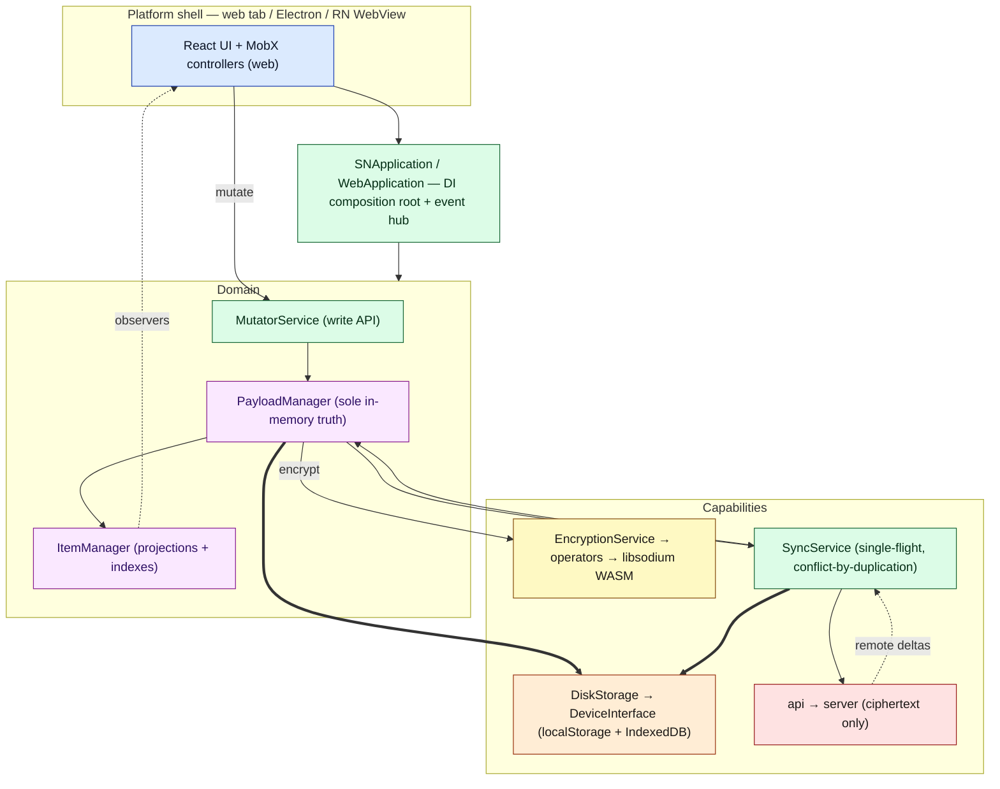
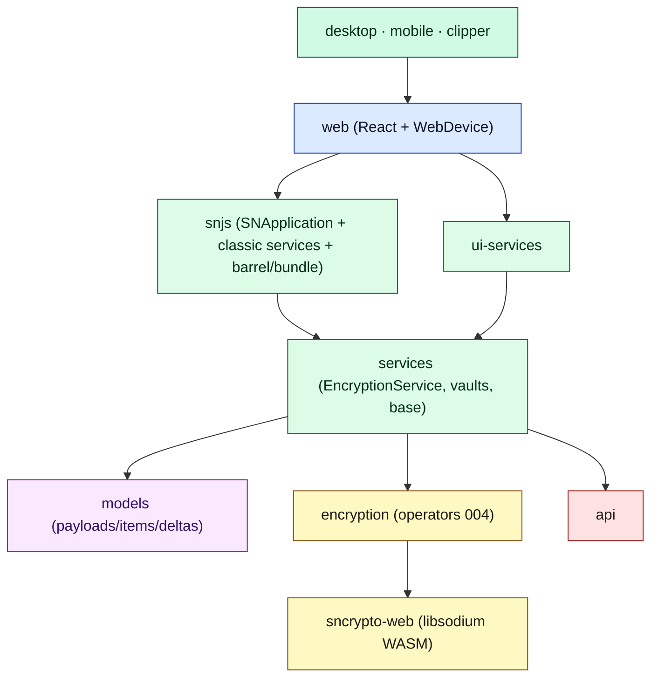
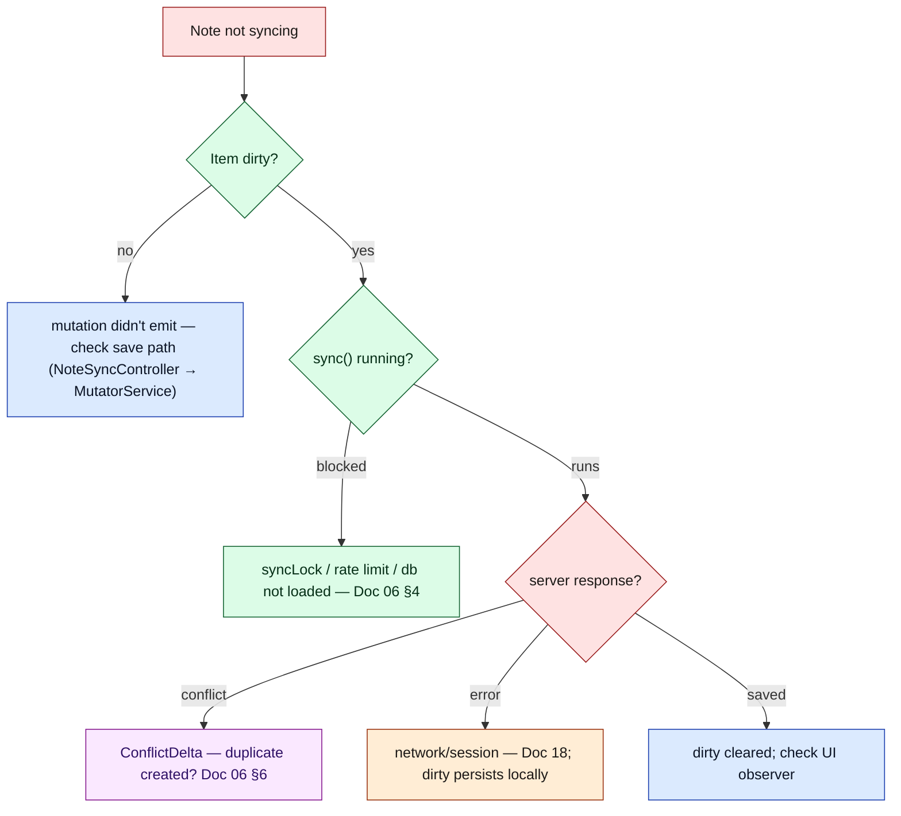
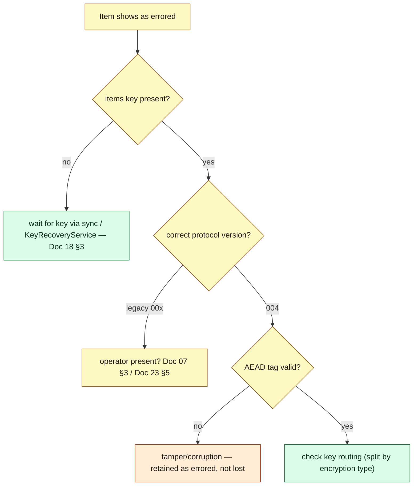

# Document 25 — Maintainer Handbook (Final Synthesis)

> **Prerequisites:** ideally all prior documents; this synthesizes them.
> **Source version:** commit `e1ebcba3c32c7cb68fdf00bb48bac49a5c10f07d`, branch `main`.

## Purpose

The operational capstone: the complete mental model, the graphs, the invariants, the bottlenecks, the debt, and — most usefully — a **“Where should I look if…?”** map and troubleshooting decision trees. If you keep one document open while working, keep this one.

---

## 1. The complete architectural mental model (one screen)

> **Standard Notes is an offline-first, end-to-end-encrypted, eventually-consistent replicated object store, wrapped in a pluggable-editor UI, whose server is a near-dumb ciphertext store.**

Ten facts that summarize the system:

1. Everything is a **payload** (immutable) projected into an **item** (live object); `content_type` is the open type system.
2. `PayloadManager` is the **sole in-memory truth**; all changes enter via a **serialized emit queue**.
3. **Encryption is a boundary crossing** (`004` envelope: items key → per-item content key; AEAD + AAD); only ciphertext + `serverPassword` leave the device.
4. **All crypto runs on the main thread** (libsodium WASM); the only worker is PDF export.
5. **Local-first:** the app hydrates the full replica from IndexedDB before contacting the server and is usable offline.
6. **Sync is single-flight** with coalescing; conflicts resolve by **duplication** (`conflict_of`) — no edit is lost.
7. **One web UI, three shells;** `DeviceInterface` is the only platform seam.
8. **No service worker;** offline is a data-layer property, not asset caching.
9. The domain runs **outside React**; MobX controllers bridge it; the tree can remount without losing state.
10. Services are **mid-extraction** from `snjs` into `packages/services`; `snjs` is prebuilt (probable bundle duplication).

---

## 2. The important package graph (compressed)

Full graphs (static, runtime, layered) in [Document 02](./02-repository-and-package-architecture.md).

---

## 3. Major runtime flows (index)

| Flow | Document |
| ---- | -------- |
| Launch → editable note | [03](./03-bootstrap-and-dependency-construction.md), [05 §1](./05-data-lifecycle-and-e2e-traces.md) |
| Keystroke → save → sync | [05 §3, §5](./05-data-lifecycle-and-e2e-traces.md), [06 §5](./06-synchronization-architecture.md) |
| Remote change → open editor | [05 §6](./05-data-lifecycle-and-e2e-traces.md), [09 §4](./09-editor-and-product-architecture.md) |
| Conflict (two devices) | [06 §6–7](./06-synchronization-architecture.md) |
| Login/unlock (KDF) | [07 §4](./07-cryptographic-architecture.md), [05 §9](./05-data-lifecycle-and-e2e-traces.md) |
| Logout vs lock | [03 §7](./03-bootstrap-and-dependency-construction.md), [05 §10](./05-data-lifecycle-and-e2e-traces.md) |

---

## 4. Subsystem boundaries & state ownership (quick reference)

| Concern | Owner | Authority | Boundary crossed by |
| ------- | ----- | --------- | ------------------- |
| In-memory items | `PayloadManager` | sole truth | `emit*` only |
| Local durability | `DiskStorage`→`DeviceInterface` | across reload (device) | persist/hydrate |
| Cross-device convergence | server + client conflict rules | timestamps + duplication | sync |
| Encryption | `EncryptionService`/operators | the E2EE boundary | Storage + Sync only |
| UI state | MobX controllers | ephemeral | rebuilt per Application |
| Secrets | `RootKeyManager` + keychain | memory + wrapped | never leave device |

Full matrix: [Document 04 §4](./04-state-architecture.md).

---

## 5. The invariants that matter most (guard in review)

The load-bearing four (full list in [Document 20](./20-architectural-invariants.md)):

- **S1/S3** — payloads immutable; all changes via the serialized `emit` queue.
- **C1** — only `004` ciphertext + `serverPassword` leave the device.
- **Y4** — conflicts resolve by duplication; no edit is lost.
- **B6** — critical writes complete before deinit.

---

## 6. Performance bottlenecks (measured + suspected)

| Rank | Bottleneck | Status | Reference |
| ---- | ---------- | ------ | --------- |
| 1 | Argon2id at login/unlock (~0.67 s, main thread) | **measured** | [16 §2](./16-performance-engineering.md) |
| 2 | Bulk decrypt on hydration (~1.8 s/10k items) | **measured**, mitigated by batching | [16 §2](./16-performance-engineering.md) |
| 3 | Large-note re-encrypt/upload (12 ms/MB) | **measured**, mitigated by 60s throttle | [16 §4](./16-performance-engineering.md) |
| 4 | Non-debounced KV persist | suspected | [16 §5](./16-performance-engineering.md) |
| 5 | Single `app.js` (no split/hash) + probable duplication | suspected | [14 §5,§8](./14-build-system-and-delivery.md) |

---

## 7. Failure modes (index)

Degrade-don’t-crash; only a destroyed device or cancelled unlock hard-stops. Errored (undecryptable) items are retained and recoverable. Full taxonomy: [Document 18](./18-error-handling-and-resilience.md).

---

## 8. Architectural debt (index)

Verify bundle duplication; fix the stale circular-dependency include; finish the services extraction; content-hash the bundle; remove dead aliases; align engines. Intentional legacy (don’t touch): operators 001–003, `'standardnotes'` id, two DI containers. Full list: [Document 23](./23-legacy-architecture-and-technical-debt.md).

---

## 9. “Where should I look if…?”

| Problem | Start here | Then inspect |
| ------- | ---------- | ------------ |
| Note doesn’t sync | `SyncService.sync` / `prepareForSync` ([06](./06-synchronization-architecture.md)) | dirty tracking → `AccountSyncOperation` → `ResponseResolver` → conflict deltas |
| Editor shows stale content | `NoteView`/`NoteSyncController` ([09](./09-editor-and-product-architecture.md)) | item observer → `PayloadManager` emit source → `ignoreNextChange` reconciliation |
| Startup is slow | `Application.launch` ([03](./03-bootstrap-and-dependency-construction.md)) | `loadDatabasePayloads` batching → argon2 (unlock) → first sync ([16](./16-performance-engineering.md)) |
| Login is slow / freezes | argon2id KDF ([07 §4](./07-cryptographic-architecture.md), [16 §2](./16-performance-engineering.md)) | main-thread crypto ([11](./11-workers-concurrency-and-wasm.md)) |
| Data won’t decrypt | errored payloads ([18 §3](./18-error-handling-and-resilience.md)) | items-key presence → `KeyRecoveryService` → operator version |
| Two versions of a note appeared | conflict duplication ([06 §6](./06-synchronization-architecture.md)) | `ConflictDelta` strategy → 20s rule → `conflict_of` |
| Storage error / “out of space” | `DiskStorageService` / `Database` ([08 §9](./08-persistence-architecture.md)) | IndexedDB quota → private window → two-tab conflict |
| Desktop-only bug | `desktop/app/javascripts/Main` ([13 §4](./13-multi-platform-architecture.md)) | `RemoteBridge` IPC → Keychain/ExtensionsServer/UpdateManager |
| Mobile-only bug | `mobile/src/MobileWebAppContainer` ([13 §5](./13-multi-platform-architecture.md)) | WebView bridge → `MobileDevice` → postMessage RPC |
| Update didn’t take effect | no service worker ([12](./12-pwa-and-service-worker.md)) | HTTP cache of `app.js` (fixed name) |
| UI didn’t rerender | MobX bridge ([10 §3–4](./10-react-architecture.md)) | controller `action`/observable → `observer()` read-set |
| A service didn’t initialize in order | stage ladder ([15 §3](./15-events-and-internal-communication.md)) | `RegisterApplicationServicesEvents` → `handleStage` |
| Which package owns X? | [Document 02 matrix](./02-repository-and-package-architecture.md) | note: classic services in `snjs/lib/Services`, not `services` ([23 §1](./23-legacy-architecture-and-technical-debt.md)) |

---

## 10. Troubleshooting decision trees

### “Note isn’t syncing”

### “Can’t decrypt an item”

---

## 11. The 40 architectural questions — quick answers

A rapid-fire index (each links to the full answer):

- **Launch → first note?** DI build → `prepareForLaunch` (crypto/storage/encryption) → `launch` (unlock → background DB hydrate → sync). [03](./03-bootstrap-and-dependency-construction.md)
- **After each keystroke?** debounced `saveAndAwaitLocalPropagation` → mutate → emit → (sync). [05 §3](./05-data-lifecycle-and-e2e-traces.md)
- **Where is a note authoritative?** `PayloadManager` (memory), local DB (reload), server (convergence). [04 §5](./04-state-architecture.md)
- **How does a note become encrypted?** `004` envelope: items key → per-item content key, AEAD+AAD. [07 §4–5](./07-cryptographic-architecture.md)
- **Reach storage?** `DiskStorage.savePayloads` → `DeviceInterface` (IndexedDB). [08](./08-persistence-architecture.md)
- **Synchronize?** dirty collect → persist → `AccountSyncOperation` (150/batch, tokens) → resolve deltas. [06](./06-synchronization-architecture.md)
- **Two devices edit concurrently?** conflict-by-duplication; both survive. [06 §7](./06-synchronization-architecture.md)
- **Remote change → open editor?** sync → PayloadManager → item observer → controller → editor (`ignoreNextChange`). [05 §6](./05-data-lifecycle-and-e2e-traces.md)
- **What’s on the main thread?** everything except PDF export — incl. all crypto. [11](./11-workers-concurrency-and-wasm.md)
- **What’s in workers/WASM, why WASM?** PDF worker; libsodium WASM for argon2/xchacha (audited, fast). [11](./11-workers-concurrency-and-wasm.md)
- **What survives reload?** the local DB replica + dirty flags. [08](./08-persistence-architecture.md)
- **Which packages know encryption / networking / React?** `encryption`+`sncrypto`+`services`(EncryptionService) / `api`+`services` / `web`+`ui-services`+`toast`+`icons`. [02](./02-repository-and-package-architecture.md)
- **Services constructed/destroyed?** lazy DI singletons / `deinit` chain. [03 §3,§7](./03-bootstrap-and-dependency-construction.md)
- **Logout vs shutdown?** both `deinit`; logout also clears workspace data. [03 §7](./03-bootstrap-and-dependency-construction.md)
- **Offline?** data-layer (IndexedDB) + dirty tracking; no service worker. [12](./12-pwa-and-service-worker.md)
- **PWA update?** reload of fixed-name `app.js` (HTTP cache). [12 §4](./12-pwa-and-service-worker.md)
- **Desktop vs Web?** Electron shell + native caps over IPC; same web UI. [13 §4](./13-multi-platform-architecture.md)
- **Prevent editor cross-corruption?** content-type-stable items + permissioned iframes. [09 §7](./09-editor-and-product-architecture.md)
- **Largest in-memory rep?** ~one decrypted copy of all items (O(N)). [17 §2](./17-memory-architecture.md)
- **Cold-start / large-sync dominators?** argon2 + batched decrypt / network round-trips. [16](./16-performance-engineering.md)
- **Frame drops while editing?** large-note serialize+AEAD on main thread. [16 §4](./16-performance-engineering.md)
- **Primary invariants / weakest boundaries?** [20](./20-architectural-invariants.md) / web keychain, editor postMessage ([19](./19-security-boundaries.md)).
- **Add editor / platform?** [21 §2](./21-extension-points.md) / [21 §5](./21-extension-points.md).
- **Most dangerous to modify?** crypto versions, persistence backends, sync operations. [21 §10](./21-extension-points.md)

---

## 12. Verification Notes

Assumptions checked during this analysis and their resolution:

| Assumption | Checked | Result |
| ---------- | ------- | ------ |
| Core services live in `packages/services` | grep for class defs | **Corrected** — classic services are in `snjs/lib/Services` (mid-extraction) |
| Web app is content-hashed for cache-busting | read webpack output config | **Corrected** — fixed `app.js` name, no hash; Doc 12 fixed |
| There is a service worker | exhaustive search | **Confirmed absent** |
| Crypto runs in a worker | search for worker imports of libsodium | **Confirmed main-thread** |
| Mobile is native RN UI | read `MobileWebAppContainer` | **Corrected** — RN WebView hosting the web app |
| Argon2/AEAD costs | ran a `libsodium` micro-benchmark | **Measured** (0.67 s / ~87 MB/s) |
| Conflict = last-write-wins | read `ConflictDelta`/`GenericItem` | **Corrected** — duplication, 20s rule |
| Desktop keychain via `safeStorage` | read `Keychain.ts`; searched `safeStorage` | **Corrected** — it uses **`keytar`** (no `safeStorage`); localStorage fallback on Linux/Snap |
| `SyncBackoffService` provides live backoff | searched `backoffItem` callers | **Corrected** — `backoffItem()` never called in production; backoff is inactive scaffolding |
| Web uses `Suspense` for lazy views | searched `Suspense` in `web/src` | **Corrected** — no `Suspense` wrapper exists; a potential latent issue for `React.lazy` |
| Only one Web Worker total | searched `new Worker`, checked `@zip.js/zip.js` | **Refined** — one *first-party* worker (PDF); `@zip.js/zip.js` also spawns its own workers |
| Mobile device RPC wiring was Inferred | read `MobileWebAppContainer.tsx` | **Upgraded to Observed** — `WebProcessDeviceInterface` postMessage RPC proxy |

*These corrections were cross-checked against six independent subsystem explorations, which otherwise corroborated the suite.*

**Items still Inferred (not runtime-verified):** bundle domain duplication ([14 §5](./14-build-system-and-delivery.md)); circular-dependency plugin ineffectiveness ([23 §4](./23-legacy-architecture-and-technical-debt.md)); `IntegrityService` internal hash formula ([06 §8](./06-synchronization-architecture.md)); browser/phone absolute perf numbers ([16](./16-performance-engineering.md)); note-list virtualization ([10](./10-react-architecture.md)).

---

## What you should now understand

- The whole system as one model, with the ten summary facts.
- Where to look for any class of problem (the “Where should I look if…?” map + decision trees).
- The measured bottlenecks, the invariants to guard, and the debt to be careful around.
- Which of this suite’s conclusions are measured, observed, or still inferred (Verification Notes).

## Architectural invariants learned

- The consolidated set is [Document 20](./20-architectural-invariants.md); the four to guard hardest are S1/S3, C1, Y4, B6.

## Open questions

- Consolidated in §12 (Verification Notes) — the remaining Inferred items to confirm with a build/heap inspection and on-device measurement.

## Source index

- The entire suite; primary anchors: `Application.ts`, `Dependencies.ts`, `PayloadManager.ts`, `ItemManager.ts`, `SyncService.ts`, `Conflict.ts`, `Operator004.ts`, `crypto.ts`, `DiskStorageService.ts`, `Database.ts`, `WebApplication.ts`, `NoteSyncController.ts`, `ComponentManager.ts`, `SuperEditor.tsx`, `web.webpack.config.js`, `MobileWebAppContainer.tsx`, `desktop/app/index.ts`.

## End of suite

Return to **[Document 00 — Documentation Map](./00-documentation-map.md)** for navigation, or dive into any subsystem. This handbook is the operational map; the subsystem documents are the depth behind it.
